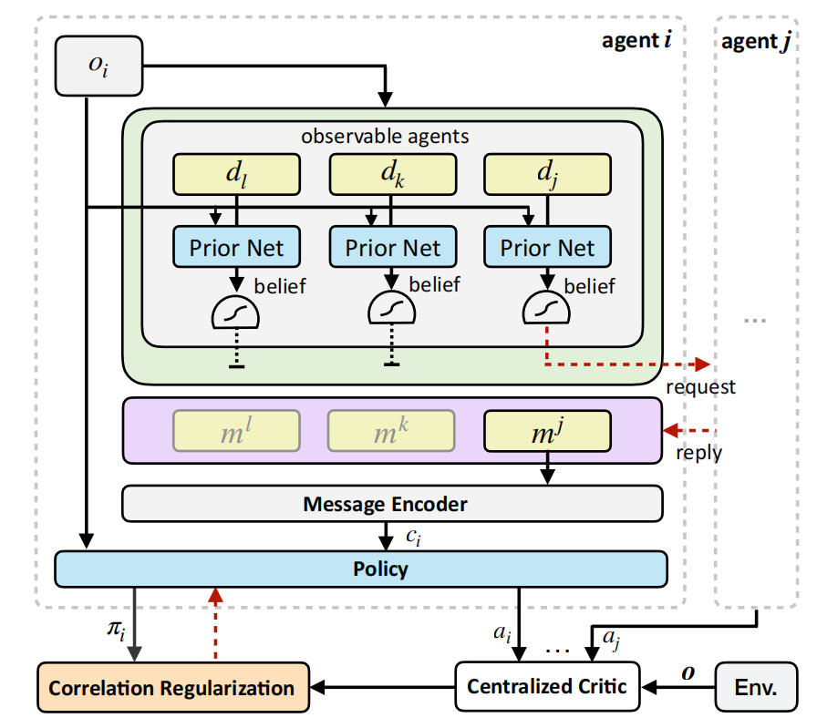
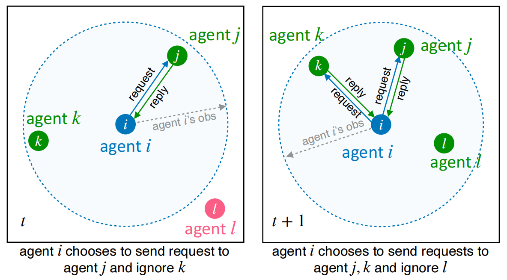
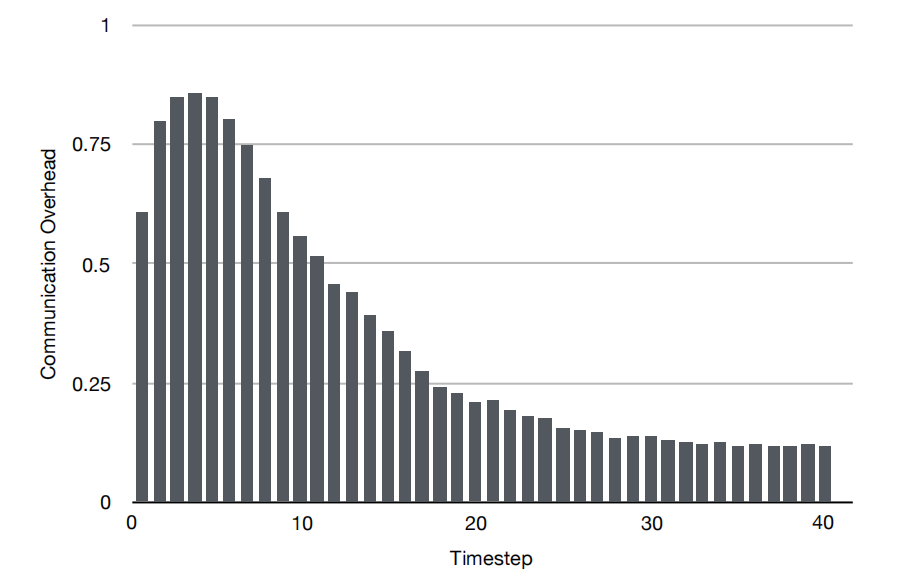
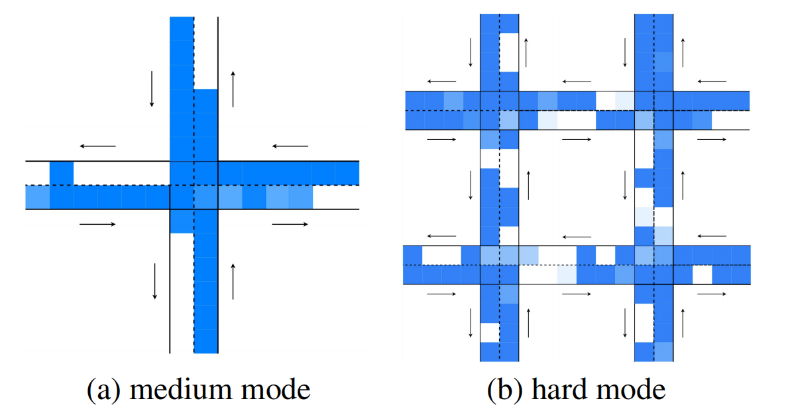

# Learning Individually Inferred Communication for Multi-Agent Cooperation

> Report of Paper Reading | Artificial Intelligence | Agent
>
> 2101212840 - Yingxuan You

## Summary

To tackle the problem of information redundancy in broadcast communication of multi-agent cooperation, this paper proposes *Individually Inferred Communication* (I2C), a multi-agent communication architecture for cooperative tasks, which is the first work to learn one-to-one communication in multi-agent reinforcement learning (MARL).

I2C consists of a prior network, which is learned via causal inference and realized by a feed-forward neural network that takes as input agent’s local observation and predicts who to communicate with. The influence of one agent on another is inferred via the joint action-value function in MARL and quantified to label the necessity of agent-agent communication.

Experiments on three multi-agent cooperative tasks: cooperative navigation, predator prey, and traffic junction, demonstrate that I2C can not only reduce communication overhead but also improve agents’ performance.

## Strengths

- **Strength 1**: This paper proposes a novel approach to learn **one-to-one communication** for cooperative multi-agent tasks.
- **Explanation**: Existing work focus on broadcast communication, which not only leads to information redundancy but also makes the learning process harder. Therefore, one-to-one communication is important for multi-agent cooperation because that it enables the agent to figure out who to communicate with and focus on relevant information without redundant ones.
- **Strength 2**: The experiments are well-executed and adequate.
  - **Explanation**: The experiments not only evaluate in three multi-agent tasks: cooperative navigation, predator prey, and traffific junction, but also compare to a reasonable set of baselines including full communication, random communication, MADDPG, IC3Net and TarMAC, which make the empirical results convincing and help the reader to understand the effect of I2C.
- **Strength 3**: The paper is clearly written and the central contribution is easy to unsterstand.
  - **Explanation**: The paper is well written in terms of clarity, figures are informative and the empirical results are presented in a neat manner. It is valuable because that it makes the reader, especially the newcomer like me, to understand the idea and approach easier.

## Weaknesses
- **Weakness 1**: More explanation on why TarMAC perform worse than MADDPG in first two experiments is needed.
  - **Explanation**: Both MADDPG and TarMAC learn joint action-value functions, but TarMAC[1] uses attention to allow communication which supposed to be better than MADDPG. And the statement, 'one possible reason is that team reward cannot be decomposed to individual ones', lacks sufficient evidence to support the claim. It may have anything to do with the setting of hyperparameter. Therefore, more explanation is needed, which is important for the reader's understanding of the methods mentioned in this paper.

- **Weakness 2**: The performance of I2C alone is supposed to evaluate in the task of traffic junction.
  - **Explanation**: In the task of traffic junction, I2C is build on TarMAC and serves as communication control, denoted as I2C+TarMAC, which is compared with TarMAC, IC3Net and no communication baseline. And in both the medium and hard mode, I2C+TarMAC performs the best, which demonstrates the high performance of I2C in some extent. But it would be more useful to benchmark I2C alone as well, for a more direct comparison to TarMAC.

## Detailed Comments
- **There are some inappropriate expressions.** 
  - Some expressions are not so appropriate in this paper, such as 'on one hand' ( line 19 'On one hand, during training ... On the other hand, even for the') and 'form a good knowledge' (line 27). The former one should be modified to 'on the one hand', and the latter one can be changed to 'generate a effective knowledge'.

- **There are some typos.**
  - In line 19 of Part 4.2 Predator Prey,  'there is no much communication redundancy', the 'no' should be modified to 'not'.
- **A discussion of the differences between human communication and agent communication can be added.**
  - Although the idea of one-to-one communication for multi-agent tasks is introduced by a human question-and-answer website, Quora, there are many differences between human communication and agent communication. Agents have much bigger communication bandwidth, and probably have quite different optimal communication setups.

## Figures

### Architecture Figures

**Figure 1: Architecture of I2C**

As illustrated in Figure 1, I2C can be instantiated by any framework of CTDE with a joint action-value function. I2C consists of a prior network, a message encoder, a policy network, and a centralized critic. Agents together aim to maximize the cumulative team reward.

**Figure 2:  I2C’s request-reply communication mechanism. The agent can only communicate with other agents in its field of view.**

As illustrated in Figure 2, agents are able to communicate with observed agents and adopt the request-reply communication mechanism. 

At a timestep, each agent *i* obtains a partial observation *oi* and identifies which agents are in the field of view based on *oi* . Suppose agent *j* can be seen by agent *i*, the prior network takes as input local observation *oi* and outputs a belief indicating whether to communicate with agent *j*.

### Experiment Figures

**Figure 5:  Change of communication overhead as one episode progresses in cooperative navigation.**

Figure 5 illustrates the change of communication overhead as one episode progresses, where the communication overhead is the ratio between the sum of communicated agents and the sum of observed agents for all agents. As the episode starts, the communication overhead quickly increases to more than 80%. This is because at the beginning of an episode, agents need to determine targets and avoid target conflicts, and thus more communications are needed to reach a consensus. As the episode progresses, agents are moving more closely to their targets and agents become less influential on the policies of others. Thus, the communication overhead is also progressively reduced.

**Figure 8: Communication overhead at different locations in the medium and hard mode of traffific junction. **

Darker color indicates higher communication overhead. 

Cars only have two actions: brake (stay at its current location) and gas (move one step forward following the route). 

Figure 8a shows the communication overhead for the medium mode. Cars communicate with other cars with high probability when moving towards and crossing the junction. However, communication occurs less after passing the junction. Intuitively, cars want to know as much information as possible, especially the location of other agents, in order to avoid collisions when crossing the junction. Even for the cars at the beginning of the route, they also need to prepare for the brake of front cars. In contrast, the optimal action for all the cars is gas all the time after passing the junction.

Figure 8b shows the communication overhead for the hard mode. Similarly, cars tend to communicate with other cars before entering all the four junctions. However, in the hard mode, keeping gas after crossing a junction is not appropriate anymore since there may be another junction in the route. After crossing a junction, cars communicate less compared with other locations.

## References

[1] Abhishek Das, Théophile Gervet, Joshua Romoff, Dhruv Batra, Devi Parikh, Mike Rabbat, and Joelle Pineau. Tarmac: Targeted multi-agent communication. In *International Conference on* *Machine Learning (ICML)*, 2019.
