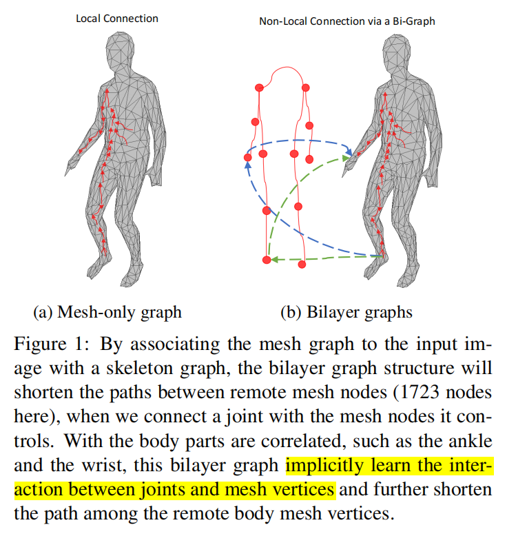
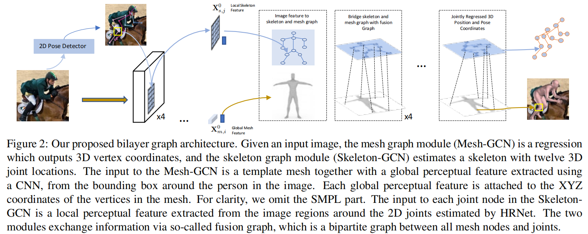
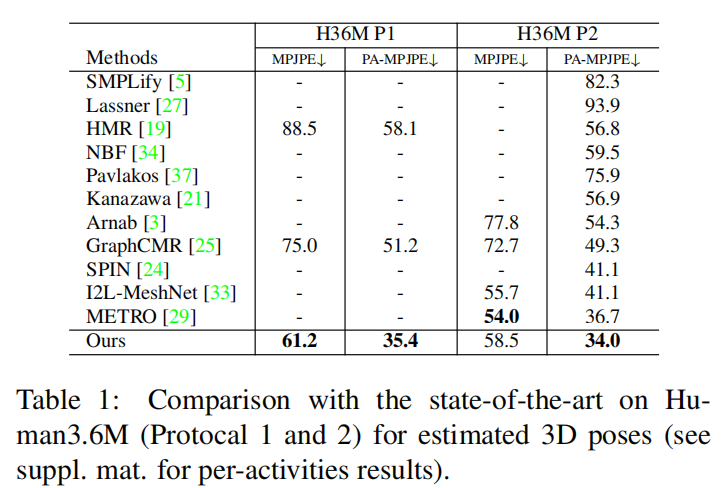
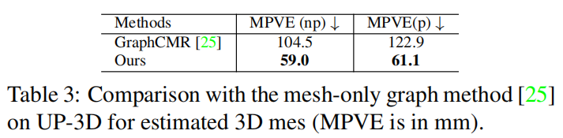
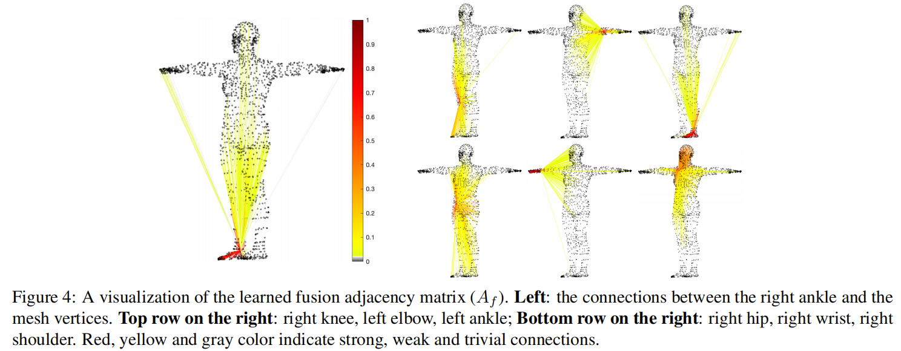
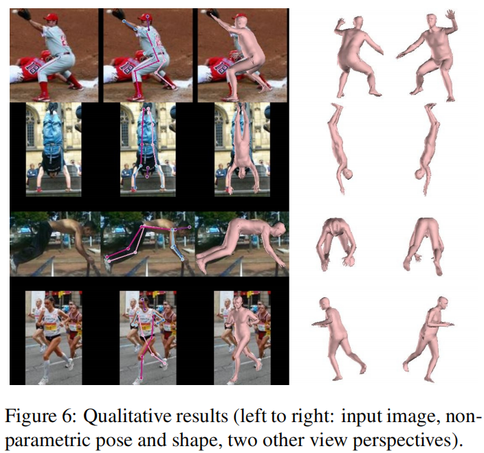
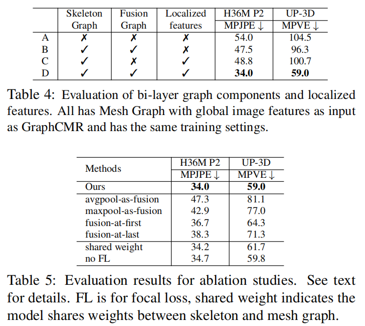

# Keypoint-aligned 3D Human Shape Recovery from A Single Imagewith Bilayer-Graph

> 3DV 2022

[TOC]

## 摘要

针对从单帧图像估计三维人体姿态和形状。三维人体使用网格表示，即无向图，使得卷积神经网络自然地适合这个问题。但图卷积神经网络的表达能力有限，图上的节点每次只把信息传递给相邻的节点，传递信息需要连续的图卷积。为了解决这个问题，作者提出了**双尺度图**方法：使用一个**稀疏的图（coarse graph）**来估计三维人体姿态，使用一个**稠密的图（dense graph）**来估计三维形体。与稠密图相比，稀疏图的信息可以在更长的距离上传播。除此之外，姿态信息可以指导恢复局部的shape细节，反之shape也可以指导恢复pose。我们认识到稠密图和稀疏图的联系本身就是一个图，并引入了图融合块（graph fusion blocks）来交换不同尺度图之间的信息。

## 引言

3D mesh是一个无向图，用来表示人体。graphCMR通过GCN来改变初始的人体mesh模板。mesh的特征在GCN中传播，但存在的问题是对稠密的（一般1723）网格顶点来说，特征传递的效率很低。近期的工作使用Transformer的自监督来缩短两个节点的距离。但是自监督在下采样后的423个网格顶点上仍然低效。位置编码虽然维护了基本坐标信息，但忽略了身体部位之间的联系。于是我们提出了non-local**双层图结构**：

双层结构的另一个好处是：可以同时进行姿态估计和形体重建。

融合层（fusion layer）是一个可训练的二部图，可以自适应地调节整个身体关节和网格节点的连接，而不是加以固定的连接。能够促进两个图的特征融合，相互增强两个任务。这与线性蒙皮（linear blend skinning）相似，但是线性蒙皮提供了一个解析转换，而融合层学习了在高维特征空间中身体关节和网格节点之间的数据自适应转换。

## 贡献

- 第一个提出基于两层图的神经网络，联合实现了三维人体的形体和姿态恢复。骨架图模块传递姿态（粗尺度）的信息，网格图模块传递细节形体（精细尺度）的信息，融合图模块交换两个模块之间的信息。
- 提出了自适应图融合块来学习身体关节和网格节点之间的可训练的对应关系
- 在不同数据集上验证了不同尺度上局部和全局信息交换对单图方法性能和速度的提升。

## 相关工作

### Graph CMR

我们的工作基于GraphCMR，GraphCMR的输入是人体网格的模板和全局图像特征，GraphCMR然后仅依赖去卷积来传递节点间的信息，最后提供3D估计。我们提出的二层图方法能够更有效地传递信息。

多尺度图（multi-scale graphs）已经在许多方面进行过探索。Graphonomy联合人体动作识别和运动预测，根据不同图之间的特征复制和连接来融合尺度之间的信息。相比之下， 我们的融合方法依赖于一个可学习的图邻接矩阵，它在两个尺度图之间交换信息。

## 方法

### 框架

输入图像 - > 图像编码器（提取特征）- > 2D pose 检测器（将图像处理为骨架图）- > 上：骨架图关注并传递局部特征；下：网格图关注整体特征；中：融合图连接所有的关节点和网格节点，并交换双尺度的信息 - > 上：估计图回归3D pose，下：网格图回归网格坐标

为了解决缺乏详细的局部信息和低效的远程交互的问题，我们使用双层图结构联合估计三维人体姿态，并基于单张RGB图片恢复完整的三维网格。

三维人体姿态和三维网格结构都可以用一组关节坐标和邻接矩阵来表示他们的连接关系。因此目标就是提出一个模型，来实现：
$$
\widehat{\mathbf{V}}_{\mathbf{s}}, \widehat{\mathbf{V}}_{\mathbf{m}}=\mathcal{F}\left(\mathbf{I}, \mathbf{A}_{m}, \mathbf{A}_{s}\right)
$$
为了在两个尺度上显式建模顶点相关性，于是引入了一个**融合图来学习关节如何控制身体网格顶点的变形**。

三个邻接矩阵：$\mathbf{A}_{\mathbf{s}} \in \mathbb{R}^{N_{\mathbf{s}} \times N_{\mathbf{s}}}$、$\mathbf{A}_{\mathbf{m}} \in \mathbb{R}^{N_{\mathbf{m}} \times N_{\mathbf{m}}}$、$\mathcal{R}^{\left(N_{m}+N_{s}\right) \times\left(N_{m}+N_{s}\right)}$，其中前两个是固定的，最后一个是可学习的。

### 图像编码器

多层卷积，ResNet

### 双层图模块

图卷积的基本计算公式：
$$
\mathbf{X}^{\ell+1}=\mathbf{A} \mathbf{X}^{\ell} \mathbf{W} \in \mathbb{R}^{N \times d_{\ell+1}}
$$

#### 1. 网格图模块

网格图的作用是回归三维网格坐标。

输入：模板坐标 concat 2048-D图像特征 $\mathbf{X}_{m, i}^{0}=\mathcal{F}_{m}^{0}\left(\mathbf{v}_{m, i}^{T} \oplus \mathbf{x}_{\mathrm{im}}^{\mathrm{g}}\right) \in \mathbb{R}^{d_{0}}$

$\mathcal{F}_{m}^{0}$线性层，将特征降维到512维

**$A_{m}$是一个二值矩阵，表示网格顶点的连通性**

#### 2. 骨架图模块

骨架图的作用是把2D pose lift到3D pose。

稀疏骨架图可以促进稠密网格图的非局部拓扑特征，增强不同部位之间的相关性。此外，我们还提取了关节周围的局部特征，以获得更精确的姿态

输入：使用现成的HRNet来估计2D关节位置。对每个关节点，以该关节点为中心，平均骨架长度为宽裁剪出一个patch，对ResNet-50第k层的图像特征$\mathbf{x}_{\mathrm{im}}^{k}$采用RoI Align（一种区域特征聚集方式）。这个特征反映了关节点周围的局部信息。concat**图像特征**patches和**位置编码**作为初始骨架特征。
$$
\mathbf{X}_{s, i}^{0}=\mathcal{F}_{s}^{0}\left(\hat{\mathbf{v}}_{s, i} \oplus \mathbf{R o} \mathbf{I}\left(\hat{\mathbf{v}}_{s, i}, \mathbf{x}_{\mathrm{im}}^{1}, \ldots \mathbf{x}_{\mathrm{im}}^{K}\right)\right) \in \mathbb{R}^{d_{0}}
$$
$\mathcal{F}_{s}^{0}$线性层，在骨架顶点中共享权重。

ps：这里作者也尝试了骨架模板坐标作为位置编码，但是没有提升性能，因此使用2D embedding。

**$A_{s}$初始化为两个模板关节顶点的欧氏距离的倒数。**

#### 3. 融合图模块

作用：将稀疏骨架图与稠密网格图关联起来，使他们之间能够进行信息交换，并增强三维形体恢复和姿态估计任务。如图1，融合图可以显著缩短两个远程网格顶点的路径，并加速网格图非局部信息的传递。

输入：融合图包括网格图和骨架图的顶点，并使用相同的初始化特征，

邻接矩阵：可训练的数据驱动的。除了定义的固定的连接部分$A_{f,s}$，还有额外的动态连接$W_{f}$，通过训练获得隐藏特征空间的连接关系，邻接矩阵的公式为：
$$
A_{f}=\operatorname{Row} \operatorname{Norm}\left(A_{f, s} \odot W_{f}\right)
$$
RowNorm是层正则化

$A_{f, s}$表述固定的邻接矩阵部分，其中的元素为骨架顶点和关节顶点欧式距离的倒数，未连接部分为0。

$W_{f}$是可学习的，其中vertex-joint连接为1，其余连接为0。

ps：作者也实验了将RowNorm改为每行的softmax，和Afs和Wf的加性操作，都带来了性能的提升，但为了简化计算，采用了以上方法

### SMPL回归器

利用MPL模块从预测的网格中回归SMPL参数

## 训练

### 损失函数

#### 顶点损失

- 网格图顶点损失：预测网格顶点与GT的L1 loss$\mathcal{L}_{m}$
- 骨架图顶点损失：预测骨架顶点与GT的L1 loss$\mathcal{L}_{s}$

#### 网格转关节损失

将网格顶点乘以预定义矩阵得到3D关节位置，与3D关节的GT做L1损失：$\mathcal{L}_{m}^{j 3 d}$

#### 投影损失

对Mesh-GCN中间特征的相机参数进行额外监督，将该相机参数应用到3D的骨架图和网格转关节中，得到2个L1的2D姿态损失：$\mathcal{J}_{m}^{j 2 d}$和$\mathcal{J}_{s}^{j 2 d}$

#### SMPL损失

MSE损失：$\mathcal{L}_{\theta}$和$\mathcal{L}_{\beta}$

#### 总损失

$$
\mathcal{L}=\mathcal{L}_{\mathrm{m}}+\mathcal{L}_{m}^{j 3 d}+\mathcal{L}_{m}^{j 2 d}+\mathcal{L}_{s}+\mathcal{L}_{s}^{j 2 d}+\mathcal{L}_{\theta}+\lambda \mathcal{L}_{\beta}
$$

#### Focal loss 聚焦损失

注意到在三维顶点上的损失中，身体部引起的差异很大。例如，手臂和腿（四肢）的误差通常比其他部位（躯干和头部）要大，直觉的原因是身体四肢的变化比躯干和头部要大。因此作者使用了focal loss，通过降低分类良好的样本的权重，来解决类不平衡问题：
$$
\mathcal{L}_{f l}=-(\alpha \mathcal{L})^{\gamma} \log (1-\max (\tau, \alpha \mathcal{L}))
$$
$\mathcal{L}$是L1损失，$\alpha$是尺度因子用来将$\mathcal{L}$规范到（0，1），$\tau<1$是一个阈值来截断$\alpha\mathcal{L}$避免当其趋近于1的时候的巨大损失，$(\alpha \mathcal{L})^{\gamma}$中${\gamma}>0$，来减小回归良好的定点的相对损失。

## 实验

## 消融实验

