# DeepCap: Monocular Human Performance Capture Using Weak Supervision

## 摘要

人体三维重建在虚拟现实和增强现实有着越来越多的使用，之前的许多工作要么需要昂贵的多视图设备，要么没有利用帧到帧的相关性来重建稠密时空一致性几何。我们的方法基于多视图监督训练了一个弱监督的方式，完全消除了对三维ground truth标注的需要。该工作分解为两个独立的网络，分别是位姿估计和非刚性表面变形。在定性和定量实验中展现了SOTA的性能和鲁棒性。

## 引入

人体三维重建的作用：

- 电影
- 游戏
- 生成个性化的动态虚拟
- 混合现实

目前大部分的单目方法只捕获了结构的运动，比如手和稀疏的面部表情，但是用在稠密全身（皮肤或着衣）的变形的单目跟踪仍然处于开始阶段。

许多多视图无标记的方法已经获得了很好的成果，但是需要多相机的工作室（比如绿幕），限制了在现实中本地摄影条件下的使用。

目前的单目人体建模方法已经在衣服、发型和面部细节有很好的效果。[1] [2] 直接回归了体素，[3]回归了连续的表面占用。因为这些预测都是像素对齐的，所以重建的细节很好，但四肢经常跟丢。重建运动分解为结构和非刚性变形，能够防止计算图风格控制超过重建，更有应用价值。更重要的是，表面顶点并不是总能被跟踪到，重建不是时空关联的。另外的方法是使用关节模板，虽然减少了肢体丢失，增加了控制，但是没有捕获到运动和表面变形。

目前的单目人体捕获方法是通过密集跟踪表面变形。利用基于深度学习的稀疏关键点检测，再执行复杂的模板拟合。因此，他们只能非刚性地拟合输入图像，并有很大的不稳定性。而我们提出了第一个在单前馈通道下，联合推理关节和非刚性三维形变参数的方法。核心算法是融合完全可微的网格模板，包括位姿和嵌入式变形图，的卷积神经网络。对于一个单帧图像，我们的网络预测了骨架位姿，变形图中每个节点的旋转和平移参数。与隐式表示形成鲜明对比，我们的方法能够实时跟踪表面顶点，能够用于增加语义、贴图和渲染。除此之外，我们模型还有一个优点是不会丢失肢体，甚至在遮挡或者图像外运动的情况。

我们的提出了一个弱监督的方法，是合成分析方法的全可微架构。在训练的时候只需要一个表演者的个性化模板网格和多视图视频序列。然后，我们的网络来学习推理三维位姿和稠密非刚性变形。测试的时候，只需要输入一个单视图图像，就能产生匹配图像中非刚性运动的变形模板。

主要贡献有：

- 提出了一个利用单帧图像进行骨架位姿跟踪和非刚性表面变形的三维人体重建方法
- 提出了一个人体表面变形的可微表达方式，可以直接从多视图视频中训练得来

## 相关工作

### 参数模型

单目人体重建有高维度和歧义的问题。低维度的参数模型可以用来作为形状和变形的先验。之前的基于模型的方法是利用一些列简单的几何模板，最近的工作采用详细的统计模型。深度学习被用于获取二维或者三维的检测或者三维顶点的位置，用于模型拟合；还有的方法直接回归模型参数。除了身体形状和姿势，最近的模型还包括了脸部表情和手部动作。又引入了着衣的重建，但参数模型只能重建紧身的衣服，宽松的衣服不行。因为宽松的衣服会产生不一样的拓扑结构。为了解决这个问题，ClothCap[4]分别捕获身体和衣服，但是需要动态的多视图输入。还有基于物理的仿真模型SimulCap[5]，来约束跟踪过程。

### 基于深度的无模板重建

这是基于一个或多个深度传感器的无先验的方法。一般的设备只能用来处理小的慢的、可控的运动，要提高鲁棒性要使用高帧率传感器和多视图设置。后融入了骨架运动先验，参数模型。HybridFusion[6]还加入了惯性传感器。但是基于深度的方法，不能直接用在单目的设置，并且有需要高功耗，在阳光下不能运行。

### 单目无模板捕获

均匀体素网格被许多隐式重建技术采用。DeepHuman[7]结合粗尺度体积重建和细化网络来增加高频率的细节。SiCloPe[8]从单张图像重建完整的三维纹理模型，包括衣服。PIFu回归隐式表面重建，进行局部的像素对齐和与三维物体全局的关联。但是没有产生强铰接，也就是隐式方法不能重建帧和帧之间的对应关系。而我们的方法能够获得每个顶点实时的对应关系。

### 基于模板的捕获

为了平衡无模板和参数模型，就只用模板网格作为先验。模板方法是探索多视图几何，然后来跟踪人的运动。一些系统会结合重建和前景分割。给定足够的多视图输入，就能获得个性的模板，但需要昂贵的设备。现在已经有基于单RGB相机的方法，但需要大量的优化和计算时间。我们的方法也能获得个性化模板，但我们结合了骨架位姿和非刚性表面变形。

## 方法

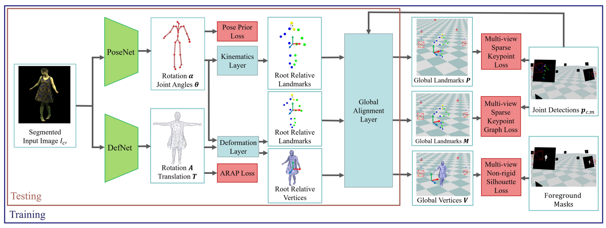

结构：PoseNet从单目图像通过连接角度的方式来估计骨架位姿；DefNet回归非刚性形变的密集变形

之后，又提出全可微人体变形和渲染模型。

训练：在绿幕下的多视图视频

测试：单RGB视频序列

### 模板和数据获取

#### 人物模型

我们的方法需要三维模板模型。

骨架模型：首先扫描获得贴图的网格模型，然后自动安装到27维关节、相机旋转和平移参数化的运动学的骨架上。

表面变形：建立一个有K个节点的嵌入式变形图G，通过K*3个欧拉角及其平移来参数化。我们将网格分成不同的非刚性等级，给每个顶点不同的刚性权重，用于不同的表面材料，比如说皮肤的形变就比衣服要小。

#### 训练数据

在绿幕下，用标定的多相机录制多种动作的视频。为了提供弱监督，我们首先使用OpenPose[8]执行二维姿态估计，再进行时序过滤。产生前景掩膜，并计算不同帧和不同相机的距离变换图像Dfc。最后的训练输入是随机采样的相机和帧的距离变换图像Df‘c’，去除了背景，用随机亮度强化了前景，因此对比度和饱和度都发生了变化。

### 位姿网络PoseNet

PoseNet使用在ImageNet上预训练的ResNet50作为backbone，并修改了最后的全连接层，来输出一个包含关节角度θ和相机根旋转α的向量。因为产生θ和α的ground truth是一个非平凡的任务（困难的任务），因此我们提出了基于拟合骨架到多视图二维关节检测的弱监督训练方法。

#### 运动学层

我们引入了运动学层作为可微的函数，包括关节角度、相机相对旋转，来计算附属在骨架上的三维路标的位置Pc'。为了把路标投影到其他的相机视角，因此要把Pc'转换到世界坐标中。

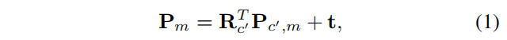

R是相机的旋转矩阵，t是骨架的全局平移

#### 全局对齐层

为了获得全局的平移t，我们提出一个全局对齐层依附在运动学层上。该层将我们的骨架定位在世界坐标下。通过投影到所有的相机视图下，最小化从相机原点到二维关节检测的仿射距离：

其中，dcm是从相机c到二维关节检测pcm的方向：

公式2的最小化问题可以近似为：

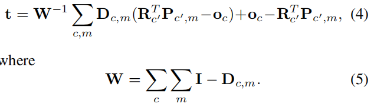

【没看懂怎么近似的？？？】

#### 稀疏关键点损失

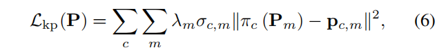

保证每个路标投影到所有相机视角对应的二维关节检测。其中λ是基于运动学链的分层权重。

#### 位姿先验损失

为了避免不自然的位姿，引入了关节角度的位姿先验损失：

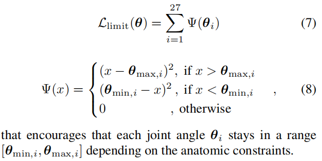

### 变形网络DefNet

只有骨架的位姿还不能完整地描述皮肤和衣服的非刚性形变，所以我们将非刚性形变和骨架运动分解开了。

DefNet的输入是分割出前景的Ic'，回归嵌入式变形图的节点的旋转角A和平移向量T，使用和PoseNet相同的backbone，但最后的全连接层输出6k维度的向量来匹配旋转角A和平移向量T的维度。在训练DefNet的时候也会更新PoseNet的权重。同样的，我们没有直接监督A和T，二是提出了可微渲染的变形层，和多视图基于轮廓的弱监督。

#### 变形层

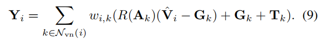

Y是变形的mesh顶点位置，V是非变形的mesh顶点位置。

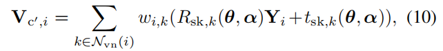

节点的旋转R和平移t最初来自于**对偶四元数**蒙皮的位姿参数。公式9和10都是关于位姿和图参数可微，所以可以融入到学习的网络，且梯度可以传播。其中Vc',i是相对与相机坐标系的，还要转换到世界坐标系，参考公式4。

#### 非刚性轮廓损失

这个损失函数鼓励非非刚性变形网格匹配到所有相机的多视图的形状：

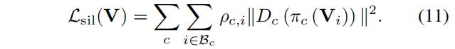

βc是边界顶点，Dc是距离变换图像，ρ是方向全中，表示Dc的梯度，这个损失函数保证边界顶点投影到距离变换的零集上。

#### 稀疏关键点图损失

只用轮廓损失函数可能会导致错误的mesh到image。特别是高清晰的运动。

和公式6有点像，但M来自嵌入的变形图。

#### 尽可能刚性损失

为了促进局部的表面平滑

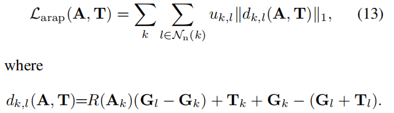

*N*n(*k*) 是节点k相邻节点的集合，uk,l是刚性权重因子，不同材料有不同刚性

### 自然场景领域调整

因为训练集是绿幕下的视频，测试集是自然场景的RGB图像，所以要进行调整。

## 实验

### 定量对比

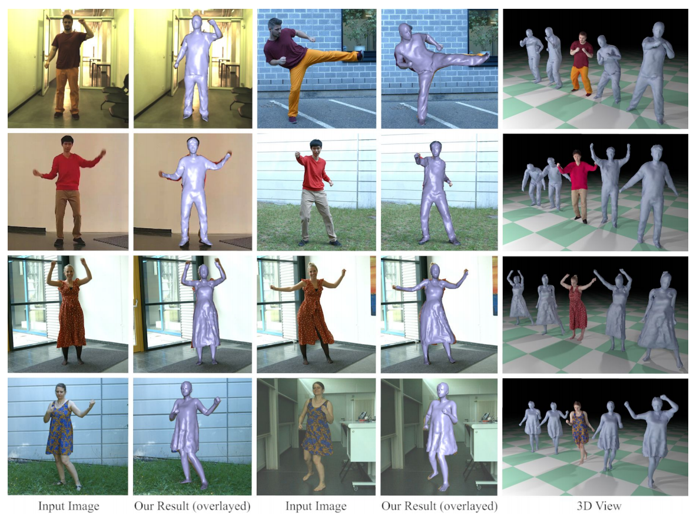

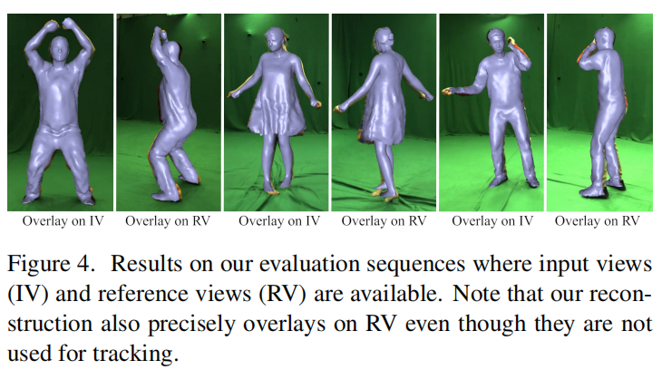

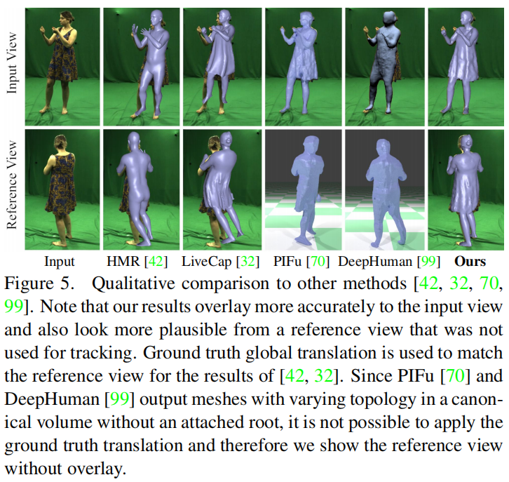

### 骨架位姿准确性

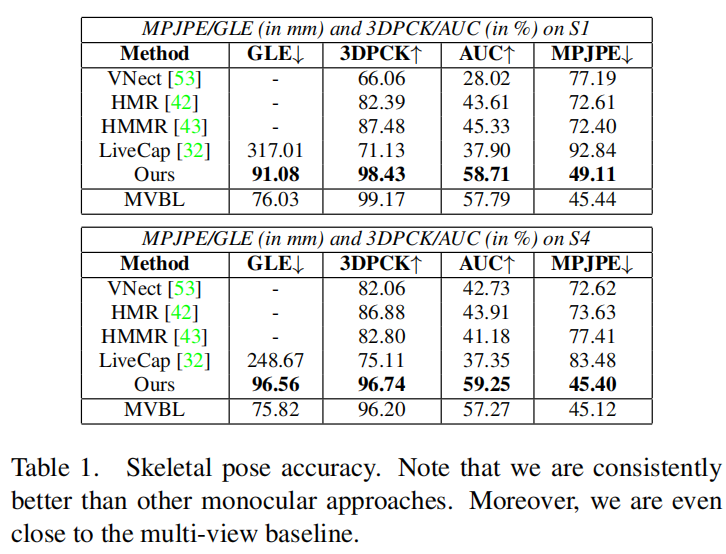

### 表面重建准确性

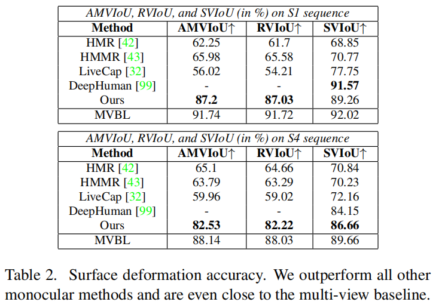

### 消融实验

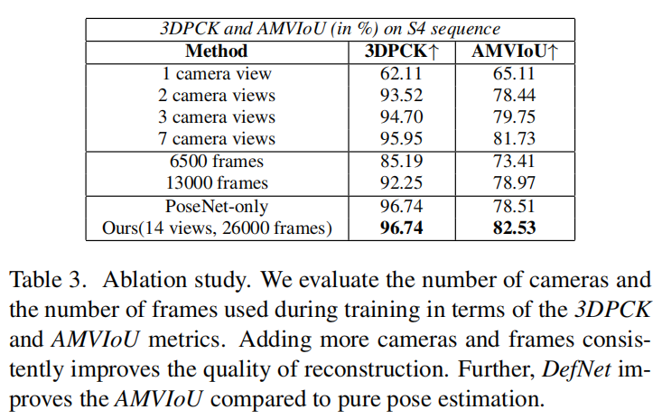

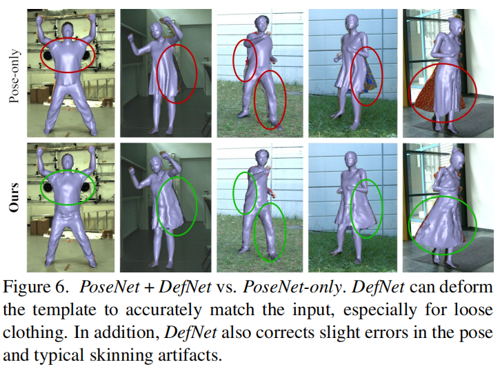

## 总结

- 融入手和脸的表达

- 加入更多正确的物理表达，使得重建更加真实

## 一些理解

### 关于弱监督

弱监督不是直接给到ground truth，而是利用一些约束，让网络能够正确学习，得到理想的输出。

## 参考文献

[1] V. Gabeur, J.-S. Franco, X. Martin, C. Schmid, and G. Rogez. Moulding humans: Non-parametric 3d human shape estimation from single images. In *Proceedings of the IEEE International Conference on Computer Vision*, pages 2232–2241, 2019. 

[2] Z. Zheng, T. Yu, Y. Wei, Q. Dai, and Y. Liu. Deephuman: 3d human reconstruction from a single image. *CoRR*, abs/1903.06473, 2019. 1, 2, 6, 7, 8

[3] S. Saito, Z. Huang, R. Natsume, S. Morishima, A. Kanazawa, and H. Li. Pifu: Pixel-aligned implicit function for high-resolution clothed human digitization. *CoRR*, abs/1905.05172, 2019. 1, 2, 6, 7, 8

[4] G. Pons-Moll, S. Pujades, S. Hu, and M. Black. ClothCap: Seamless 4D clothing capture and retargeting. *ACM Trans actions on Graphics, (Proc. SIGGRAPH)*, 36(4), 2017. 

[5] Y. Tao, Z. Zheng, Y. Zhong, J. Zhao, D. Quionhai, G. Pons Moll, and Y. Liu. Simulcap : Single-view human performance capture with cloth simulation. In *IEEE Conference on Computer Vision and Pattern Recognition (CVPR)*, jun 2019.

[6] Z. Zheng, T. Yu, H. Li, K. Guo, Q. Dai, L. Fang, and Y. Liu. HybridFusion: Real-Time Performance Capture Using a Single Depth Sensor and Sparse IMUs. In *Proceedings of*  the 15th European Conference on Computer Vision*, Munich, Germany, Sept. 2018. Computer Vision Foundation.

[7] Z. Zheng, T. Yu, Y. Wei, Q. Dai, and Y. Liu. Deephuman: 3d human reconstruction from a single image. *CoRR*, abs/1903.06473, 2019.

[8] Z. Cao, T. Simon, S.-E. Wei, and Y. Sheikh. Realtime multi-person 2d pose estimation using part affifinity fifields. In *CVPR*, 2017.

## 关键词

space-time coherent geometry - 时空几何一致性

weakly supervised manner- 弱监督方式

pose estimation - 位姿估计

non-rigid surface deformation - 非刚性表面变形

multi-view marker-less method - 多视图无标记方法

monocular human modeling approaches - 单目人体重建方法

articulated template - 关节模板

fully differentiable fashion - 全可微方法

differentiable representation - 可微表达

high dimensionality - 高纬度

ambiguity - 歧义

implicit reconstruction techniques - 隐式重建技术

uniform voxel grid - 均匀体素网格

coarse scale volumetric reconstruction - 粗尺度体积重建

refinement network - 细化网络

articulation - 铰接

foreground mask - 前景掩膜

color keying - 色键

distance transform image - 距离变换图像

kinematic chain-based hierarchical - 基于运动学链的分层结构

geodesic distances - 测地线距离

differentiable with respect to - 关于...可微

silhouette - 形状

zero-set of the distance transform - 距离变换的零集

off-the-shelf - 现成的

crop - 裁剪