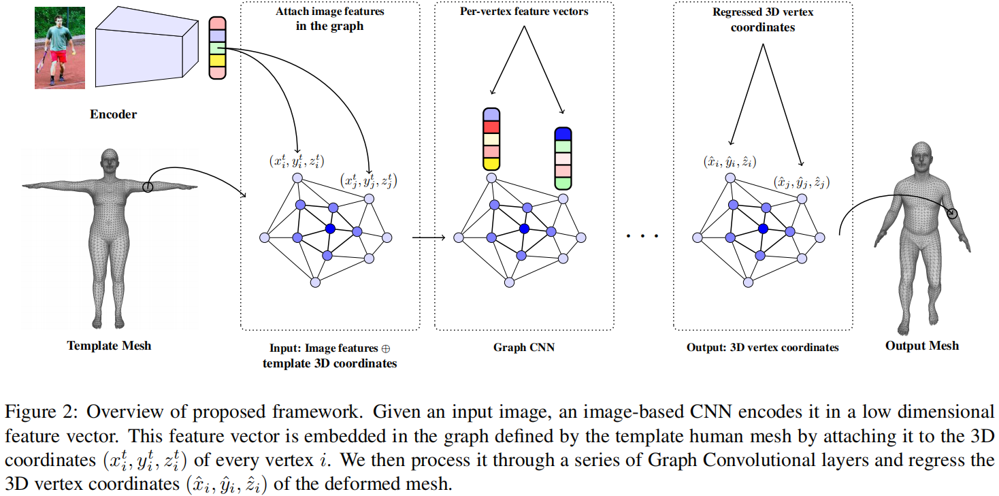
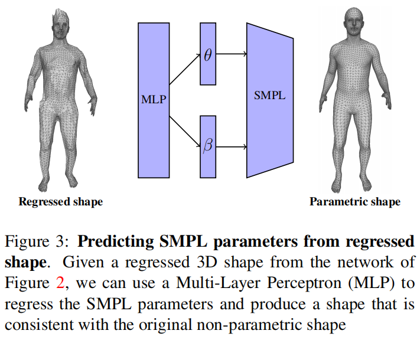
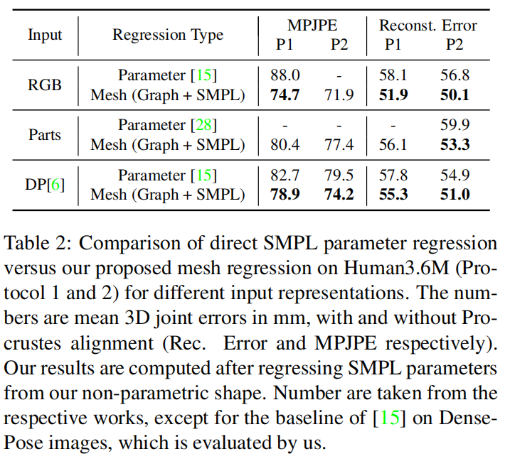

# Convolutional Mesh Regression for Single-Image Human Shape Reconstruction

[TOC]

## 摘要

针对单张图片的三维人体形体估计。GraphCMR提出减小对人体模型参数空间的依赖，保留SMPL模板的网格拓扑，但不预测人体模型参数，而是**直接回归网格的顶点**。使用GraphCNN能够简化该任务，图结构能够显示编码模板的网格结构并利用网格所提供的的空间局部信息。基于图像的特征附未回执加到网格顶点上，由GraphCNN来回归他们的网格结构，**目标是得到每个顶点的三维位置信息**。有了网格的三维几何结构后，如果还需要模型参数，可以使用网格顶点位置来回归得到。

## 贡献

- 避免直接回归SMPL模型参数的困难，GraphCMR回归网格顶点的三维位置
- 提出GraphCNN编码网格结构并卷积回归三维顶点位置
- 输入灵活性：RGB、人体语义解析、dense pose等输入

## 相关工作

### 基于Graph CNN

- Pixel2Mesh: Generating 3D mesh models from single rgb images. (ECCV 2018) 通过变形一个初始椭球体从图像中重建物体的网格。

- FeaStNet: Feature-steered graph convolutions for 3D shape analysis. (CVPR 2018) 提出了一种新的数据驱动图卷积算子。
- Deformable shape completion with graph convolutional autoencoders. (CVPR 2018) 使用图形VAE来学习人体形状的潜在空间，这对形状补全很有用。
- Generating 3D faces using convolutional mesh autoencoders. (ECCV 2018) 从一系列网格中恢复三维人脸的网格自动编码器网络的潜在表示

## 方法

### 框架

输入图像 - > Resnet50提特征（2048 D） - > GraphCNN（附加到每个顶点的三维坐标，初始化为模板网格） - > 图卷积层 - > 输出每个顶点位置

### GraphCNN算法

$$
Y=\tilde{A} X W
$$

$X \in \mathbb{R}^{N \times k}$是输入特征向量，$W \in \mathbb{R}^{k \times \ell}$是权重矩阵，$\tilde{A} \in \mathbb{R}^{N \times N}$是行归一化的邻接矩阵。相当于对每个顶点进行一个全连接操作后（$XW$），再进行领域平均操作（$\tilde{A} X$）

### 损失函数

- 3D顶点损失 - 预测顶点vertex和groundtruth的L1 loss：
  $$
  \mathcal{L}_{\text {shape }}=\sum_{i=1}^{N}\left\|\hat{Y}_{i}-Y_{i}\right\|_{1}
  $$

- 2D关节损失 - 投影关节projected joint locations（2维）和groundtruth keypoints：
  $$
  \mathcal{L}_{J}=\sum_{i=1}^{M}\left\|\hat{X}_{i}-X_{i}\right\|_{1}
  $$

- 总损失：
  $$
  \mathcal{L}=\mathcal{L}_{\text {shape }}+\mathcal{L}_{J}
  $$

### 用生成的shape来获取SMPL模型（参数θ和β）

- 损失函数：
  $$
  \mathcal{L}=\mathcal{L}_{\text {shape }}+\mathcal{L}_{J}+\mathcal{L}_{\theta}+\lambda \mathcal{L}_{\beta}
  $$

$\mathcal{L}_{\theta}$和$\mathcal{L}_{\beta}$是SMPL姿态和形状的参数的$\mathcal{L}_{2}$损失

！！用轴角表示三维旋转（姿态参数θ）容易出错，这里将轴角表示转换为旋转矩阵的表示

## 实验

## 专业词汇

mesh consistent - 网格一致性

三维旋转的表示：

- axis angle：轴角
- rotation matrices：旋转矩阵
- quaternions：四元数

local minima：局部最小

differentiable SVD：