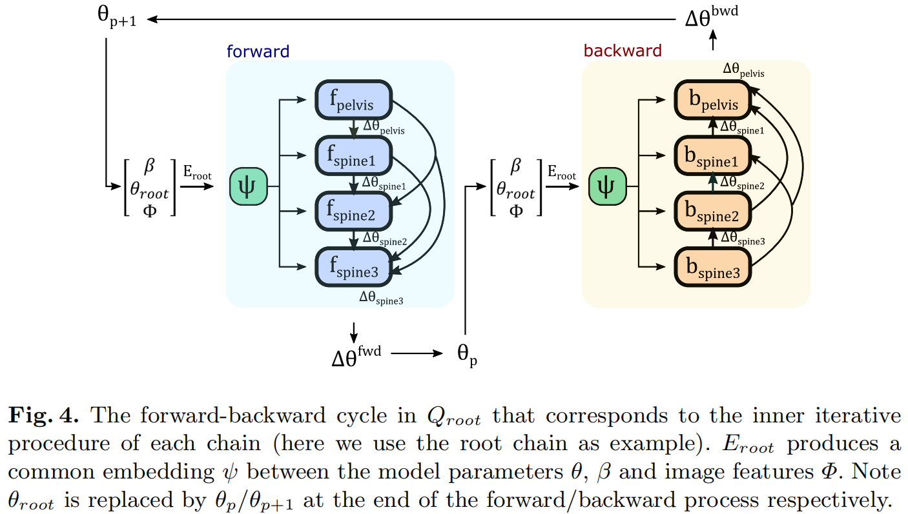
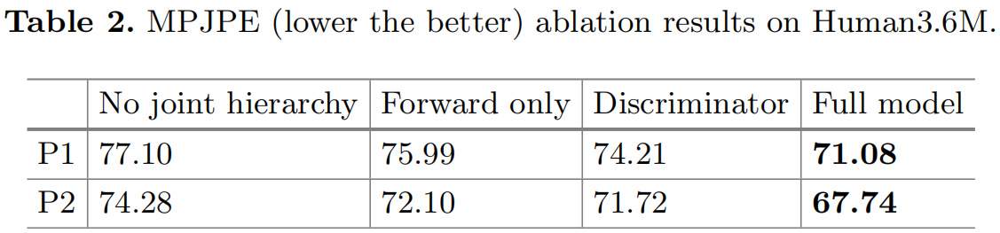

# Hierarchical Kinematic Human Mesh Recovery

> ICCV 2020
>
> Cambridge | United Imaging Intelligence

[TOC]

## 摘要

本文对单张图像估计参数化的三维人体网格。目前的方法只隐式地探索了人体运动学结构，导致模型先验的次优使用。我们提出了一个显式利用已知层次结构（包括关节相互依赖关系）的方法来回归人体参数模型。给回归架构带来了强大的先验设计和相关的层次优化，该有化可以灵活地与当前三维人体网格重建的标准框架一起使用。我们的方法甚至可以在数据遮挡的情况下估计关节，并通过实验证明了这一点。

## 引言

### 基本架构

人体姿态和形体重建HMR设计一个**编码器-回归器架构**，其中CNN的编码器用来提取输入图像的特征，回归器用来产生模型参数。

SPIN将其扩展到了**编码器-回归器-优化器框架**，通过引入一个循环优化步骤。将回归器的输出作为迭代优化的起点，来产生更准确的模型估计。

回归器构成了这两种方法的核心，回归器通常是一组具有非线性激活单元的**全连接层**，以特征向量作为输入，产生形状和旋转（姿态）参数向量输出。

### 挑战

直接回归旋转参数是一个很大的挑战，而人体关节的多次旋转及其之间的依赖关系加剧了难度。

在我们的工作中，我们试图**拟合模型的底层几何结构**，可以改进回归器的性能。

同时在遮挡的情况下，直观的结构信息（比如一个关节依赖或者连接到另一个关节）能够帮助推断被遮挡关节的参数。

我们的架构称为HKMR，结合了关联的多层次优化技术，并利用了SMPL的结构信息。HKMR定义了六条链，一个根链和五个依赖的子链：头，左右手臂，左右腿。

每个非根链的预测都基于根链的输出，因此形成了一组分层嵌套的操作来建模HKMR。此外，这种回归变量对数据损坏的情况下的参数推理特别有利。我们的方法可以很灵活地应用到**编码器-回归器**范式和**编码器-回归器-优化器**范式。

### 贡献

- 我们提出了HKMR（分层运动学网格重建），可以添加到**编码器-回归器**范式和**编码器-回归器-优化器**范式。

- 我们的创新点是显式利用了人体模型的结构约束，设计了参数回归器。
- 我们在**编码器-回归器**范式和**编码器-回归器-优化器**范式上，都提升了性能。
- 验证了HKMR在遮挡情况下的鲁棒性。

## 方法

### 框架

我们的架构由一个编码器（生成特征）和一个回归器（显式建模多层运动学依赖）。以躯干为根，其他链（四肢）分层以来于根链。旋转（姿态）参数是六条链估计参数的concatenation，形状参数是通过姿态参数更新的。t是迭代次数，共迭代T次。

涉及到所有链的处理称为**外迭代**。此外，每条链还有自己的**内迭代**。

### 内迭代

每条链有自己的内迭代过程

- 输入：上一次迭代中（t-1）估计的姿态参数和形状参数，图像特征
- 输出：当前迭代（t）的姿态参数

#### 逆运动学

正运动学是根据姿态参数求关节位置，$\boldsymbol{e}=g(\boldsymbol{\theta})$。

逆运动学是根据关节位置求姿态参数，$\boldsymbol{\theta}=g^{-1}(\boldsymbol{e})$。

通过泰勒级数展开，可以获得关节位置变化与参数变化的关系是：$\Delta e=\boldsymbol{J} \Delta \theta$。

而我们关注的是姿态参数变化与关节位置变化的关系，利用伪逆雅克比矩阵来估计姿态参数的残差：$\Delta \theta=\boldsymbol{J}^{+} \Delta \boldsymbol{e}$。

而**姿态参数的更新公式为**：$\boldsymbol{\theta} \leftarrow \boldsymbol{\theta}+\alpha \Delta \boldsymbol{\theta}$。

这个更新操作在内迭代中重复进行，直到达到目标关节的标准位置，用三维关节GT进行监督。

如图，利用输入的上一次迭代的姿态、形状参数和图像特征，我们首先学习一个低维特征$\boldsymbol{\psi} \in \mathbb{R}^{d}$。我们的想法是当前关节角度的预测会影响该链中后续关节角度的预测，因此从该链的起始关节开始，进行前向传递的优化。然后把预测的特征和旋转角度残差concat到一起：
$$
\Delta \boldsymbol{\theta}_{i, p}^{\mathrm{fwd}}=f_{i}\left(\left[\boldsymbol{\psi}, \Delta \boldsymbol{\theta}_{i-1, p}, \Delta \boldsymbol{\theta}_{i-2, p}, \cdots, \Delta \boldsymbol{\theta}_{0, p}\right]\right)
$$
其中，$f_{i}$是关节$i$的全连接层，输出三个实数。后续关节旋转参数的预测依赖于之前关节旋转参数的预测。当这条链上所有关节的旋转参数残差都预测好后，旋转参数的更新如下：$\boldsymbol{\theta}_{i, p}=\boldsymbol{\theta}_{i, p-1}+\Delta \boldsymbol{\theta}_{i, p}^{\mathrm{fwd}}$

同时，因为这些关节会受到下一个关节和前一个关节的影响，因此在上面的正向更新之后，我们又接上了反向更新：
$$
\Delta \boldsymbol{\theta}_{i, p+1}^{\mathrm{bwd}}=b_{i}\left(\left[\boldsymbol{\psi}, \Delta \boldsymbol{\theta}_{i-1, p+1}, \Delta \boldsymbol{\theta}_{i-2, p+1}, \cdots, \Delta \boldsymbol{\theta}_{0, p+1}\right]\right)
$$
其中，$b_{i}$是关节$i$的全连接层，输出三个实数。当这条链上关节的反向旋转参数残差都预测好之后，更新旋转参数：$\boldsymbol{\theta}_{i, p+1}=\boldsymbol{\theta}_{i, p}+\Delta \boldsymbol{\theta}_{i, p+1}^{\mathrm{bwd}}$。

以上的就是内迭代过程，重复多次。

### 层次优化

我们将躯干设置为根链，四肢设置为子链，这个层次结构的目的是利用根链的预测来影响其余链。实现方式是，使用预测的根链旋转参数作为子链网络的输入。

#### 根链

- 输入：上一次迭代的形状参数、上一次迭代的根链旋转参数和图像特征
- 输出：当前迭代的根链的旋转参数

#### 子链

- 输入：上一次迭代的形状参数、上一次迭代的该子链的旋转参数、图像特征和当前迭代的根链的旋转参数。
- 输出：当前迭代的子链的旋转参数

#### 形状参数

在所有六条链完成内迭代过程后，进行形状参数的重预测。

- 输入：上一次迭代的形状参数、当前外迭代得到的旋转参数和图像特征。
- 输出：当前迭代的形状参数

### 相机参数估计

为了充分利用二维关节标签，我们定义了一个相机参数网络，类似于HMR中使用的方法。因此，可以利用相机参数从三维关节位置得到二维关节位置：$\hat{\boldsymbol{x}}^{t}=s \Pi\left(\hat{\boldsymbol{X}}^{t}\right)+\boldsymbol{\rho}^{t}$

### 姿态先验

按照Expressive Body Capture的方法，设计了一个VAE来学习合理的人体姿态。

### 损失函数

$$
L=\sum_{t=1}^{T} \lambda_{\mathrm{smpl}} L_{\mathrm{smpl}}^{t}+\lambda_{3 \mathrm{D}} L_{3 \mathrm{D}}^{t}+\lambda_{2 \mathrm{D}} L_{2 \mathrm{D}}^{t}+\lambda_{\mathrm{KL}} L_{\mathrm{KL}}^{t}
$$

## 实验

### 遮挡实验

生成多个遮挡图像（定向条形、圆形、矩形），这些遮挡图像只在测试集上使用，未在训练集上使用。

### 定量实验

#### Baseline对比

#### 遮挡鲁棒性对比

### 消融实验

#### 分析每个模块

#### 分析迭代次数

### 与HMR及SPIN的对比

## 专业词汇

- joint interdependencies  - 关节相互依赖关系
- as one can note - 我们可以注意到
- torso - 躯干
-  inverse kinematics - 逆运动学
