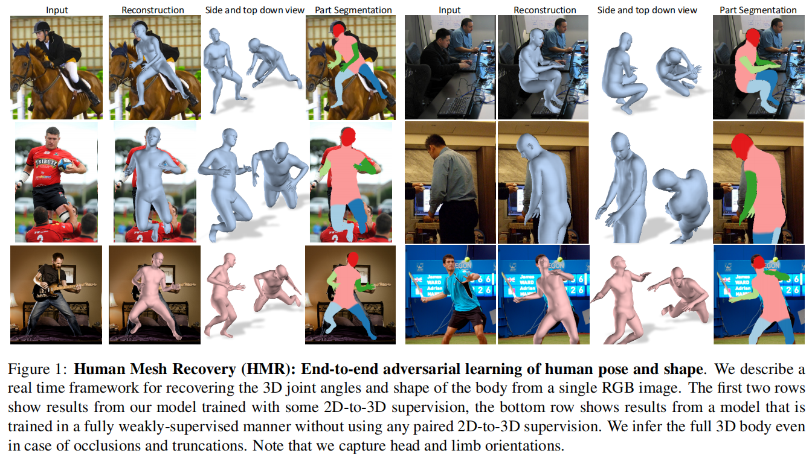
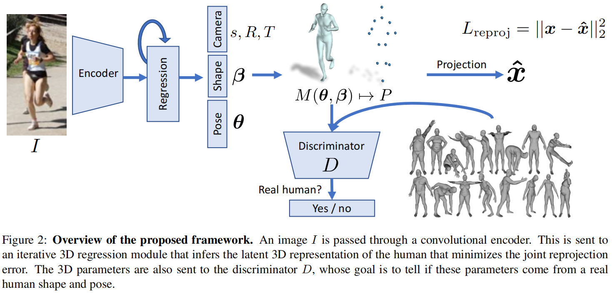
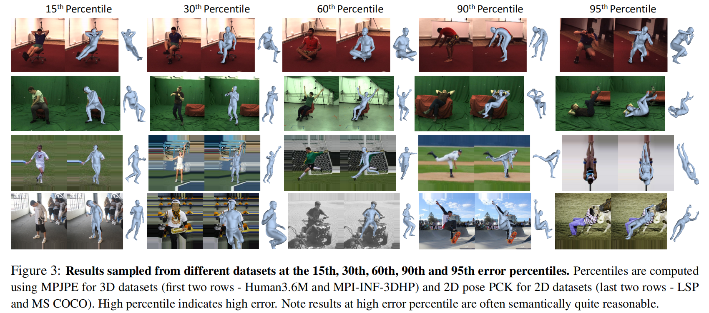
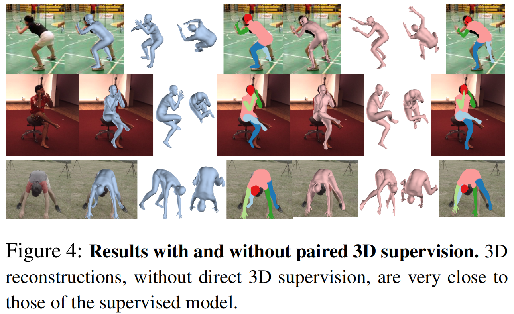
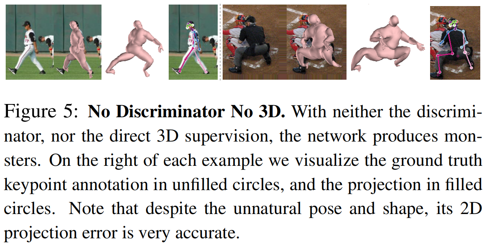

# End-to-end Recovery of Human Shape and Pose

[TOC]

## 摘要

针对单张图片的三维人体形体估计。HMR使用了一个参数化的形状和关节角度，主要的目标是**最小化关节点重投影损失**，因此能够使用in-the-wild的二维图像来训练。但只使用重投影误差的约束过小，因此我们引入**对抗训练**，来区分重建的形体是真实的还是假的。HMR可以不使用任何2D-3D对的监督。我们不使用中间的2D关节点检测，直接从图像中推理3D姿态和形状参数。

## 引言

### 优势

- 3D mesh estimating相比骨架有广泛的应用前景，比如前景分割、人体解析
- 输出的mesh可以直接应用到动画animators、修改modifified、测量measured、操纵manipulated和重定位retargeted
- 单独的关节位置并不包含关节的自由度，因此根据关节位置估计人体的全姿态很困难。相反，我们在运动学树中输出每个关节的相对旋转矩阵，捕获关于头部和肢体方向的信息。

### 挑战

- 目前带有3D标注的数据集都是在严格的条件下采集的，训练后的模型在真实图像下表现不佳
- 2D-3D固有的歧义性，比如深度歧义，不同的3D姿态有同样的2D投影
- 回归旋转矩阵有难度

### 创新点

- 直接推理3D网格参数，而之前的方法要先推理出2D关节点。避免了二阶段训练，也避免重要信息的丢弃，比如背景信息context
- 超越骨架，输出网格，更复杂也更适合更多的应用，但并没有增加额外的推理过程
- 端到端训练，在3D关节误差和运行时间上优于其他的方法
- 展示了有无2D-3D数据监督的结果。在无2D-3D监督下，我们的方法也能产生合理的3D重建，说明可以从大量的2D数据中学习3D的重建

## 相关工作

### 3D pose estimation

有两类方法，一类是two-stage：先预测2D关节位置，再预测3D关节位置；另一类是直接预测3D关节位置。

许多方法对**肢体长度或是比例**做出了一些假设。

## 方法

我们以前馈的方式提出了一个从单张RGB图像直接重建完整3D人体网格的方法。网络框架如图2所示：

- Encoder：CNN提取图像特征
- Regression：图像特征送入iterative 3D regression模块，获得人体形态参数和相机参数
- Reprojection loss：将3D关节投影到2D关节，计算重投影误差
- Discrimination：人体形态参数同时也送到鉴别器，来鉴别这个3D参数是否来自真实的网格

### SMPL

- 参数：

  - pose：$\boldsymbol{\theta} \in \mathbb{R}^{3 K}$，K=23各关节的相对三维旋转，使用轴角表示

  - shape：$\boldsymbol{\beta} \in \mathbb{R}^{10}$，形状空间前十的系数

- mesh：

  - 顶点：$N=6980$
  - 网格：$M(\boldsymbol{\theta}, \boldsymbol{\beta}) \in \mathbb{R}^{3 \times N}$
  - 以$\beta$和$\theta$为条件构造模板顶点，然后通过正向运动学根据关节旋转$\theta$连接骨骼，最后用线性混合蒙皮linear blend skinning使表面变形

- 3D关节：$X(\boldsymbol{\theta}, \boldsymbol{\beta}) \in \mathbb{R}^{3 \times P}$通过网格顶点的线性回归获得，它的2D投影关节：

  - $$
    \hat{\mathbf{x}}=s \Pi(R X(\boldsymbol{\theta}, \boldsymbol{\beta}))+t
    $$

  - π是正交投影

### 迭代误差反馈回归

一次就回归出模型参数比较困难，尤其是旋转参数，因此使用迭代误差反馈回归参数的方法。

- 输入：图像特征 + 当前参数$\Theta_{t}$
- 输出：残差$\Delta \Theta_{t}$

- 更新：$\Theta_{t+1}=\Theta_{t}+\Delta \Theta_{t}$
- 初始$\Theta_{0}$是平均值

### 损失函数

- 总损失：
  $$
  L=\lambda\left(L_{\text {reproj }}+\mathbb{1} L_{3 \mathrm{D}}\right)+L_{\mathrm{adv}}
  $$

- 重投影损失：
  $$
  L_{\mathrm{reproj}}=\Sigma_{i}\left\|v_{i}\left(\mathbf{x}_{i}-\hat{\mathbf{x}}_{i}\right)\right\|_{1}
  $$

- 3D losses：
  $$
  \begin{aligned}
  L_{3 \mathrm{D}} &=L_{3 \mathrm{D} \text { joints }}+L_{3 \mathrm{D} \text { smpl }} \\
  L_{\text {joints }} &=\left\|\left(\mathbf{X}_{\mathbf{i}}-\hat{\mathbf{X}}_{\mathbf{i}}\right)\right\|_{2}^{2} \\
  L_{\mathrm{smpl}} &=\left\|\left[\boldsymbol{\beta}_{i}, \boldsymbol{\theta}_{i}\right]-\left[\hat{\boldsymbol{\beta}}_{i}, \hat{\boldsymbol{\theta}}_{i}\right]\right\|_{2}^{2}
  \end{aligned}
  $$

- 对抗损失：

  - 编码器目标：

  $$
  \min L_{\mathrm{adv}}(E)=\sum_{i} \mathbb{E}_{\Theta \sim p_{E}}\left[\left(D_{i}(E(I))-1\right)^{2}\right]
  $$

  - 鉴别器目标：

  $$
  \min L\left(D_{i}\right)=\mathbb{E}_{\Theta \sim p_{\text {data }}}\left[\left(D_{i}(\Theta)-1\right)^{2}\right]+\mathbb{E}_{\Theta \sim p_{E}}\left[D_{i}(E(I))^{2}\right]
  $$

因为在迭代的过程中直接使用最终目标会使模型进入局部最优值，因此迭代过程中只使用对抗损失，保证网络向正确的方向回归。只在最后估计$\Theta_{T}$的时候使用$L_{\text {reproj }}$ 和 $L_{3 \mathrm{D}}$

## 实验

## 专业词汇

underconstrained - 约束过少的

occlusion - 遮挡

truncation - 截断

scale ambiguity - 尺度模糊

3D interpreter networks - 三维解释网络

linear blend skinning - 线性混合蒙皮

weak-perspective - 弱透视投影