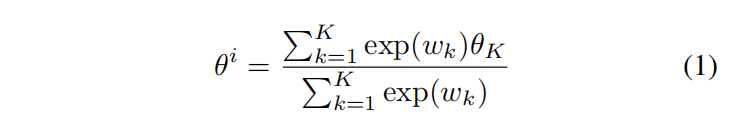
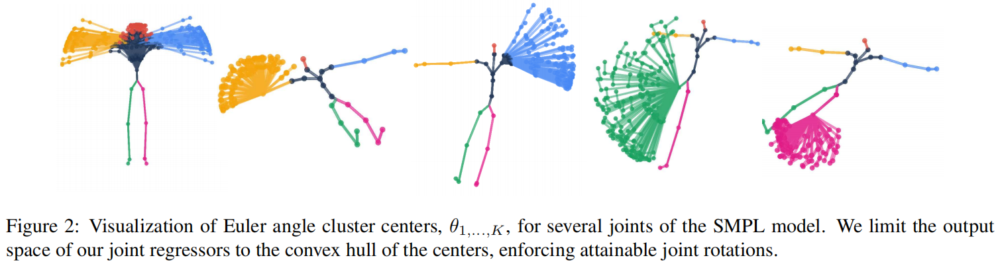
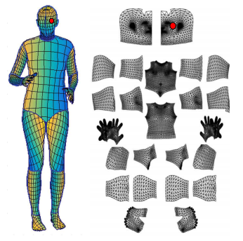
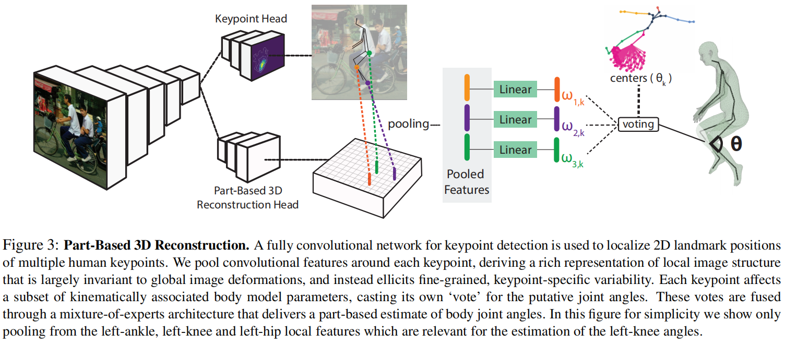
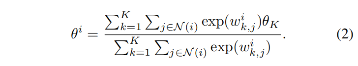
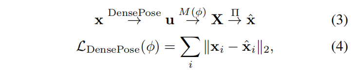
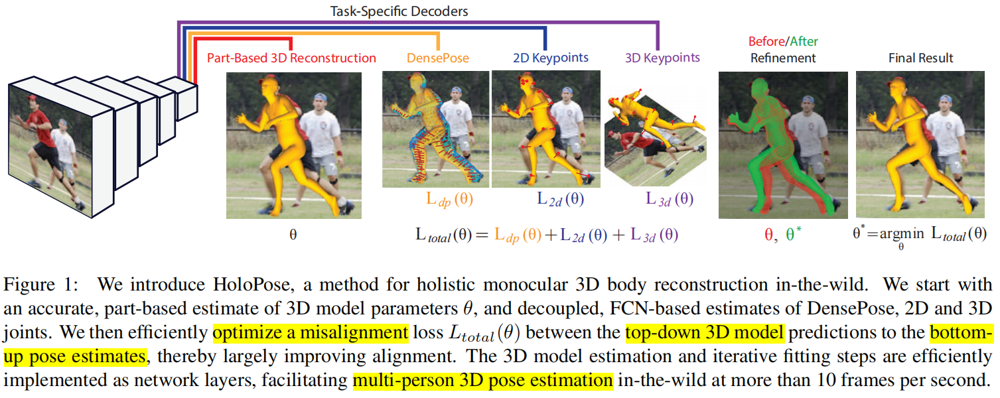
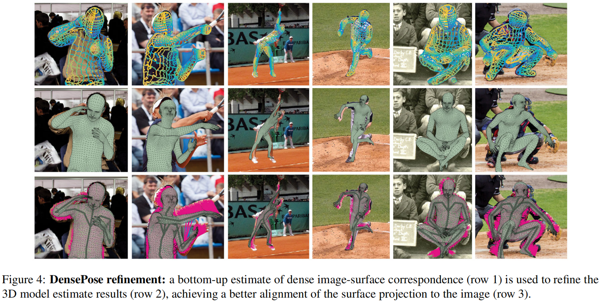
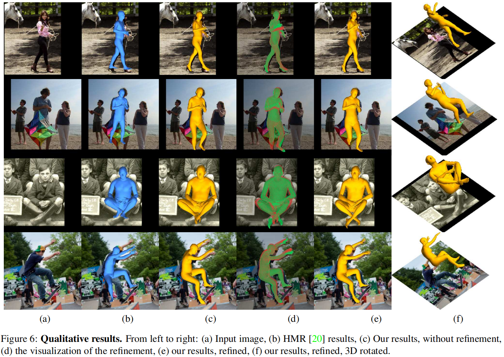
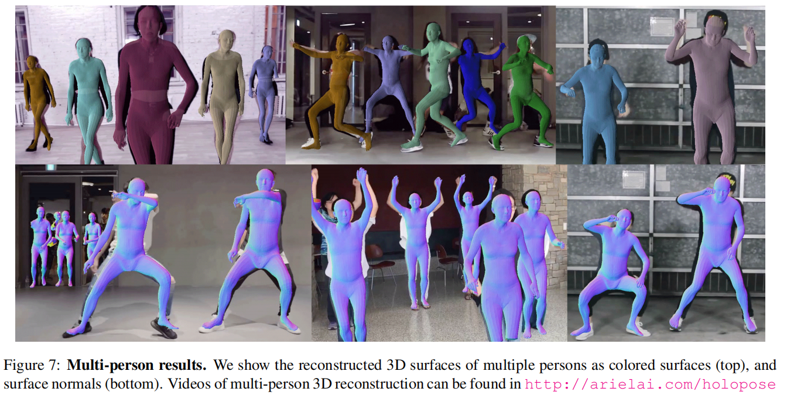

# HoloPose: Holistic 3D Human Reconstruction In-The-Wild

> CVPR 2019
>
> Ariel AI

[TOC]

## 摘要

HoloPose是一个**整体单目三维人体重建**方法。我们首先引入了一个**基于部分的参数回归模型**，能够处理**严重遮挡**和**较大的姿态变化**。我们进一步训练一个**多任务网络**，包括二维、三维和密集姿态估计来驱动三维重建。为此，我们引入一个**迭代优化**的方法，对齐二维/三维关节位置和DensePose，实现全局一致性和较高的空间精度。

## 引言

人体三维重建的方法：基于部分的表征、基于采样的推理、时空推理、自底向上/自上而下的计算。最后，最近对密集姿态估计Dense Pose的研究表明，通过训练一个通用的、自下而上的检测系统，将图像像素与表面级UV坐标关联起来，可以估计RGB图像和体表面之间的密集对应关系。尽管DensePose建立了图像和表面之间的直接联系，但它并没有揭示特定场景的三维几何形状。

我们将这些线程整合到一个框架中，结合不同方法的优点。

## 贡献

- 引入了一个基于部分的参数回归框架，我们的基于部分的回归器池化二维关节点附近的图像特征，来提取精细的局部的特征。这些特征在很大程度上是不变的，同时能够跟踪关节点的存在或者不存在。
- 利用DensePose和三维关节点估计来提高三维重建的精度。首先，我们引入重投影误差来促进多任务的训练。然后，我们分别预测DensePose和二维/三维关节点来细化从上而下的基于模型的三维重建。
- 为了使我们的人体模型更好地和通用卷积层兼容，我们还引入了两个简化建模的技术。首先，我们引入了一个**专家混合回归层（Mixture-of-Experts Regression Layer）**，来限制关节角度的空间。其次，我们对每个部分引入了一个统一的UV空间的笛卡尔系，有效地实现网格级操作，从而实现一个简单而快速的基于GPU的精细化过程。

## 方法

### 1. 专家混合旋转先验（Mixture-of-Experts Rotation Prior）

关节角的范围收到人体力学的限制，这个约束可以用来提高关节角度估计的准确性。受启发于使用分类作为旋转估计的方法——与估计欧拉角不同，他们将旋转估计视为一个分类问题，其中的类对应于不相交的角度范围。因为CNN能够利用回归中的分类来提高回归的精确性。

我们首先使用关节角度的数据来覆盖可能的关节角的空间。利用欧拉角来表示关节旋转，并计算了旋转聚类。我们的方法能够利用这些聚类中的凸包通过softmax加权，来预测任意一个旋转。

下图估计了部分关节合理的角度分布：

### 2. 笛卡尔曲面参数化

人体表面是一个连续的结构，而我们使用三角网格进行离散化。这意味着，如果要将一对连续的UV坐标和网格属性（比如网格顶点位置）关联起来，需要首先识别包含UV坐标的面，然后找到面的顶点，并使用点的质心来插值，这个方法的效率不高。

我们发现用**局部笛卡尔坐标系**再参数化人体表面是有利的。

- 为了执行这种再参数化，我们首先执行**多维尺度化**：将模型表面的各个部分平化为二维，然后均匀地对这些部分进行采样。

- 具体来说，将人体的24个部分使用32×32×3的网格（如下图），在网格上对模型特征形状进行采样，并用所得到的张量来表示形状合成方程，

  

- 我们进一步识别出不对应网格顶点的UV部分，并忽略其中的UV点。

### 3. 基于部分模型的三维人体重建

现有的基于模型的单目三维重建方法通过目标的bbox提取的CNN特征应用单个线性层来估计SMPL参数。**这样的系统容易受到特征变化的挑战，比如遮挡、旋转或者bbox失调引起的全局平移**。

我们通过**提取关节点附近的局部特征**来解决这个问题，我们**提取特征的位置与关节的位置共同变化**。因此这些特征具有平移不变性，并关注到局部特征，从而更好地揭示局部3D几何。

如图3所示，将**反卷积网络**的结果作为提取的特征，并对可见的关节周围的特征通过**双线性插值**进行**池化**。关节位置由一个独立的经过训练的网络分支获得。提取完每个关节周围的特征后，原则上，能够单独回归得到整个模型的参数，但是直觉上，**二维关节点应该对与其更相关的模型参数有更大的影响**，比如左手腕和左手臂。由于可能存在关节的缺失，我们不能简单地把特征concat到一个大的特征向量中，需要一种形式来适应潜在的缺失。

我们将这些需求融入到公式（1）的变体中，其中我们池化关节点 $i$ 的邻接点。

其中关节的邻接关系是线下构建的，基于运动学树的依赖，通过检查哪些模型参数直接影响人体二维关节。

通过取二维关节模块的最大值，可以在图像中找到关节。如果这个最大值小于阈值，那么认为这个关节未被观察到。在这种情况下，对应的每个和都被排除，因此公式（2）仍然有效，如果所有关节都缺失，那么将姿态参数设置为**静息姿态**。

### 4. 整体三维人体重建

所描述的网络提供了对人体三维表面“自下而上”的估计，通过全卷积网络的前向传播能够获得2D关键点、3D关节或者DensePose。他们提供了人体姿势的互补信息。基于模型的估计是一个紧凑的、可控的水密网格表征，必然会符合一个合理的人体姿态。但对于全卷积网络的估计通常不是这样的，因为它的前馈结构很难增加横向约束。同时，全卷积网络会对每个图像patch进行香精的检查和打分，使得能够精确地定位图像中的人体结构。相比之下，基于模型的评估可能会严重偏离，比如在运动学树的开始有一些错误计算的角度。

- 受这种互补性的激励，我们转向开发一个整体的姿态估计系统。首先，拥有一个**三维表面**使得我们可以用一种可微的方式估计**3D关节位置和它的2D投影，以及密集的表面到图像的对应**。因此，可以使用任一额外的姿态信息来构造一个损失函数，来评价表面估计的质量。我们使用多个姿态估计线索来监督三维重建任务，现在将**DensePose**也作为一个新的监督信号。

- 我们还引入了一个**细化过程**，**通过迭代的方法迫使基于模型的三维几何与FCN的预测相一致**。这在测试的时候也很有效，其中基于FCN的姿态估计驱使基于模型的预测和图像线索对齐。

为了实现这两个目标，我们利用了几何性质，并构建了一个是损失函数，来惩罚**基于模型的预测**和**由互补线索获得的姿态信息**的偏差。

#### DensePose与基于模型的回归

DensePose将图像位置$\mathbf{x}=\left(x_{1}, x_{2}\right)$和表面坐标$\mathbf{u}=\left(u_{1}, u_{2}\right)$关联起来，然后利用模型参数，将u向量关联到3D坐标$\mathbf{X}(\phi)=M(\phi, \mathbf{u})$。然后将每个三维点投影到2D上$\hat{\mathbf{x}}(\phi)=\left(\hat{x}_{1}, \hat{x}_{2}\right)$。

公式（4）有两个作用：

- 监督网络的训练：其中DensePose代表Dense Pose GT，模型参数 $\phi$ 由公式（2）的投票得到，这可以使得网络服从DensePose的监督，补偿缺乏的3D监督。
- 测试时使用：迫使FCN的估计和基于模型的估计相互耦合。我们将基于CNN的估计作为迭代优化的初始化，并用几何损失之和驱动迭代过程。

此外，为了解决不合理的形状，我们用一个损失来限制预测的 $\beta$ 值的大小：$\mathcal{L}_{\text {beta } a}=\sum_{i} \max \left(0, b-\left|\beta_{i}\right|\right)$

# 实验

## 专业词汇

- contour - 轮廓
- seminal work - 开创性工作
- convex hull - 凸包
-  barycentric - 质心
-  bilinear interpolation - 双线性插值 
- intuitively - 直觉地
- resting pose - 静息姿态
- complementary - 互补的
- compact - 紧凑的
- refinement process - 细化过程
- bound the magnitude - 限制大小
-  Conjugate Gradients - 共轭梯度
- holistic - 全局的
- synergistic refinement - 协同细化
-  perspective projection - 透视投影
- surface normal - 表面法向量
- contour - 轮廓
