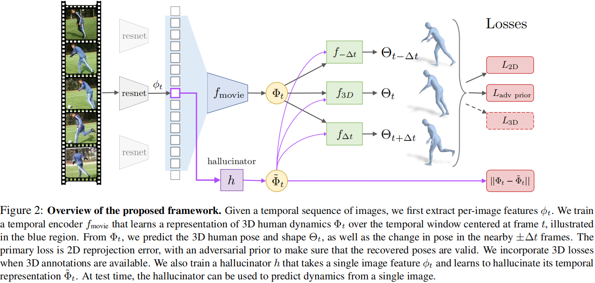
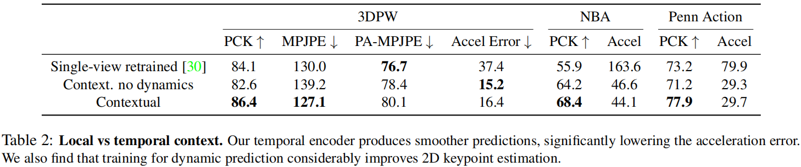
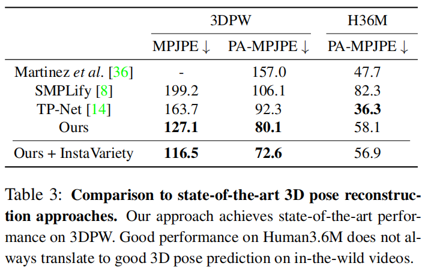
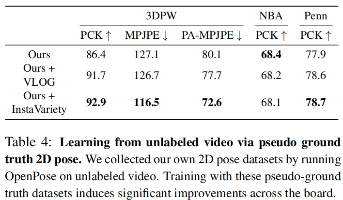
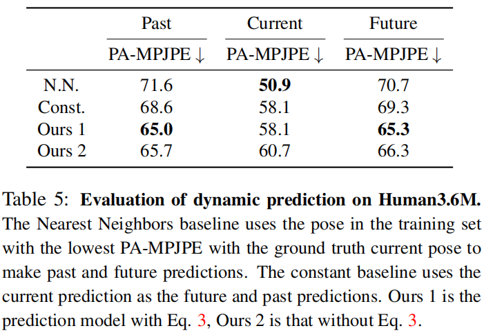
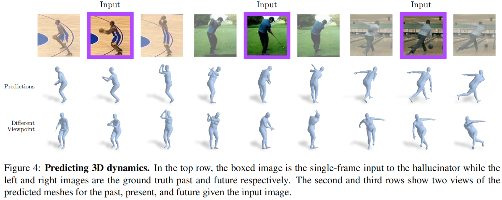

# Learning 3D Human Dynamics from Video

> CVPR 2019
>
> University of California, Berkeley

[TOC]

## 摘要

这篇文章提出了一个从视频中重建三维人体网格。使用半监督的方法，用无标签的视频和现成的2D姿态检测器生成的伪标签来训练模型，没有用到三维的监督。实验表明，使用越多的从2D检测器获得伪标签的视频能够提高3D预测性能。

## 引言

输入一个视频（时序的图像序列），首先提取每个**图像的特征**，然后训练一个简单的**一维时序编码器**来学习3D人体动态的表征。通过预测**当前帧**的姿态和形状，和**相邻过去帧和未来帧**的姿态变化，使得这个表征捕获3D人体动态。我们通过一个转换器将学到的动态先验转换到静态图像上，可以从单一图像特征获得时序文本表征（ps：从单一图像获得动态信息）。

时序编码器中的时序文本能够缓解单视角方法预测结果的**不确定性和抖动**。

### video-based的3D人体重建的挑战

- 3D监督有限并且难以获取
- 在受控环境下获得的数据集，模型训练后难以泛化到真实场景中。
- 带2D pose标签的视频数据也难以获取

于是我们使用现成的2D pose检测器来生成视频的pose伪真值，对3D重建结果进行监督。并证明，使用越多的这样的数据，能够同时提高3D和2D模型的性能。

### 贡献

- 我们提出了一个简单但有效的时间编码器，以学习捕获3D人类动态。
- 学习到的表征能够预测的平滑三维网格。学习到的表征可以转移到静态图像中，从单个图像中，我们可以预测当前帧的三维网格以及附近帧中三维姿态的变化。
- 我们进一步表明，我们的模型可以利用互联网中未标记视频源和伪真值的2D姿态进行学习。

## 相关工作

姿态估计和重建中可用的cues：RGB image、RGB images & 2D keypoints、keypoints & silhouettes、 keypoints & body part segmentations、光流。

使用轮廓可以获得更精确的形状，但是需要人在图像中是完全可见的。

使用光流可以获得pose的时序相关性。

文献表明，前馈卷积模型在实验上优于循环模型，同时具有可并行性，更容易用稳定的梯度进行训练。

## 方法

### 损失函数：

$$
L_{t}=L_{2 \mathrm{D}}+L_{3 \mathrm{D}}+L_{\text {adv prior }}+L_{\beta \text { prior }}
$$

包括2D重投影损失、3D SMPL参数损失、对抗损失和形状先验损失（限制与模板形状不能差别太大）

因为每个序列都是同一个人，即使每一帧的姿态和相机参数会有变化，但是形状应该是保持一致的。因此额外引入了每个序列的形状损失：
$$
L_{\text {const shape }}=\sum_{t=1}^{T-1}\left\|\beta_{t}-\beta_{t+1}\right\|
$$
【PS：这个约束力度不够，还有一些近大远小的变化、相邻多帧的形状没有约束】

### 预测动态

通过预测相邻前后帧的3D pose变化。因为在视频中同一个人的形状应该是不变的，且弱视角相机解释了人在bbox的位置，所以我们只预测了姿态的变化。为了提高鲁棒性，我们在尺度和平移上加上了随机抖动，来增强图像，以模拟真实人体检测器中的噪声。然而这种噪声不应该被动态预测器建模。

因此，我们设计了一个输出72维姿态变化的预测器，将特征和当前姿态映射到相邻帧的姿态变化上，$\theta_{t+\Delta t}=\theta_{t}+\Delta \theta$，用来最小化重投影误差、3D误差和对抗误差。

因为在动态的预测中，只预测了姿态变化值，没有预测相机参数，因此我们优化正交投影的尺度和平移。通过对齐正交投影的预测的3D关节和ground truth

的2D关节，$x_{g t}: \min _{s, \vec{t}}\left\|\left(s x_{\text {orth }}+\vec{t}\right)-x_{g t}\right\|_{2}$。

## 实验

## 专业词汇

- uncertainty - 不确定性
- jitter - 抖动
- potentially - 潜在地
- pseudo ground truth - 伪真值
- distill - 提取，蒸馏
- seminal works - 开创性工作

## 讨论

- 关于时序平滑性的损失可以重新设计，目前的损失函数是相邻帧的形状参数：

$$
L_{\text {const shape }}=\sum_{t=1}^{T-1}\left\|\beta_{t}-\beta_{t+1}\right\|
$$

- 高歧义姿态

  弓背和拱背是一对很有歧义的姿态，容易出错

- 基于视频的重建在**遮挡**和**快速运动**的情况下仍然存在问题。

- 身体大小的变化在目前所有的video-based的方法中都比较严重。
