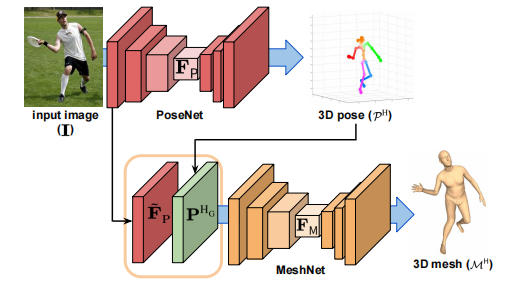

# I2L-MeshNet: Image-to-Lixel Prediction Network for Accurate 3D Human Pose and Mesh Estimation from a Single RGB Image

## Method

This work predicts the per-lixel (line-pixel) likelihood on 1D heatmaps for each mesh vertex coordinate instead of directly regressing the parameters.

预测每个线像素的在一维热图的似然值，而不是直接回归参数。保留了输入图像的空间关系。

The I2L-MeshNet is composed of 2 sub-networks, PoseNet and MeshNet.

**PoseNet**估计人体关节的位置，$p^H=\{ P^{H,x}, P^{H,y}, P^{H,z}\}$，前两者定义在图片空间的x轴和y轴，后者是相对于根关节的相对深度空间。

MeshNet和PoseNet有相似的网络结构。输入为PoseNet预训练的特征