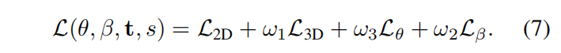

# KAMA: 3D Keypoint Aware Body Mesh Articulation

> 3DV 2021
>
> NVIDIA

[TOC]

## 摘要

KAMA是一个3D关节点级的网格连接方法，能够从**3D关节位置估计人体网格**。为此，我们学习了26个3D关节位置的估计，并提出一个解析方法，通过一系列简单的几何变换，来构造一个参数化模型SMPL。因为关节点估计直接依赖于图像信息，与SOTA方法相比，我们的方法提供了更好的图像对齐。我们的方法不需要任何配对的网格注释，并仅通过3D关节点回归提供精确的网格拟合。

## 引言

现有的方法直接从图像回归人体模型的参数，虽然带来了性能的提升，但是由于图像和模型参数之间存在很高的非线性，这些方法的关节定位精度比较低。他们的网格模型通常没与图像内容对齐，特别是手和脚的区域。

此外，这些方法需要大量的网格GT标注，这在无约束的场景中是很难获得的。

**该方法利用3D姿态估计优越的关节定位能力，从回归的3D关键点中重建人体网格模型**。优点有：

- 与传统回归模型参数的方法相比，该方法的网格估计更加准确，并能够与图像信息准确对齐
- 不需要配对的图像的网格GT，其中网格GT是比较难获取的

我们首先学习一个**3D关键点回归器**，来获得身体部位的方位。然后，提出了**KAMA**——关键点级的网格连接。它使用一系列几何操作利用回归的3D关节位置，来连接一个正则网格（网格模板）。虽然KAMA已经取得了SOTA的性能，但我们进一步使用了**一阶优化**来消除回归的关键点和连接的网格之间的差异。

## 相关工作

**基于优化的方法**的缺点：

- 易于陷入局部最小值，因为2D-3D的深度歧义
- 需要仔细的初始化才能得到最佳的解决方案
- 由于迭代过程，计算量大

## 方法

我们的目标是从预定位人体的RGB图像中重建完整的3D人体网格。主要由三部分组成：3D关节点回归器、人体网格重建、优化过程。

### 1. 3D关键点回归

这部分的目标是，学习一个关节回归器，输入为图像，输出K个3D关节位置坐标。

常用的是17个关键点，但不能满足任务的需求。比如，它缺乏头的姿态（ryp），这不能从脖子和头的位置直接得到。因此，我们回归26个关键点，包括眼睛、耳朵、鼻子、小脚趾和大脚趾、脚后跟。主要的挑战是，现有的数据集不包括这些额外的部位的标签。因此，我们采用多视图一致性和2D姿态标签的弱监督方法。对于原有的关键点，我们采用全监督的方法，对于额外引入的关键点，我们通过多视角一致性采用弱监督的方法。

### 2. KAMA

从回归的3D关键点中回归SMPL的姿态参数$\theta$。

#### 全局旋转

为每个关键点定义孩子关键点集合和C(k)和邻接关键点集合N(k)（包括k本身），使用三种不同的规则来计算每个关键点初始的全局旋转：

这些公式计算的都是3D关键点的**全局旋转**

- 对于有一个孩子节点的关键点，我们用**后补偿的模糊扭转**(twist)来估计它的旋转。

  

  - 等式右边的右部分代表旋转轴，左部分代表旋转的角度。
  - 需要注意的是，以这种方式估计的旋转本质上是不唯一的，因为任何关于子向量的扭转都是可以的，且不影响子关键点点的位置。
  - 我们将在计算所有的关键点的旋转之后，删除这种不唯一的扭曲。

- 对于有多个孩子节点的关键点，我们利用其他与k连接的节点的帮助来估计它的旋转。

  

  - 对于有多个子节点的关键点，我们能够更精确地估计出关键点的旋转。
  - 这里我们假设所有关键点的平移都是刚性的，并且估计的是他们的刚性旋转。
  - $\phi\left(\theta, \overline{\mathbf{x}}_{i}\right)$ 表示向量 $\overline{\mathbf{x}}_{i}$ 旋转 $\theta$ 的角度，$\psi\left(\mathbf{x}_{\mathbf{i}}\right)$表示从关键点回归器得到关键点 $i$ 的置信度。
  - 公式（3）可以通过奇异值分解解决

- 对于孩子节点，不估计他们的旋转。

#### 全局到局部的旋转

以上估计的都是关键点的全局旋转，为了估计SMPL参数，需要转换到局部旋转。

#### 扭转删除

考虑所有关节的局部旋转，我们需要删去不必要的旋转。一个合理的选择是默认扭转来自标准姿态（初始为0）。这可以通过摆动后扭转（swing-after-twist）来分解。具体来说，我们将局部旋转分解为摆动分量和扭曲分量，然后将旋转设置为摆动分量，而丢弃扭转分量。

#### 缩放和平移

利用普氏分析（Procrustes analysis）来估计缩放尺度和平移

其中 $\hat{M}$是根据估计的旋转得到的SMPL网格。再结合缩放和平移因子，得到绝对相机坐标系下的网格$\mathbf{M}=\hat{s} \hat{\mathbf{M}}+\hat{\mathbf{t}}$。我们利用透视投影将网格投影到图像平面。

### 3. 姿态优化和形状估计

利用姿态和形状先验，以及能量最小公式来细化：

$L_{\theta}$支持合理的姿态参数，$L_{\beta}$对形状参数进行标准化，使得优化后的形状不会和平均形状差距太大。

## 实验

### 消融实验

## 专业词汇

- articulation - 连接
- plausible - 合理的
- heatmap - 热图
- analytical solution - 解析解法
- orientation - 方向，方位
- synthetic - 合成的
- first-order optimization - 一阶优化
- volumetric representation - 体素
- data hungry - 依赖数据的
- multi-view consistency - 多视图一致性
- ambiguous twists  - 模糊扭转（轴角表示的不唯一性造成）
- perpendicular - 垂直的
- Procrustes analysis - 普氏分析：基于匹配两个数据集中的对应点（坐标），通过平移、旋转和缩放其中一个数据集中点的坐标以匹配另一数据集中对应点的坐标，并最小化点坐标之间的偏差平方和（表示为M2）。
- perspective-projections - 透视投影
- energy minimization formulation - 能量最小公式
- discrepancy - 差异

## 讨论

- 虽然引入额外的关键点（眼睛、耳朵、鼻子、小脚趾和大脚趾、脚后跟）达到了26个，但最后还是利用SMPL构建人体网格，依然无法精确控制边角的方向。
- 在3.2KAMA关节点的旋转估计中，只利用了相邻节点的信息，会导致误差的传递和积累。
- 由于是通过相邻节点计算的，在遮挡情况下算法失效
