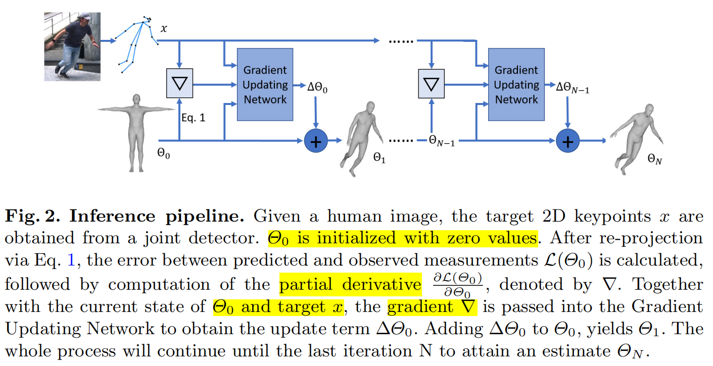
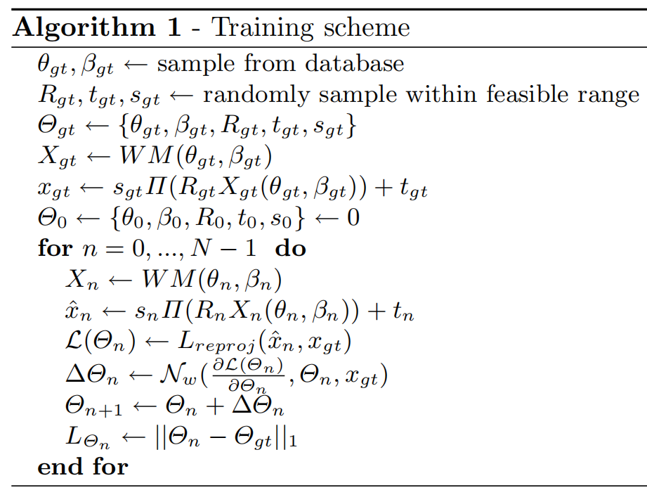
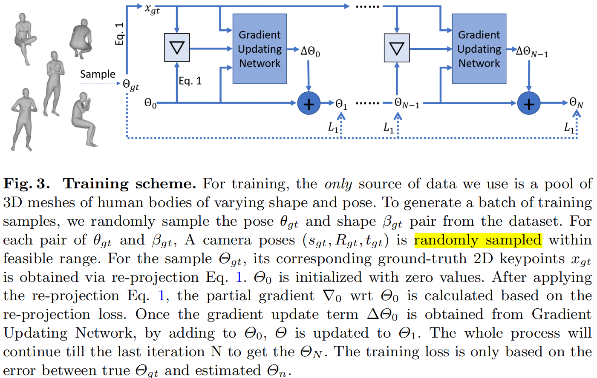
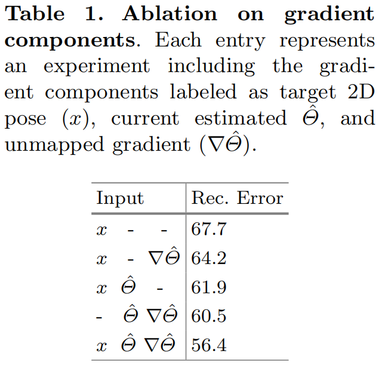
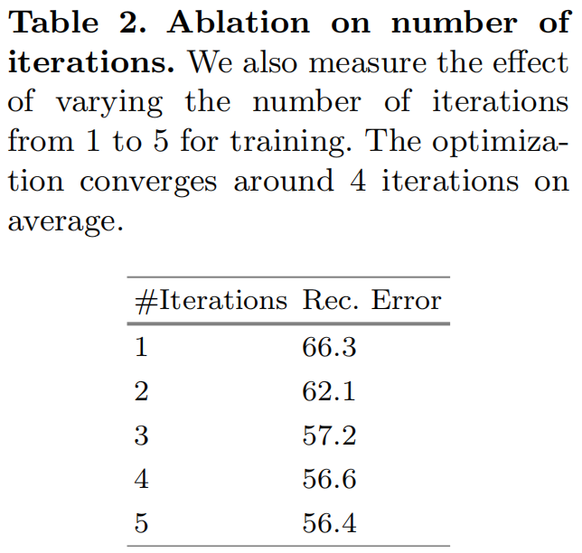
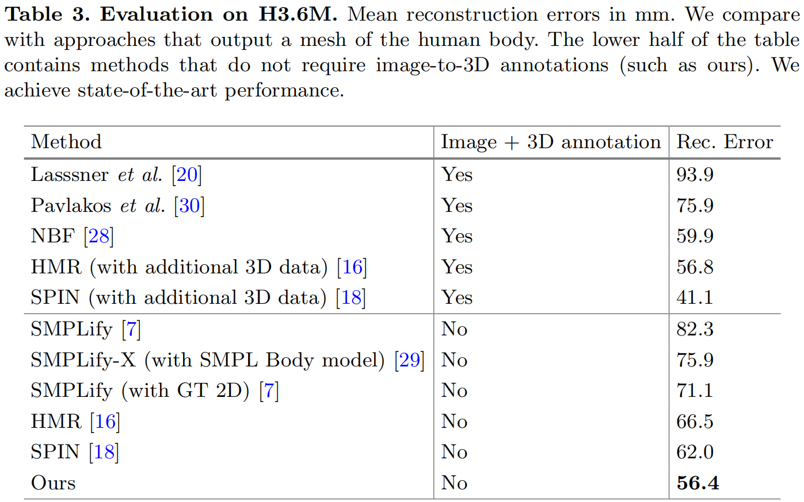
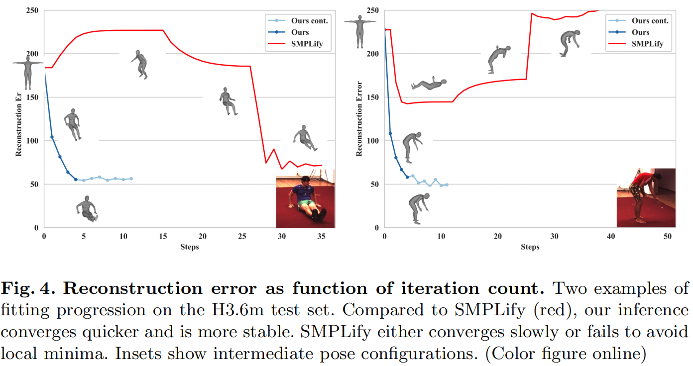
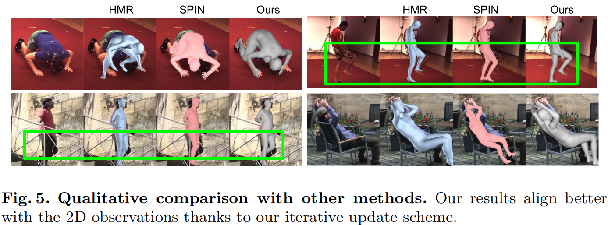
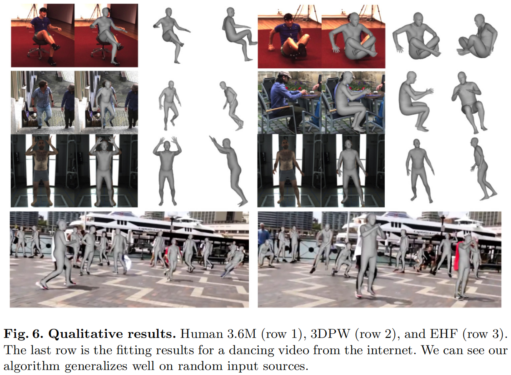

# Human Body Model Fitting by LearnedGradient Descent

> ECCV 2020  
>
> Max Planck ETH Center for Learning Systems

[TOC]

## 摘要

本文的方法是用图像拟合三维人体shape。提出了梯度下降的方法来预测每次迭代的参数的更新规则。这种每个参数和状态感知的更新引导优化器在非常少的步骤中走向一个好的解决方案，通常在几个步骤中收敛。网络从数据中学习一个有效的姿态和形状的子空间，更高效地执行优化。在测试的时候，我们只优化2D关节的重投影误差不需要任何更多的先验和正则化项。

## 引言

基于迭代梯度下降的优化方法寻找模型中与可用测量值最匹配的未知参数。

多正则项和先验会产生相互的traded-off，造成许多局部最优值。

基于优化的方法的优点：

- 训练的图像不需要标注的3D ground truth
- 与端到端的回归方法相比，通过迭代优化可以更好地获得细节信息
- 不会过拟合，一个调整好的优化算法在不用的数据集上一致的表现良好

**在训练时**，该方法只需要一个人体姿势和形状的数据集（例如，AMASS），并且在训练时**不使用图像**。

**在推理时**，直接优化了二维重投影误差，不需要任何进一步的先验或正则化来收敛。

## 贡献

- 提出了一个迭代算法，通过课学习的梯度下降，利用2D观测来拟合人体模型参数
- 一种学习梯度映射网络的数据高效利用方法，只需要三维Mocap数据，不需要图像到姿态的对应。

该算法迭代计算当前**人体模型对输入的二维关节的梯度**，网络将这个**偏导数**和**当前参数**和**目标x**作为输入产生每个参数的更新规则。

## 方法

### 任务

**从二维观测（比如从图像中提取的二维关键点）重建人体的完整三维网格。**

模板顶点首先以 $\beta$ 和 $\theta$ 为条件，然后通过正向运动学根据关节的旋转 $\theta$ 将骨骼连接，最后通过LBS（线性混合蒙皮）对表面进行变形，返回人体网格。

虽然用现有的迭代优化算法找到一个好的解决方案还存在挑战，但是一旦避免了局部极小值，迭代方法就能对看不到的数据产生非常好的预测结果，特别是**迭代细化**和**不会过拟合**可能对回归方法来说是一种困难。

本文提出了可学习的参数更新方法来替代标准的梯度下降方法：
$$
\Theta_{n+1}=\Theta_{n}+\mathcal{N}_{w}\left(\frac{\partial \mathcal{L}\left(\Theta_{n}\right)}{\partial \Theta_{n}}, \Theta_{n}, x\right)
$$
其中，$\mathcal{N}_{w}$ 是一个网络参数的集合，因此是可学习、自适应和数据驱动的。网络的作用是对输入的梯度和模型参数的状态来产生更新，使得拟合算法保持在自然的姿态和形状的流形中，并从局部极小值开始恢复。

### 算法伪代码

### 训练过程

**训练过程**：首先对3Dmesh进行采样，获得姿态和形状参数作为 $\Theta_{gt}$ ，然后随机获取合理的相机参数制作二维关节的GT。从输出模板mesh开始迭代，对预测的mesh的2D投影和2D GT计算一个梯度，来更新 $\Theta$，每次迭代结束计算$\Theta_{gt}$ 和 $\Theta_{n}$ 的L1 loss，这也是训练过程中使用的唯一损失。

为了处理缺失关节的问题，我们随机丢弃了 $x_{gt}$ 的一些关节。

## 实验

### 输入的消融实验

### 迭代次数的消融实验

### 和其他方法的比较

### 拟合过程

### 定量实验

## 专业词汇

- inverse problem - 求逆问题
- ill-posed - 病态（不存在稳定的唯一解）
- pseudo-labels - 伪标签
- unnatural bends - 不合理的弯曲
- physically impossible interpenetrations - 物理上不可能的相互渗透

