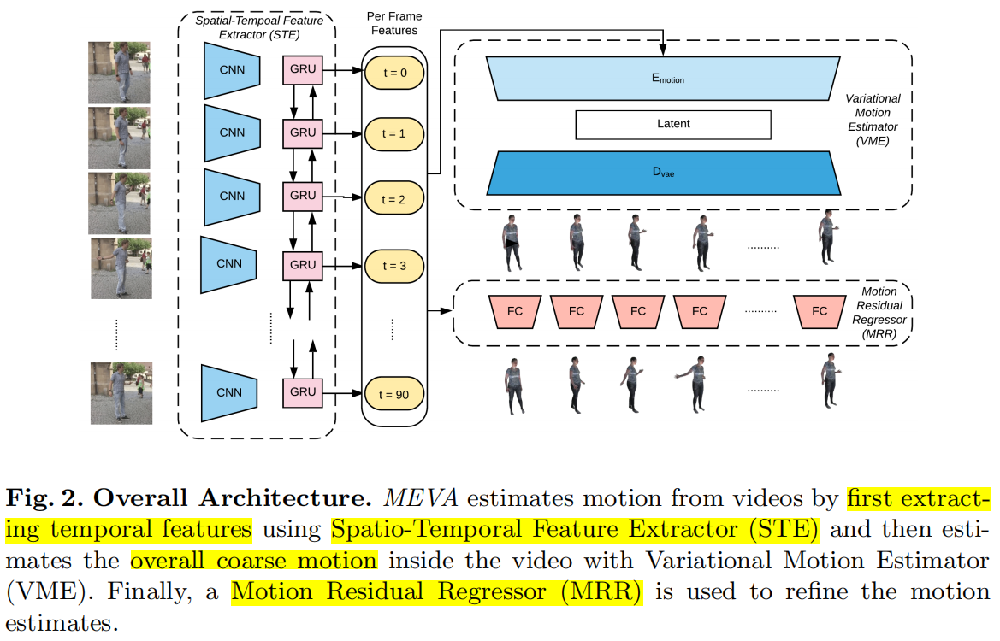
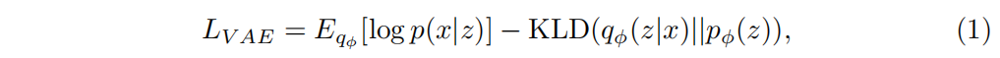
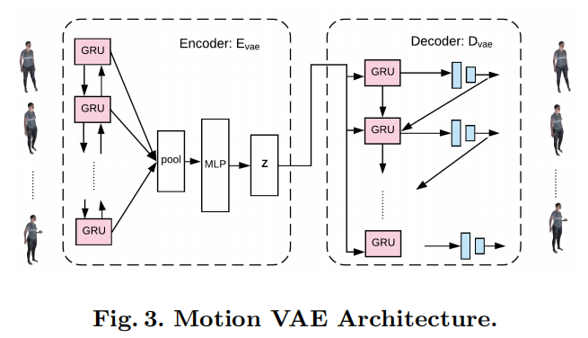
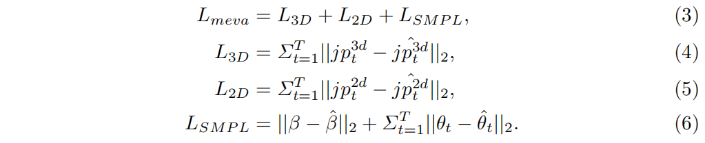
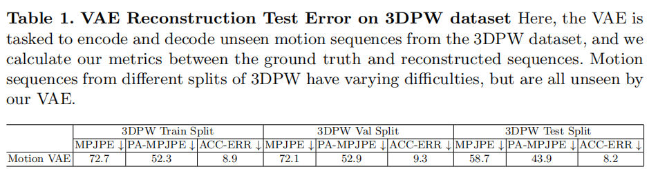
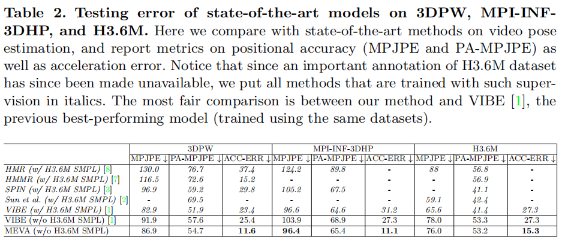
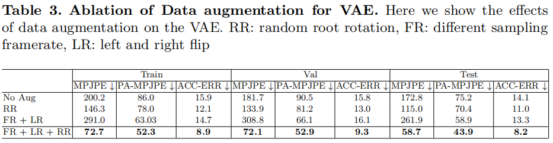
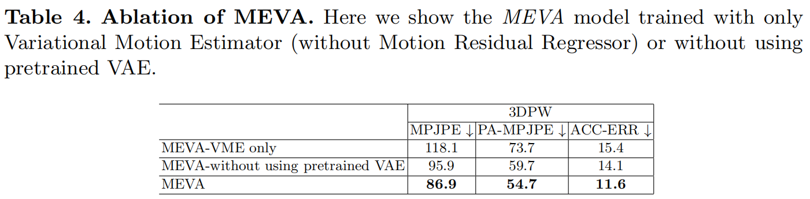
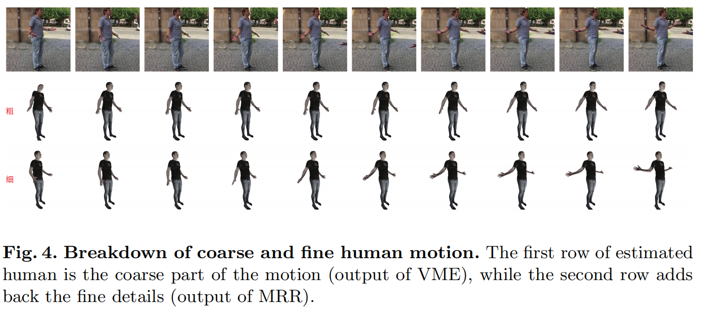
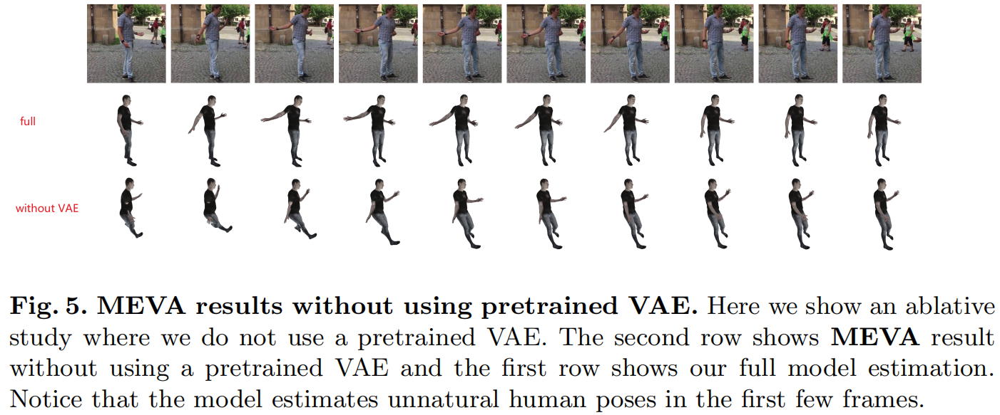

# MEVA: 3D Human Motion Estimation via Motion Compression and Refifinement

[TOC]

## 摘要

我们提出了一个方法对于RGB视频序列输入，产生光滑和准确的人体姿态和运动估计。使用**基于自动编码器的运动压缩**和**通过运动细化学习到的残差表示**，将人类运动的时间序列分解为平滑运动表示。这两步编码将人类运动的捕获分为两个阶段：1. **全局人体运动估计**：用来捕获粗糙的一般运动；2. **残差估计**：添加人的特定运动细节。实验展示了我们的方法在三维人体姿态和运动的平滑性和准确性上有较好的性能。

## 引入

从单个视频中估计三维人体姿态序列需要一个计算模型，该模型可以提取人体运动潜在的运动学，也可以保留被捕获人所特有的运动。人类具有相同的人体结构（相同的关节数量）和相似的物理约束（关节约束），所以能够学习一个**广义的运动学模型**与图像相匹配来推断一个人的一般运动。但是广义的运动模型不能给特定个人的运动建模，因此需要使用图像信息添加或细化广义运动的估计结果。我们提出了两阶段三维估计方法：**首先，从视频中提取粗糙的运动序列**；**然后，细化这个序列来产生更准确的三维运动估计**。我们将推理过程分解为（1）一般运动模型和（2）特定的运动模型，来获取更准确和平滑的估计。

近几年，人体三维姿态估计获得了很大的进展，在**单张图片**和**视频**的人体网格重建有很好的结果。主要的指标有： Mean Per Joint Position Error (MPJPE)：平均每个关节位置误差。但缺少运动的时序平滑性的体现，存在抖动的现象，导致不自然的运动估计，优化的方法是使用抖动的姿态估计。

时序平滑性的问题已经有部分被解决，包括，**大尺度的运动数据集**（比如AMAAS）和引入**对抗性损失**[1] [2]来监督学习，[3]预测帧顺序（？？？）。但是只在损失函数中使用先验知识难以在平滑性和准确性中找到平衡。

我们认为在平滑度和精确度之间达到平衡可以通过**粗糙**和**精细**运动的分解来实现。首先我们通过观察人类运动的大数据集来学习粗糙的运动模型，因为**人类的运动通常是平滑**的。如果要将一个模型拟合到大量的人类运动中，那么大多数数据将位于一个运动平滑的子空间中。这意味着，如果我们要压缩人类运动的数据，它应该学习一个潜在的子空间，其中的运动是固有特性是平滑和粗糙的。以这个**潜在子空间为回归目标**，我们可以直接从输入视频中推理出粗糙的人体运动。但是这个运动子空间中，罕见的运动，比如突然的运动，被从运动数据中移除。为了保留这样的运动，我们还认为，产生最后的三维运动估计可以被视为一个**细化步骤**，将细节添加到粗运动序列中。

为了验证我们的论点，我们提出两阶段人体运动估计方法，1. 首先使用**变分自动编码器（VAE）**从数据压缩中估计粗糙的人体姿态序列，称为**变分运动估计器（VME）**；2. 然后把VME的输出作为姿态回归器的输入，细化姿态估计，称为**运动细化回归器（MRR）**。

我们提出一个基于视频的人体三维运动估计方法，聚焦产生平滑和准确的人体运动序列。主要贡献有：

- 提出一个两阶段运动估计方法，保证时序平滑性和姿态估计准确定
- 描述一个鲁棒的变分自动编码器的学习过程，作为潜在人体运动子空间，从视频中估计三维人体的粗运动
- 我们在真实场景的3DPW数据集中进行姿态和运动估计的性能评测，减少了54.3%的加速度误差，同时实现了最先进的WPJPE结果。

## 相关工作

相关工作将介绍单张图像的**人体形状和姿态恢复**和视频**人体运动恢复**，后者是前者的子集，因为人体运动是人体姿态的一个序列。然后介绍现有方法是如何使用人体运动作为先验，和如何将运动序列映射到低维空间。

### 单张图像的三维人体姿态和形状恢复

这里聚焦基于模型的方法，能够同时恢复形状和姿态，我们选择使用**参数化三维人体模型**（SMPL、SCAPE、SMPLify-X），因为它能够容易地转换成三维人体网格。近年来，参数化人体三维重建获得了大量关注，从剪影或者人工输入，到直接拟合模型参数到二维关节位置，到直接从图像估计形状和位姿。因为缺少三维标签的这是你hi之，这些方法使用弱监督的方式来拟合三维人体到二维关节位置、身体部位分割或者稠密像素关联[4]。这些方法由于缺乏**时序信息**，提取的运动往往不稳定。

### 基于视频的三维人体姿态和形状恢复

视频人体三维重建是图像的自然拓展，[5]等（1）预测从二维到三维的关节位置，使用**LSTM**、**时序信息**和**全连接层**来探索时序信息。（2）HMMR、VIBE直接从图像中预测三维关节位置，并使用**时序滤波器**对运动序列进行后处理。**HMMR**通过让模型预测未来和过去帧的运动，来增强时序一致性；[4] **Denserac**预测被打乱的帧的顺序；**VIBE**使用GRU将特征的输入帧转换为一系列时间相关的潜在特征。

### 人体姿态和动作先验

使用预先记录的人体运动序列作为先验，已经用在许多人体运动相关的任务上。（1）学习**运动捕获MoCap**来帮助**三维运动跟踪**；（2）使用**对抗性鉴别器**对每帧结果进行处理，保证恢复有效的人体姿态；（3）**使用预训练的VAE**潜在空间；（4）时序上的鉴别器，鉴别整个运动序列。以上的方法都是用对抗的方式使用姿态和运动先验，用在损失函数中。

### 人体运动表达

将人体运动压缩到一个紧凑的潜在表达，能够用来生成人体运动和轨迹预测。目前的生成模型：1. **VAE** 2. **生成流（generative flow）** 3. **GAN**

【生成（generation）和表达（representation）的关系是什么？？？】

## 3. 方法

现有方法的问题：难以实现时序平滑性和精确性的平衡

本文解决方法L提出MEVA，通过变分自动编码器进行运动估计，首先估计整体粗运动，然后添加细节运动作为残差。MEVA分三步处理输入：

- 首先，使用**时空特征提取器（STE）**提取相关的**时序特征**
- 然后，使用**变分运动估计器（VME）**捕获**全局粗运动**
- 最后，使用**运动残差回归器（MRR）**增加精细运动的细节

### 3.1 公式

$V_T=\{I_t\}^T_{t=1}$：视频输入

$M_T=\{\theta_t\}^T_{t=1}$：运动序列，需要重建的

直观上，从视频中重建人体运动不需要恢复人体形状，可以直接从视频映射到人体运动。但是和真实运动注释匹配的视频需要专业的捕捉设备，与二维姿态数据相比仍然比较罕见。在缺乏三维数据样本的情况下，我们的模型以半监督的方式学习运动序列（利用经过三维或者二维标记过关节位置的视频）。因此我们的运动估计目标就是学习函数：$V_T->M_T$

### 3.2 时空特征提取器（STE）

过去的运动可以提供关于未来工作的线索。因此，除了单独使用前馈卷积网络来提取每一帧的视觉特征，我们还能够产生时序相关特征来更好地进行运动序列建模。

### 3.3 变分运动估计器（VME）

#### 人体运动变分自动编码器

为了学习一个能够封装广泛**人体运动的子空间**，我们使用**变分自动编码器（VAE）**。VAE显示地将**每个数据点映射到潜在的代码**，能够高效地捕获大量可能的数据模式，对学习到的潜在空间施加一个**高斯先验**，相似运动的潜在代码将会相互接近。因此，VAE的潜在空间允许代码间更多的重合，能够加强潜在空间的平滑性。【具有一个平滑的潜在代码对于提高模型的通用性至关重要，因为可能的人体运动空间是高度相关和有限的？？？】。根据之前VAE的工作，目标是最大化对数似然的evidence lower bound（ELBO）

编码器$E_{vae}$接收一系列SMPL姿态参数的人体运动的帧W，输出潜在代码$z$。解码器$D_{vae}$输入潜在代码$z$并重建运动$\hat M_W$，编码器$E_{vae}$和解码器$D_{vae}$使用GRUs。

目标函数可以写成：

#### 人体运动数据增强

我们学习到的VAE应该能够推广到**看不到的人体运动序列**，并实现较高精度的重建，以确保学习到的潜在空间确实可以作为一个全面的人类运动子空间。我们用大规模人类运动数据集**AMASS**（13k不同长度的运动样本），但我们训练的VAE在看不见的序列上**通用性**很差。于是我们进行**数据增强**，来增强现有的运动并产生可行**独特的人体运动**序列。**虽然数据增强在图像处理中得到了广泛的研究，但是在人体运动数据集方面的尝试却很少**。在轨迹预测和人体运动生成的应用中，VAE潜在空间的通用性没有被广泛讨论，因为模型只需要生成新的运动序列，而不强调其编码看不见的运动序列的能力。

我们采用以下的数据增强方案：

- **加速和减速**：对帧进行均匀上采样或者下采样（加速和减速），仍能产生合理且自然的人体运动
- **左右翻转**：对于相同的动作，使用左手或者右手，将仍是一个有效的人体运动，所以我们遵循SMPL模型的运动学树，**镜像左右运动**，生成一个新的运动序列。
- **随机根旋转**：从单位球中随机选取一个根旋转，来捕获可能的人体运动中不同的根方向。不同的姿态估计器可能假设不同的基平面和坐标系，采样随机根旋转有助于模型处理不同坐标系的选择。

#### 从视频中学习平滑运动

使用VAE学习了一个全面人体运动子空间之后，我们学习了一个额外的编码器$E_{motion}$，它可以直接从视频特征中提取出粗运动序列， 映射到与$E_{vae}$相同的潜在空间。

输入一个视频特征序列$f_W=\{f_w\}^W_{w=1}$，编码器$E_{motion}$的作用是将输入特征压缩成一个潜在的代码$z$，将当前的观测结果表达为一个粗糙的人体运动序列。在VAE中预训练的解码器$D_{vae}$迫使编码器$E_{motion}$从预训练的运动子空间中采样，将编码器的潜在空间限制在预训练的人体运动子空间中提供一个很强的人体运动先验，有助于编码器$E_{motion}$的学习过程。结合编码器$E_{motion}$和解码器$D_{vae}$，构成了变分运动估计器（VME）

### 3.4 运动残差回归器（MRR）

使用VAE的潜在空间作为目标学习的运动序列具备固有的平滑性和粗糙性，通过信息压缩捕获当前视频帧的整体运动特征。为了捕获细节，采用SMPL回归器来**迭代细化**估计的姿态。MEVA中回归变量用**VME计算的姿态来初始化**，而之前的方法都是用平均SMPL姿态来初始化。因此，回归变量的任务只是对粗糙估计做微小的修改，来增加在压缩步骤中丢失的运动细节。

回归器的输入特征跟VIBE一样，使用时序视觉编码器，所以及时每帧的估计是分别计算的，但视觉特征已经是时序相关的。

VME使用一般的运动模型从视频中计算**全局粗运动**，回归器（MRR）联合细化运动和人体形状估计，相当于在每帧中**添加特定的运动细节**。

### 3.5 训练和损失函数

## 实验

介绍了三部分：1.数据集  2. 实验  3. 消融实验

#### 4.1 数据集

VAE：

- 训练AMASS

- 测试3DPW

视频训练：

- MPI-INF-3DPH, 3DPW and human 3.6M：有三维关节标注

- InstaVariety、PennAction：有二维关节标注

### 4.2 评估结果和分析

#### 运动变分编码器的生成

记录了VAE对3DPW数据集中看不见的运动序列的重建误差运动VAE模型是使用所有三种形式的数据增强技术训练的性能最好的模型。结果表明，我们的VAE模型能够推广到看不见的序列，学习的子空间可以合理地展示人体运动空间。

#### 定量结果

表2展示了我们的方法在位置误差（MPJP和PA-MPJPE）取得了可比性的结果，同时显著提高了平滑度（加速度误差ACC-ERR），意味着在不牺牲精度的情况下进行更平滑、更自然的运动估计。为了进行更直接的比较，我们使用与我们方法完全相同的数据集重新训练了之前最先进的方法VIBE。之前平滑性最先进的模型是HMMR。

#### 定性结果

https://youtu.be/YBb9NDz3ngM

### 4.3 消融实验

#### 数据增强对运动VAE训练的效果

表格3展示了VAE在3DPW数据集中，使用不同数据增强方法后，对看不见序列的重建误差

#### 粗运动与精细运动检索

MEVA从粗细运动的显式分解中受益，使用时序压缩来捕获给定序列的全局运动。表4展示了粗细运动信息的检索量。

#### 预训练运动VAE的效果

MEVA从预训练的运动VAE的潜在空间中受益。预训练的VAE提供了一个人体运动子空间，帮助约束运动序列更自然可信。

## 结论

为了实现时序平滑和精确的三维人体姿态估计，（1）学习一个压缩模型，编码一般人体运动的光滑性，（2）同时学习一个基于图像的回归模型，来捕获特定的运动。我们提出两阶段模型，首先，训练一个变分自动编码器给粗糙/光滑的人体运动进行建模；然后学习人体特殊运动细化回归模块，来保留一般运动模型没有捕捉到的运动。通过全面的实验，验证了我们方法的平滑性和准确性。

## 指标

 **Mean Per Joint Position Error (MPJPE)**：平均每个关节位置误差

- 根据视频每一帧计算的相对关节位置
- 但缺少运动的时序平滑性的体现

 **MPJPE after Procrustes Alignment (PA-MPJPE)**：执行程序对齐后的MPJPE

- 对齐三维关节的根位置（盆骨）后计算MPJPE

 MPJPE和PA-MPJPE都是运动估计器的准确性指标（$mm$）

**Acceleration error (ACC-ERR)**：加速度误差

- 测量预测结果和真实值中每个关键点的三维加速度误差（单位$mm/s^2$）

- ACC-ERR是估计运动序列的主要的平滑度指标
- 加速度使用有限差分方法计算得到

以上指标需要共同使用：低的**位置误差**表明运动的捕获**整体的正确性**，而好的**加速度误差**标志着**平滑和自然**的人体运动估计。

## 数据集

- Archive of Motion Capture as Surface Shapes（AMAAS）：Mahmood, N., Ghorbani, N., Troje, N.F., Pons-Moll, G., Black, M.J.: Amass: Archive of motion capture as surface shapes. 2019 IEEE/CVF International Conference on Computer Vision (ICCV) (2019) 5441–5450
- MPI-INF-3DPH
- 3DPW
- human 3.6M
- InstaVariety
- PennAction

## 关键词

smooth motion representation - 平滑运动表示

auto-encoder-based motion compression - 基于自动编码器的运动压缩

residual representation - 残差表示

motion refinement - 运动细化

generalized kinematic model - 广义运动学模型

human mesh recovery - 人体三维重建

adversarial loss - 对抗性损失

data compression - 数据压缩

【Variational Autoencoder（VAE）- 变分自动编码器】

Variational Motion Estimator（VME）- 变分运动估计器

Motion Residual Regressor（MRR）- 运动细化回归器

body part segmentation - 身体部分分割

dense pixel correspondence - 图像稠密像素关联

LSTM

temporal convolution - 时序卷积

fully connected layers - 全连接层

motion capture（MoCap）- 运动捕获

3D motion tracking - 三维运动跟踪

adversarial discriminator - 对抗性鉴别器

human motion representation - 人体运动表达

compact latent representation  - 紧凑的潜在表达

spatio-temporal feature extractor（STE）- 时空特征提取器

linear coefficient - 线性系数

weak perspective camera - 弱视角相机

feed-forward convolutional network - 前馈卷积网络

human motion subspace - 人体运动子空间

Gaussian prior - 高斯先验

Gaussian parameterization of the VAE - VAE的高斯参数化

data augmentation - 数据增强

kinematic tree - 运动学树

finite difference - 有限差分

explicit breakdown - 显式分解

kinematically invalid - 运动学无效

## 参考文献

[1] Kocabas, M., Athanasiou, N., Black, M.J.: Vibe: Video inference for human body pose and shape estimation. In: Proceedings of the IEEE/CVF Conference on Computer Vision and Pattern Recognition. (2020) 5253–5263

[2] Kanazawa, A., Zhang, J.Y., Felsen, P., Malik, J.: Learning 3d human dynamics from video. 2019 IEEE/CVF Conference on Computer Vision and Pattern Recognition (CVPR) (2019) 5607–5616

[3] Xu, Y., Zhu, S.C., Tung, T.: Denserac: Joint 3d pose and shape estimation by dense render-and-compare. 2019 IEEE/CVF International Conference on Computer Vision (ICCV) (2019) 7759–7769

[4] Xu, Y., Zhu, S.C., Tung, T.: Denserac: Joint 3d pose and shape estimation by dense render-and-compare. 2019 IEEE/CVF International Conference on Computer Vision (ICCV) (2019) 7759–7769

[5] Xu, J., Yu, Z., Ni, B., Yang, J., Yang, X., Zhang, W.: Deep kinematics analysis for monocular 3d human pose estimation. In: Proceedings of the IEEE/CVF Conference on Computer Vision and Pattern Recognition (CVPR). (2020)

