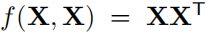

# Capturing Humans in Motion: Temporal-Attentive 3D Human Pose and Shape Estimation from Monocular Video

> CVPR 2022
>
> Institute of Information Science, Academia Sinica, Taiwan

[TOC]

## 摘要

MPS-Net提出了一个运动姿态和形体网络，从**视频**中捕捉精确和时序相关的运动人体。

目前的方法主要依赖卷积操作来建模时序信息，限制了人体运动的**非局部关系**。我们第一个提出了一个**运动连续性注意力模块（MoCA）**来利用视觉线索来自适应地校准在序列中需要注意的范围，以更好地捕捉运动的连续性和依赖性。然后，我们提出了一个**层次注意特征集成模块（HAFI）**来结合相邻的过去和未来特征表示，以**加强时间相关性**，并细化当前帧特征的表示。通过结合MoCA和HAFI，MPS-Net在从视频估计人体姿态和形体方面表现出色。

## 引言

### 任务

以单张图像或者视频序列作为输入，估计三维人体网格的参数。

### 挑战

深度模糊性（depth ambiguity）

有限的三维标注（limited 3D annotations）

非刚性人体的复杂运动（complex motion of non-rigid human body）

------

与从图像恢复人体网格不同，从单目视频恢复更困难。它不仅需要估计**姿态、形状和相机参数**，还需要将序列中的**人体运动的连续性**关联起来。

现有的基于单张图像的方法虽然能够预测合理的输出，但是缺乏对连续帧中人体运动连续性的建模，很难估计出**时间相干（temporally coherent）**和**平滑（smooth）**的人体姿态和形状。为了解决这个问题，现有的方法依赖RNN或者CNN来建模时序信息（比如人体运动的连续性）进行相干性预测。然而，RNN和CNN虽然擅长处理局部关系，但是单一的模型可能不能有效学习到特征之间长距离的依赖，不能很好地描述人体运动的相关性。

为了解决以上问题，我们提出了MPS-Net，主要有两个创新点：

- 尽管自注意力机制能够补偿RNN和CNN的不足（更好地学习长距离依赖），我们发现它并不总是能建模动作序列中的人体运动。因为通过自注意力机制计算的注意力图不稳定，容易将注意力集中在较少相关性的时间位置（比如遥远帧中的不同动作），并忽略人体运动的连续性。为此我们提出了**运动连续性注意力模块**（MoCA），来实现对运动序列中不同时间内容和关系的适应性。MoCA有两点贡献：
  - 首先，建立了一个**归一化自相似矩阵**（normalized self-similarity matrix， NSSM）来捕获运动序列中的时序相似性和视觉表征的不同。
  - 其次，NSSM作为一种先验知识，用来指导自注意力模块的学习，从而能够自适应地校准序列中需要注意的范围，以捕捉运动连续性依赖。

- 受TCMR的时序特征集成方法的启发，我们提出一个层次注意特征集成模块（HAFI），利用过去和未来相邻特征表示来**加强时序相关性并细化当前帧的特征**表示。

## 相关工作

### 从单张图像重建人体网格

- HMR：端到端的人体网格估计（HMR），利用3D到2D的关节投影损失和对抗训练缓解三维标注问题。

- Pavlakos et al.：利用2D关节热图和轮廓信息来提高估计精度

- NBF：利用语义分割提取身体部位信息，来估计SMPL参数

- SPIN：提出self-improving方法，利用回归-迭代优化的方式来更好地估计SMPL参数

- PyMAF：设计一个金字塔网格对齐回环来探索多尺度内容、

还有一些非参数模型的方法

- GraphCMR：利用图卷积，将图像特征编码到模板网格中，直接回归人体网格的顶点

- I2L-MeshNet：用全卷积的方法，利用lixel的一维热图来直接定位顶点的坐标。

尽管上面的方法对静态图像有效，但很难在视频序列中产生**时间相干和平滑**的三维人体姿态和形体，也就是可能发生**抖动、不稳定**的三维人体运动。

### 从单目视频重建人体网格

和基于图像的方法相同，基于视频的方法也大多数回归SMPL模型参数。

- Kanazawa et al.（CVPR2019）：提出一个基于卷积的时序编码器来学习人体运动，利用相邻的过去帧和未来帧估计SMPL参数

- Doersch et al.：结合CNN和LSTM利用2D关键点热图和光流，验证了预处理的运动信息能够促进SMPL参数的估计

- Sun et al.：提出一个骨架分解的框架，将任务分解为多层空间和时序的子问题，然后进一步提出一个无监督的训练策略，称为时序打乱和顺序恢复，来促进时序特征的学习

- VIBE：提出一个时序编码器，由GRU组成，将静态特征编码到时序特征中，然后送入回归器估计SMPL参数。再进一步利用AMASS数据集区分真假人体运动

- MEVA：提出两阶段的模型，首先估计粗糙的人体运动，然后利用运动残差恢复期来细化运动估计

- TCMR：利用GRU时序编码器，利用三个不同的编码策略，来踧踖网络学到更好的时序特征，然后用时序特征融合的方式融合三个编码器的特征，来估计正确且平滑的3D人体网格

以上基于CNN和RNN的方法虽然取得了成功，但是卷积操作和循环操作都只能处理局部信息，很难学习动作序列中的特征表示之间的长期依赖关系（即非局部关系）。因此难以估计准确和平滑的三维人体姿态和形状。

### 注意力机制

注意力机制具有捕获**长距离依赖**和**选择性关注**的能力。有许多方式来执行注意力机制，这里我们使用自注意力机制。基于自注意力机制的Transformer完全取代了循环操作，并提高了性能。后来自注意力机制被证明是非局部操作的一个实例，并在CNN上加入一个非局部块来捕获长距离依赖。和Transformer一样，非局部块几窜输入特征每个位置之间的关系，生成注意力图，然后执行注意力引导的密集信息聚会，来描述长距离依赖关系。

尽管自注意力机制表现良好，但我们发现由自注意力模块（比如非局部模块）计算的注意力图往往是不稳定的，这意味着容易将注意力集中在不相关的时间位置（即，遥远帧和非常不同的动作姿态），并忽略了人体运动的连续性。

因此，我们提出一个**运动连续性注意力模块（MoCA）**来利用视觉线索来自适应地校准在序列中需要注意的范围，以更好地捕捉运动的连续性和依赖性。然后，我们提出了一个**层次注意特征集成模块（HAFI）**来结合相邻的过去和未来特征表示，以**加强时间相关性**，并细化当前帧特征的表示。

## 方法

### 时序编码器

输入T帧的视频序列，首先使用预训练的ResNet50来提取每一帧的静态特征（2048维）

然后，提取的特征X送入MoCA模块来计算时序特征Z（T × 2048维）

#### MoCA

MoCA通过两步来扩展非局部操作。

- 首先，我们引入归一化自相似矩阵NSSM来捕捉动作序列中视觉表征的时序的相似性和不同，来揭示人体运动的连续性。
- 其次，我们将NSSM视为一种先验知识，并将其与非局部操作生成的注意力图结合，来自适应的重新校准动作序列中需要注意的范围。

非局部表示Y，由一系列X的计算得到：

其中，m是一个减小率，用来减小计算复杂度。2-4都是卷及操作

5计算时序之间相互的相似性（自注意力），然后执行一个softmax进行归一化，得到注意力图。

但是这样得到的注意力图不稳定，因此我们引入归一化自相似矩阵NSSM，是的MoCA模块能够学习关注到更合理的动作序列。自相似性矩阵的计算为：

自相似性矩阵能够揭示人体运动的连续性。同样的，我们对自相似性矩阵进行归一化，方便后续和注意力图的结合。

然后用1×1矩阵处理自相似性矩阵和注意力图，对注意力图进行重新矫正，再进行一个softmax后得到重矫正的注意力图称为MoCA图。

将MoCA图和经过卷积后的输入做一个线性组合得到Y。

最后，将Y线性变换后和输入X做一个残差连接，得到X加强后包含丰富时序信息的Z：

### 时序特征集成

HAFI模块的目标是细化当前帧的时间特征zt，通过整合相邻的时间特征从过去和未来的帧来加强他们的时间相关性，获得更好的姿态和形状估计。

ps：两层TCMR的temporal feature integration

每三个相邻帧为一组（没有重叠），首先估计注意力值（权重）a，然后和每帧的时序特征相乘，来放大重要帧的贡献。然后再做一个特征聚合。

### SMPL参数回归器

使用和VIBE一样的SMPL参数回归器，来回归pose、shape和相机参数。我们初始化SMPL参数回归器的权重为HMR预训练的权重。

## 实验

## 讨论

在TCMR的框架上加入了non-local

