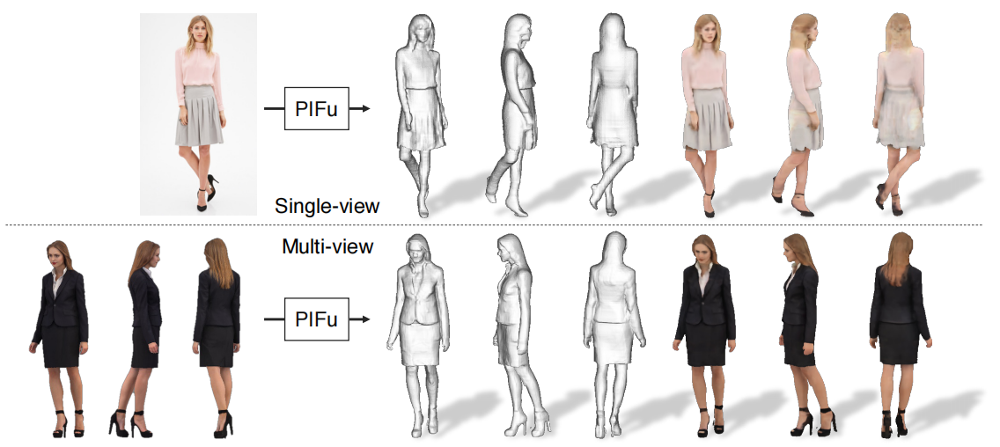
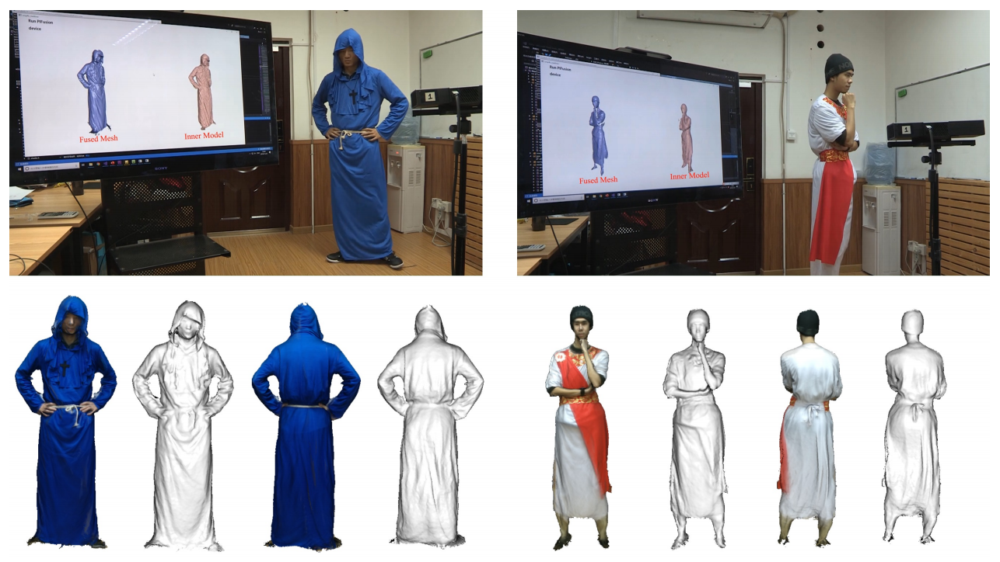
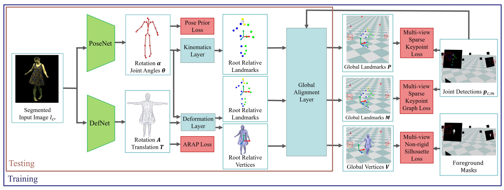
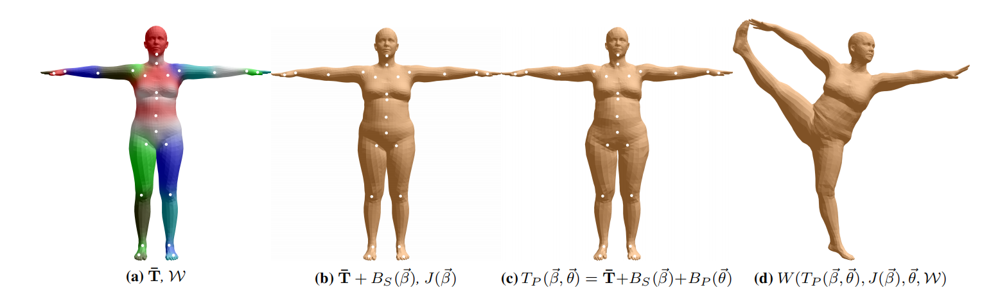
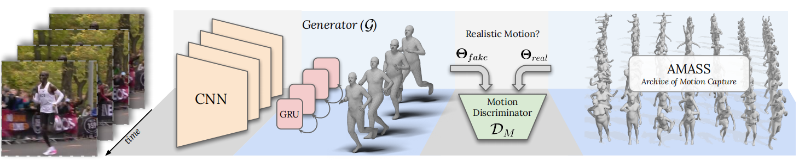
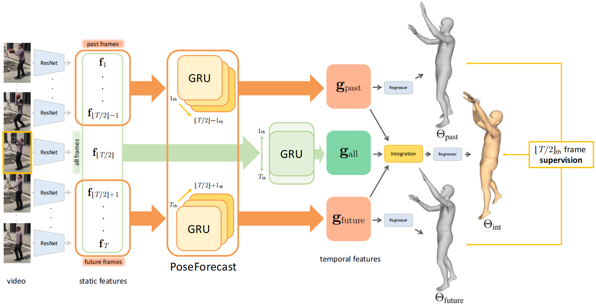
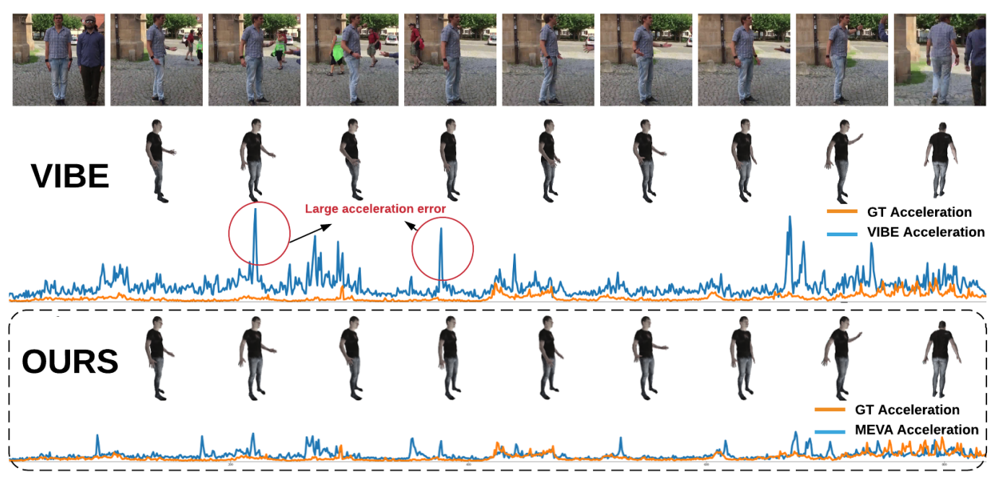

# Paper_Reading
The record of paper reading

## 3D Human Reconstruction

- [x] [Learning High Fidelity Depths of Dressed Humans by Watching Social Media Dance Videos](./learning)

  

- [x] [PIFu_Pixel-Aligned Implicit Function for High-Resolution Clothed Human Digitization](./PIFu)
  

- [x] [Robust 3D Self-portraits in Seconds](./robust)
  

- [x] [DeepCap_Monocular Human Performance Capture Using Weak Supervision](./Deep)
  

- [x] [SMPL: A Skinned Multi-Person Linear Model](./SMPL)
  

- [x] [VIBE: Video Inference for Human Body Pose and Shape Estimation](./VIBE)
  

- [x] [TCMR: Beyond Static Features for Temporally Consistent 3D Human Pose and Shape from a Video](./TCMR)

  

- [x] [MEVA: 3D Human Motion Estimation via Motion Compression and Refinement](./MEVA)

  

## Multi-agent Reinforcement Learning

- [x] [Learning Individually Inferred Communication for Multi-Agent Cooperation](./Agent)
  

## Contact to me

- Emain：[youyx@stu.pku.edu.cn](mailto:youyx@stu.pku.edu.cn)

