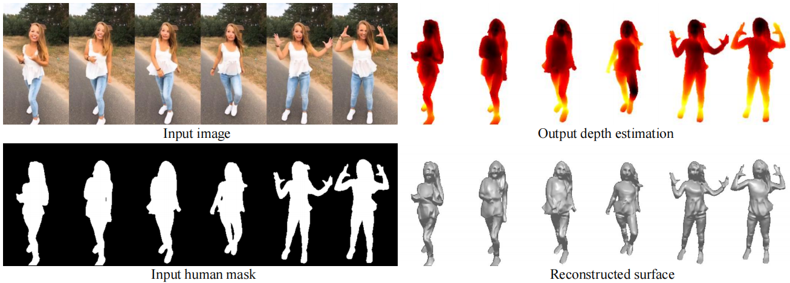

# Paper_Reading
The record of paper reading

## 3D Human Reconstruction

- [x] [Learning High Fidelity Depths of Dressed Humans by Watching Social Media Dance Videos](./learning)

  

- [x] [PIFu_Pixel-Aligned Implicit Function for High-Resolution Clothed Human Digitization](./PIFu)
  

- [x] [Robust 3D Self-portraits in Seconds](./robust)
  

## Multi-agent Reinforcement Learning
- [x] [Learning Individually Inferred Communication for Multi-Agent Cooperation](./agent)
  

## Contact to me

- Emain：[youyx@stu.pku.edu.cn](mailto:youyx@stu.pku.edu.cn)

