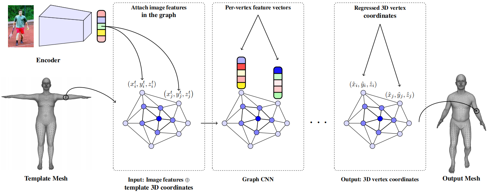
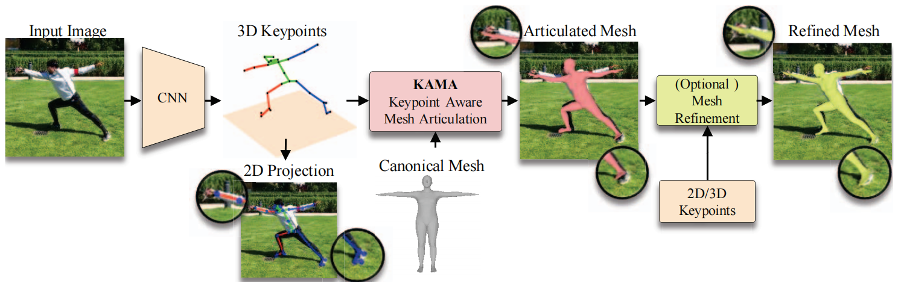

# Paper_Reading
The record of paper reading

## 3D Human Reconstruction

- [x] [Learning High Fidelity Depths of Dressed Humans by Watching Social Media Dance Videos](./learning)

  

- [x] [PIFu_Pixel-Aligned Implicit Function for High-Resolution Clothed Human Digitization](./PIFu)
  

- [x] [Robust 3D Self-portraits in Seconds](./robust)
  

- [x] [DeepCap_Monocular Human Performance Capture Using Weak Supervision](./Deep)
  

- [x] [SMPL: A Skinned Multi-Person Linear Model](./SMPL)
  

- [x] [Mesh Graphormer](./Mesh_Graphormer)

  

- [x] [Pose2Mesh: Graph Convolutional Networkfor 3D Human Pose and Mesh Recovery from a 2D Human Pose](./Pose2Mesh)

  

- [x] [Convolutional Mesh Regression for Single-Image Human Shape Reconstruction](./GraphCMR)

  

- [x] [HMR: End-to-end Recovery of Human Shape and Pose](./HMR)

  
  
- [x] [Human Body Model Fitting by Learned Gradient Descent](./LearnedGradientDescent)

  
  
- [x] [Keypoint-aligned 3D Human Shape Recovery from A Single Image with Bilayer-Graph](./BiGraphBody)

  
  
- [x] [Skeleton2Mesh：Kinematics Prior Injected Unsupervised Human Mesh Recovery](./Skeleton2Mesh)

  
  
- [x] [HKMR: Hierarchical Kinematic Human Mesh Recovery](./HKMR)

  
  
- [x] [THUNDR: Transformer-based 3D HUmaN Reconstruction with Markers](./THUNDR)

  
  
- [x] [HoloPose: Holistic 3D Human Reconstruction In-The-Wild](./HoloPose)

  
  
- [x] [KAMA: 3D Keypoint Aware Body Mesh Articulation](./KAMA)

  

- [x] [Shape as Points: A Differentiable Poisson Solver](./Shape_as_Points)(roughly)

  

## Video-based 3D Human Mesh Reconstruction

- [x] [VIBE: Video Inference for Human Body Pose and Shape Estimation](./VIBE)
  

- [x] [TCMR: Beyond Static Features for Temporally Consistent 3D Human Pose and Shape from a Video](./TCMR)

  

- [x] [MEVA: 3D Human Motion Estimation via Motion Compression and Refinement](./MEVA)

  

- [x] [MPS-Net: Capturing Humans in Motion: Temporal-Attentive 3D Human Pose and Shape](./MPS-Net)

  

## Classical Networks

- [x] [AlexNet: ImageNet Classifification with Deep Convolutional](./AlexNet)
  
  
  
- [x] [Transformer: Attention is All You Need](./Transformer)
  

## Multi-agent Reinforcement Learning

- [x] [Learning Individually Inferred Communication for Multi-Agent Cooperation](./Agent)
  

## Contact to me

- Emain：[youyx@stu.pku.edu.cn](mailto:youyx@stu.pku.edu.cn)

