# SRNet: Improving Generalization in 3D Human Pose Estimation with a Split-and-Recombine Approach

> ECCV 2020
>
> The Chinese University of Hong Kong

[TOC]

## 摘要

罕见的人体姿态对网络来说是一个困难的重建任务，类似于视觉识别中的长尾分布问题，而局部姿态受**长尾问题**的影响较小：因为一个罕见的姿态，在局部上可能并不罕见。我们利用这个事实，来提高泛化性能。我们的方法将身体分割为局部区域，并在单独的的网络中处理他们，因为由于一个关节的位置主要受局部身体区域的影响。而全局关系通过一个低维向量的方式编码到每个分支中。通过对不相关身体区域的降维，网络分支更能反映局部姿态的统计数据，而不是全局姿态，同时不牺牲对推理很重要的信息。这个分裂和重组方法能够用在单帧和时序方法上，带来很大的性能提高

## 引言

### 2D提升到3D的算法：

- 基于结构或者运动学人体模型
- 学习身体部位之间的关系
- 或者直接回归。

### 数据集上的操作：

- 通过**合成图片**来生成罕见姿态，增强训练数据，但训练集与测试集存在gap
- 通过**模拟相机的不同视角**，以提高对其他位置的泛化，但效果提升有限

### 创新点：

本文提出利用局部关节配置来解决罕见\极端姿态不准确的问题。比如骑自行车的姿态在训练数据中不常见，但是其腿部的变化与爬坡类似，因此可以利用他们来学习局部姿态。进一步，还能够用局部关节配置来重建遮挡姿态。

- 我们设计了一个网络，将人体分割为局部关节组，这些关节组内有很强的相互关系，对组外关节的依赖相对较弱。

- 每组利用单独的网络训练。

- 为了解决每个分支与主体其他部分的弱依赖关系，从其它分支计算出低维全局上下文，并重新组合到该分支中。这样低维的全局特征也降低对组内局部关节特征学习的影响。

- 这种称为SRNet的分割和再组合方法，可以提高泛化性能，从而有效地预测训练集中罕见或不存在的全局姿态。

## 相关工作

### 利用局部关节关系

许多工作利用了关节的**物理连接关系**，来促进特征学习和关节预测。这些连接在关节间产生了强大的相互依赖性和空间相关性。他们自然地成为了信息共享、编码运动学和人体解剖的方法。他们采用两种方法建模：

- 分层建模：先学习局部分组，然后扩展所有的局部分组到全局级别
- 用GCN在连接关节之间显式建模，然后通过层的堆叠扩展到更远的关节。

这两种方法，都会受到组外关节的严重影响。而SRNet通过全局特征降维，限制了非局部关节对局部特征学习的影响。

### 姿态估计的泛化性

提高泛化性的方法是增加训练数据，但人造数据与实际图像之间存在真实性差距。我们的方法通过关注局部姿态区域而不是全局姿态来获得改进的训练数据分布，因此它不涉及图像处理或合成，从而保持了原始训练集的真实性。

### 长尾分布的鲁棒性

长尾分布：在数据集分布中，尾部的例子很少。由于这些例子对特征学习的影响很小，因此对尾部类别的识别性能往往较差。

## 方法

为了解决罕见或者遮挡姿态的问题，我们的解决方法是将全局姿态估计分解为一组局部姿态估计问题。

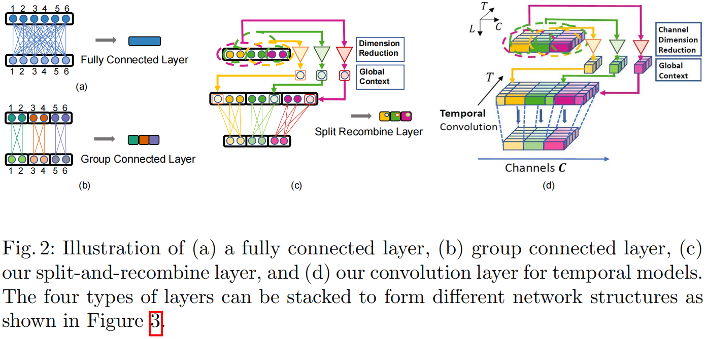

### 全连接基线

在全连接基线中，每个输出关节和中间特征不加区别地连接到所有的输入关节，输出关节过拟合到几乎没有相关性的远距离关节位置

### 将身体划分为局部姿态区域

一个局部区域应该包含高度相关的关节，而与非局部关节几乎没有相关性。

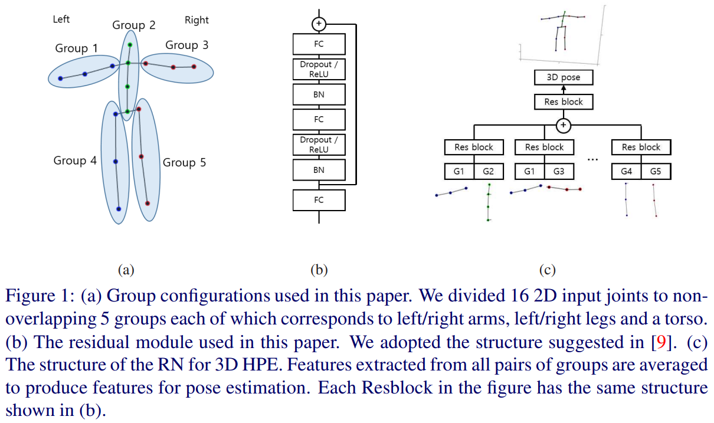

然而，在推理局部姿态时，其它身体部位的状态是完全未知的，从而降低性能。因此，要考虑全局信息，同时在很大程度上保持局部特征的独立性。

### SRNet：融合低维全局特征

公式：

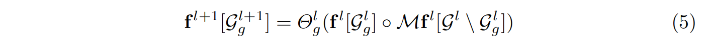

### 姿态相似性

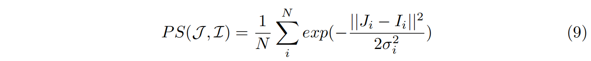

计算相邻关节之间的欧拉距离。这个公式的输出在(0, 1)。如果两个姿态完全相同，输出为PS=1，如果差距比标准差大很多，PS趋近于0。标准差用来控制衰减。

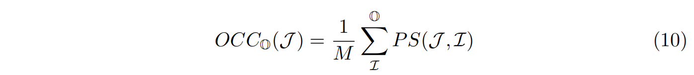

该公式是姿态J与其他姿态的平均姿态相似性公式。对于罕见的姿态来说，该值较小。

## 实验

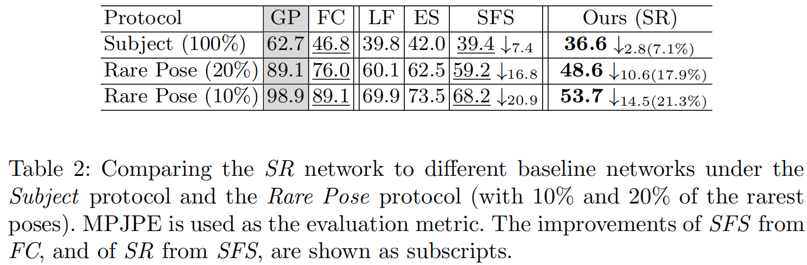

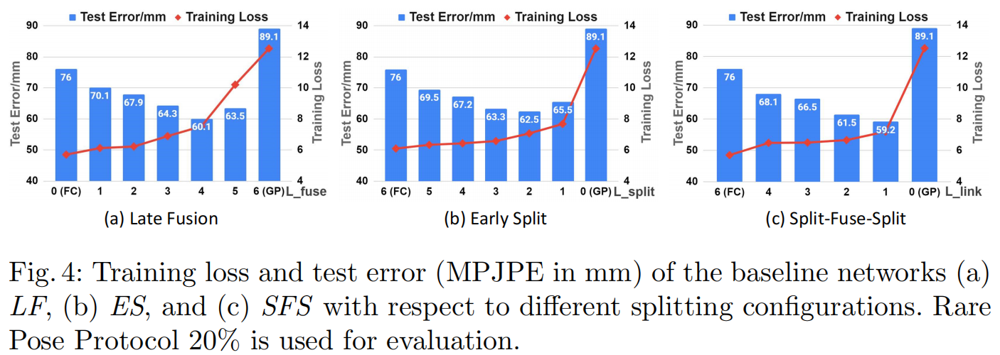

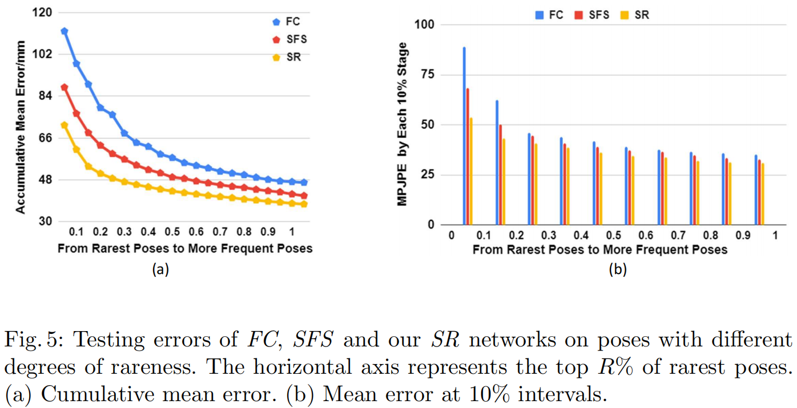

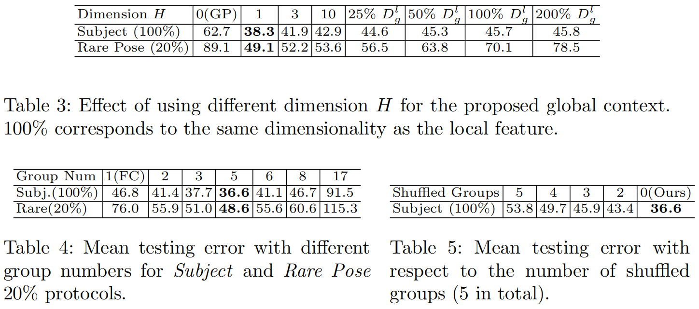

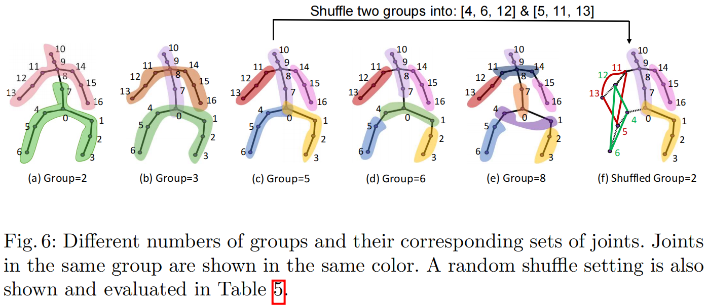

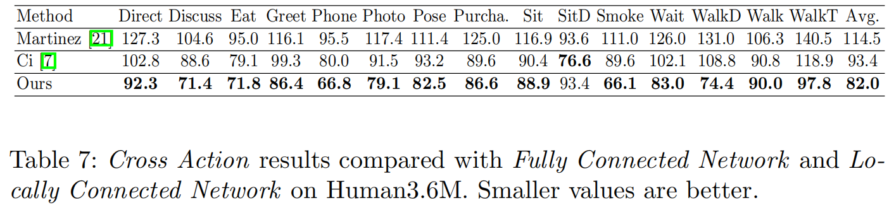

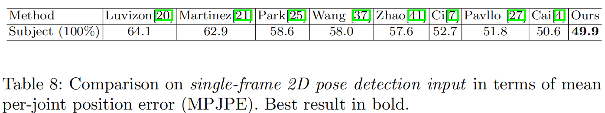

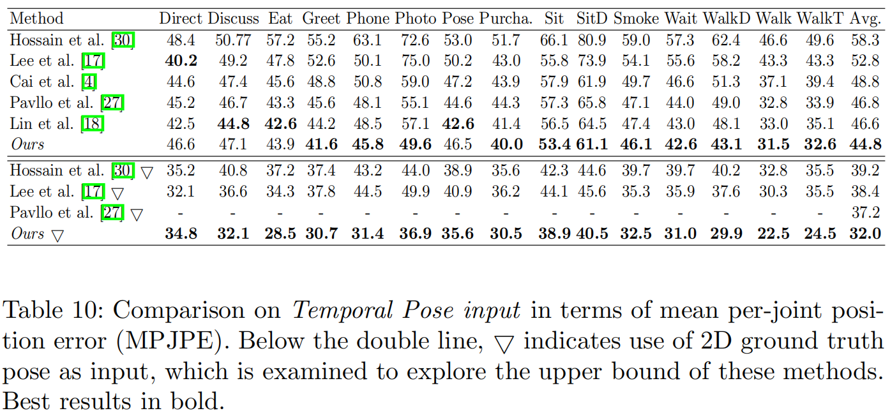

## 专业词汇

- long-tailed distribution problem： 长尾分布问题

## 讨论

- local feature concat low-dim global feature
- formula of rare pose

