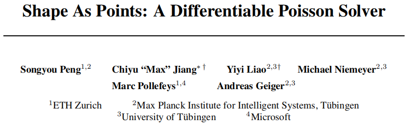
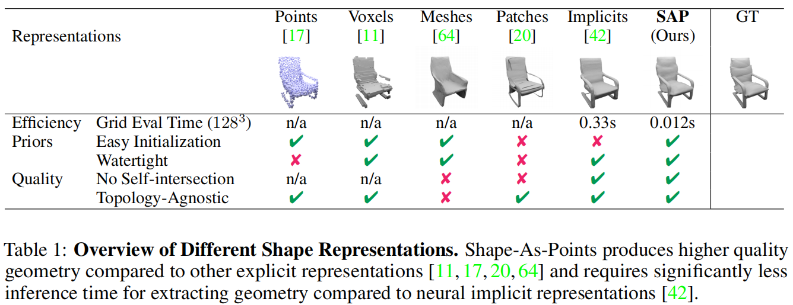
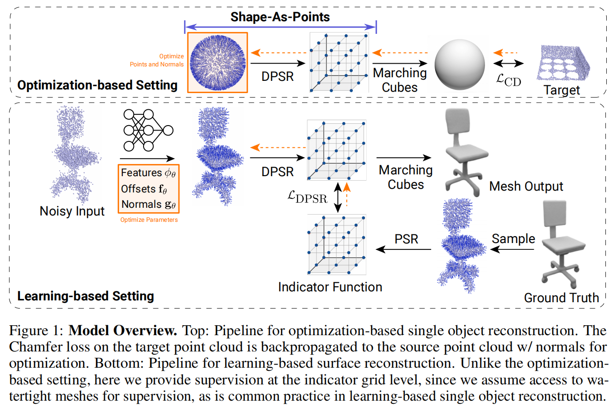
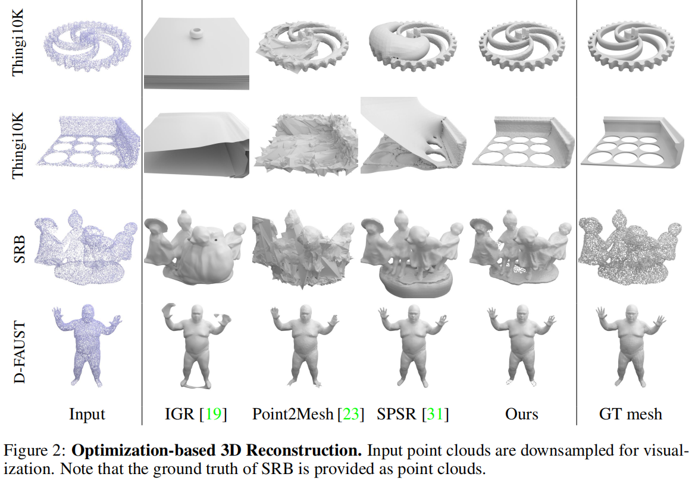
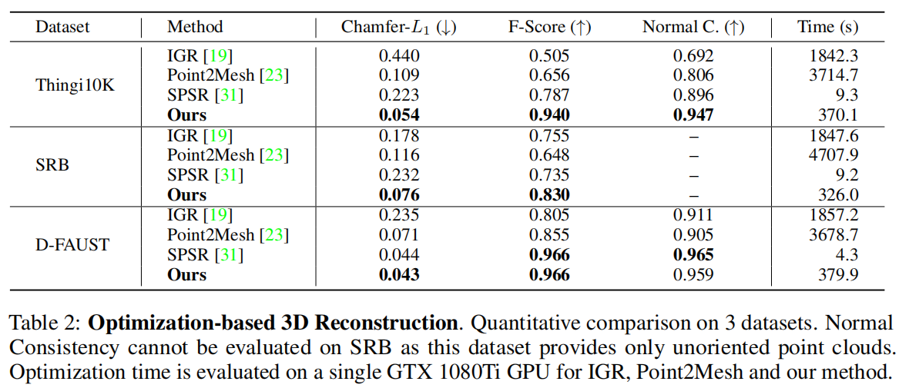
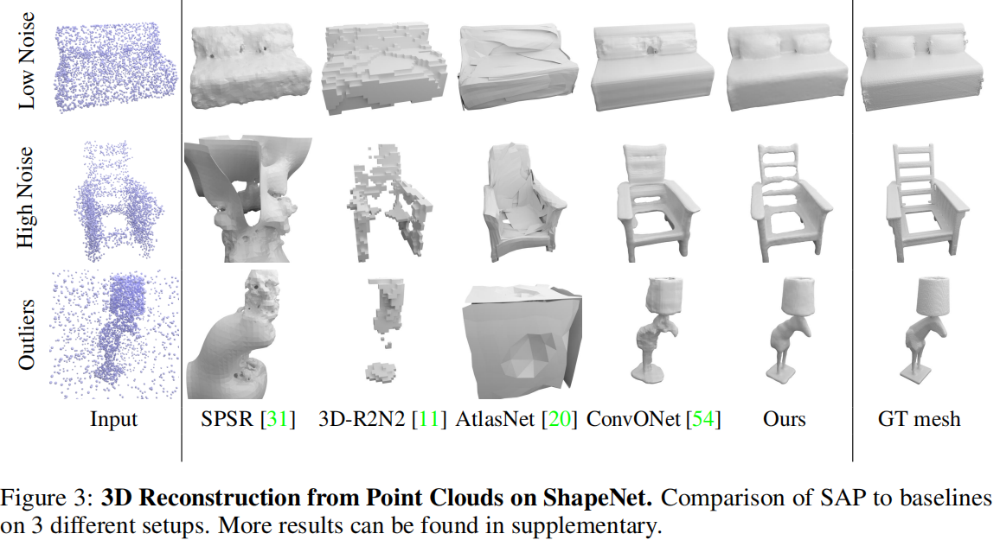
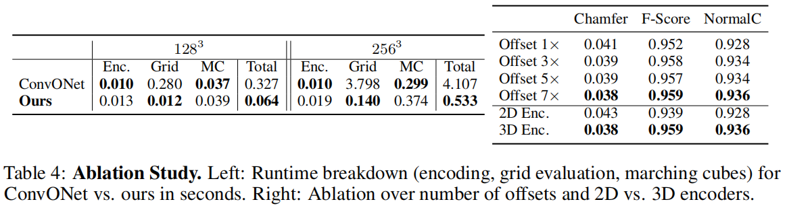

# 【Roughly】Shape As Points: A Differentiable Poisson Solver

## 摘要

最近，由于**神经隐式表达**的表现性和灵活性在三维重建获得了很大的关注。然而，神经隐式表达结果的隐式性质导致推理时间较慢且需要注意初始化。本文重新讨论了经典但普遍存在的点云表示并使用**泊松表面重建（PSR）**的可微公式引入**可微点网格层**，该公式允许给定定向点云的指标函数使用GPU快速求解。可微的PSR层通过**implicit indicator field（隐式指示器字段）**在**显示三维点**表示与**三维网格**之间架起桥梁，从而实现表面重建指标，比如**Chamfer distance（倒角距离）**，的端到端优化。点和网格之间的对偶性允许我们显示、轻量、易于表现地表达形状和定向点云。与神经隐式表示相比，我们的SAP模型更可解释、轻量级，并将推理时间加速了一个数量级。与其他显式表示，如points、patches和meshes相比，SAP产生了与拓扑无关的、水密的流形曲面。我们证明了SAP在无定向点云的表面重建和基于学习的重建任务上的有效性。

- 点云 ----可微泊松表面重建---- > indicator function grid (指标函数网格) -----标记立方体----> 网格
- 基于优化的方法：点云要初始化，通过优化得到目标点云。利用倒角距离损失$L_{CD}$优化原始点云
- 基于学习的方法：输入原始无方向点云，输出定向点云及其法向量

## 专业词汇

neural implicit representation - 神经隐式表达

implicit nature - 隐式性质

Poisson Surface Reconstruction（PSR） - 泊松表面重建

Chamfer distance - 倒角距离

explicit - 显示的

implicit indicator field - ？？？

watertight manifold surfaces - 水密性流形表面

interpretable - 可解释的

radiance fields - 辐射场

## 写作词汇

expressiveness - 表现

flexibility - 灵活性

ubiquitous - 普遍存在的

duality - 二元性，对偶性

lightweight - 轻量的

expressive - 富于表现力的

## 参考文献

[1]  Convolutional occupancy networks, ECCV 2020

