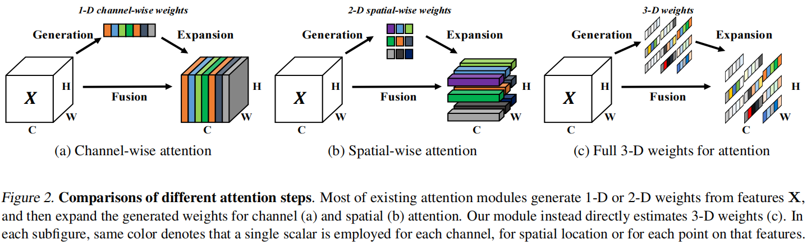
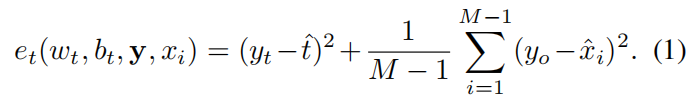
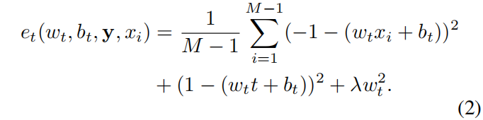
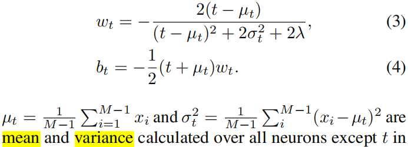
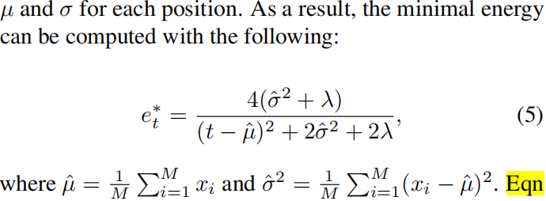
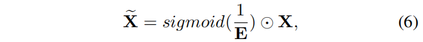
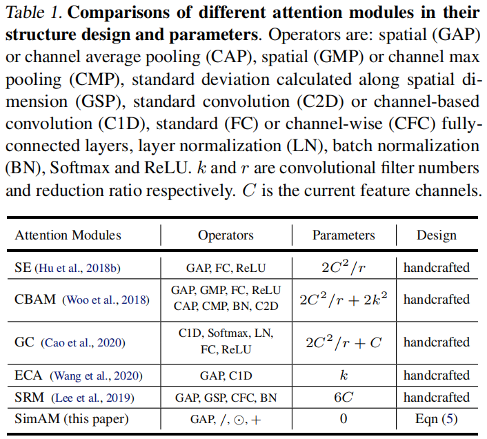
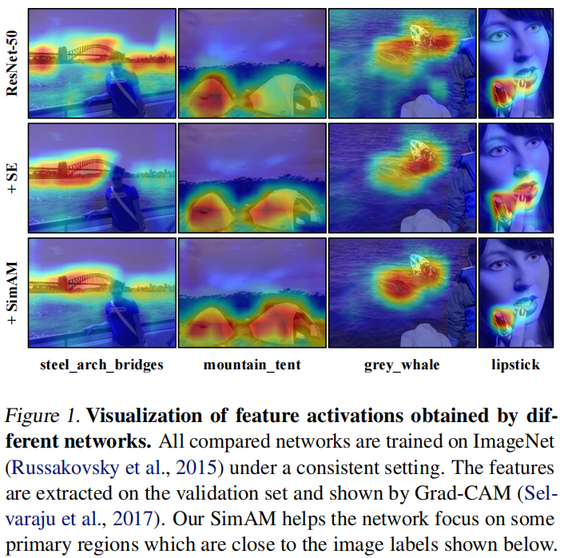
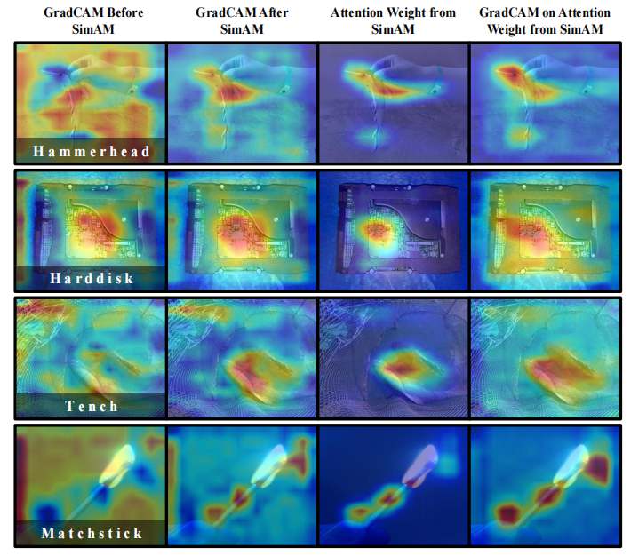

# SimAM: A Simple, Parameter-Free Attention Module for Convolutional Neural Networks

> PMLR 2021
>
> Sun Yat-sen University

[TOC]

## 摘要

SimAM提出了一个概念简单，但有效的注意力模块，适用于卷积网络。与通道注意力和控件间注意力不同，我们的方法推理三维注意力权重但**不需要引入额外的参数量**。我们基于一些著名的神经科学理论，并提出一个**优化的能量函数**，来探索每个神经元的重要性。我们进一步推导了能量函数的快速封闭解。该模块的另一个特点是大多数操作符都是通过能量函数的解来选择的，避免了大量结构调整的工作。

## 引言

现有的注意力模块存在两个问题：

- 首先，它们**只能沿着通道或空间维度来细化特征**，这限制了它们学习在不同通道和空间中变化的注意力权重的灵活性。existing attention modules in computer vision focus on either the channel domain or the spatial domain。
- 其次，它们的结构是由一系列复杂的因素建立起来的（无根据的启发），比如池化的选择。

我们的贡献主要有：

- 受人脑注意机制的启发，我们提出了一个具有**全三维权重的注意力模块**，并设计了一个**能量函数**来计算权重。
- 我们推导了**能量函数的快速封闭解法**
- 我们将所提出的模块集成到一些著名的网络中，并在各种任务上对它们进行评估。我们的模块在**精度、模型大小和速度**方面都优于其他流行的模块。

## 相关工作

注意力模块（attention module）又称为重新校准模块（recalibration module），是用来细化特征图的。人类的注意力是最重要的选择机制之一，它优先**考虑与任务相关的信息和减弱无关的信号**。

基于特征的注意力和基于空间的注意力其实是同时存在于人脑中的，并共同参与了视觉处理过程中的信息处理。

- 如何根据一个特征图来计算单个神经元的重要性？

  在视觉神经科学中，信息最丰富的神经元通常是那些与周围神经元有**独特放电模式**的神经元。此外，一个活跃的神经元也可能**抑制周围神经元**的活动，这种现象被称为**空间抑制**(Webbetal.，2005)。

### 方法

表现出明显的**空间抑制效应**的神经元在视觉处理中应被给予更高的优先级（即重要性）。找到这些神经元最简单的实现是**测量一个目标神经元和其他神经元之间的线性可分性**。基于这些神经科学的发现，我们定义了每个神经元的以下能量函数：

对$y_t$和$t_o$采用1和-1，得到：

同一个通道中的所有像素服从相同的分布，简化得到：

将（3）（4）代回公式（2），得到：

公式（5）表明，能量越低，神经元t与周围神经元越不同，对视觉处理越重要。因此，每个神经元的重要性可以表示为$1/e_t^*$

根据研究，人类大脑中的注意力调节通常表现为**对神经元反应的增加（即缩放）效应**。因此，我们使用**缩放算符**而不是**添加**来进行特征细化。我们的模块的整个细化阶段是：

E聚合了所有的通道维度和空间维度。sigmoid函数不改变每个神经元的相对重要性，因为它是单调函数。

我们在每个块的第二个卷积层之后添加这个操作。

## 实验

## 专业词汇

- customized meta-structure - 自定义元结构
-  plug-and-play modules - 即插即用
-  without other bells and whistles - 没有附加的东西，花里胡哨的东西
-  recalibration module - 重新校准模块
-  selection mechanism - 选择机制
-  spatial suppression - 空间抑制
-  linear separability - 线性可分离性
-  neuron - 神经元
-   monofonic function - 单调函数
-  element-wise operation - 对应元素操作

## 讨论

- These two attention mechanisms correspond exactly to the feature-based attention and the spatial-based attention in the human brain (Carrasco, 2011). However,

  in humans, these two mechanisms coexist and jointly contribute to information selection during visual processing.  

  这段话也适用于video-based的三维人体重建。基于特征的注意力和基于空间的注意力其实是同时存在于人脑中的，并共同参与了视觉处理过程中的信息处理。

