# Learning Skeletal Graph Neural Networks for Hard 3D Pose Estimation

> ICCV 2021
>
> The Chinese University of Hong Kong

[TOC]

## 摘要

目前3D人体姿态估计的问题有：depth ambiguity, self-occlusion, and complex or rare poses

这篇文章着力解决困难姿态的问题，提出了一个骨架GNN的方法——跳跃感知的 分层 通道压缩 融合层来提取相邻节点的相关信息并抑制不期望的噪声。另外，我们提出了一个时序感知的动态图构建，进行有效鲁棒的3D人体姿态估计。

## 引言

3D人体姿态估计的发展：

1. 全连接FCN：容易发生过拟合

2. 加入图结构

    As articulated human body can be naturally modeled as a graph, with the recent development of graph neural networks (GNN), various GNN-based methods [49, 6, 20, 2, 51] are proposed in the literature for 2D-to-3D pose estimation.

GNN的好处是，自然地捕捉了身体关节之间的关系，对于一个目标节点，从相邻的节点中提取语义信息，减轻了其在估计三维位置时的不确定性。然而，现有的基于GNN的解决方案不能很好地利用骨架图的潜力。**However, existing GNN-based solutions do not fully tap the potential of the skeleton graph. The reasons are two-fold:**

- 噪声：在GNN中，越是远距离的节点，越容易引入噪声。
- 关节间的动态关系：身体关节之间的关系因不同姿态而异。例如，对于“跑步”中的姿势，手足关节是密切相关的，而对于“坐姿”中的姿势，则没有如此紧密的关系。It is rather difficult to capture such information with a static

在这个工作中，我们提出了一个新的骨架GNN来解决以上问题，特别是对困难姿态的估计：

- 我们提出一个跳跃 分层 通道压缩 融合（hop-aware hierarchical channel squeezing fusion layer）的层来从相邻节点提取相对信息，同时抑制不期望的噪声。这是受到**特征压缩（feature squeezing）**工作的启发，即减小通道size并保留有价值的信息。于是，我们将长距离文本特征（比如远距离节点信息）压缩，并以分层的方式融合到短距离特征中。
- 受到基于GNN的动作识别动作的启发，我们构建了一个**动态骨架网络（dynamic skeletal graphs）**。其中，边不只是来源于固定的人体骨架拓扑，也来自捕获的特定动作姿态。为了解决动态图中时间和帧间异常点的问题，我们进一步融合时序信息来学习动态图。

如图所示：

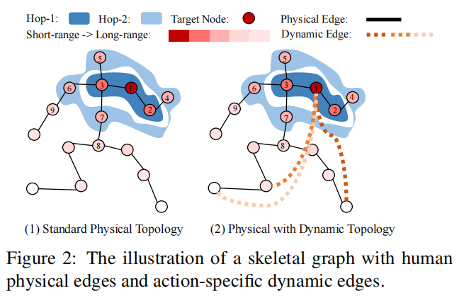

ps：（1）适用于GSAT的分层图 

## 方法

我们的目标是减少3D人体姿态估计的误差，特别是困难姿态。我们框架的核心模块是：动态分层通道压缩-融合层（D-HCSF），包括一个**分层通道压缩-融合层**（更新节点特征）和一个**时序感知的动态图学习**（更新动态图）

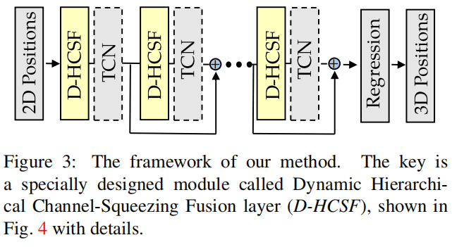

### 分层通道压缩-融合层

受到LCN的启发：

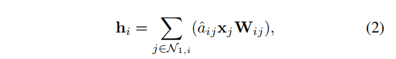

每个节点由**自身和直接相连的节点（hop=1）**更新

分层空间特征有助于捕捉更好地短-长距离信息。长距离信息包含有用的语义信息，但同时存在噪声。因此，我们提出了分层通道压缩-融合层，对长距离信息进行压缩，然后concat到最后的特征中。

#### 分层融合层

为了捕获不同距离的空间信息，每个节点**由直接相连的节点到hop-k节点更新**。

分层融合模块包括两部分：

- 短距离hop-s，包含当前节点基本的信息，因此保持他们完整的特征维度。

- 远距离hop-l，包含潜在的有用信息，进行维度压缩来减少噪声。

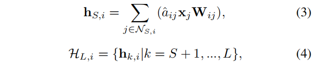

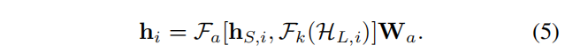

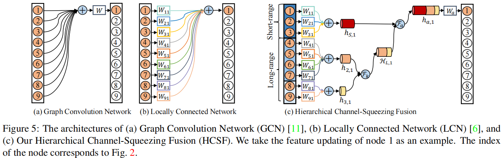

#### 通道压缩模块

在信息增益理论中，根据平均KL散度，hop-k的信息增益（IG）和函数$ae^{-bk}$拟合，这意味着长距离信息是指数下降的。因此，长距离信息维度由下式确定：

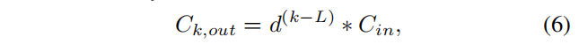

d是通道压缩率。

### 时序感知动态图学习

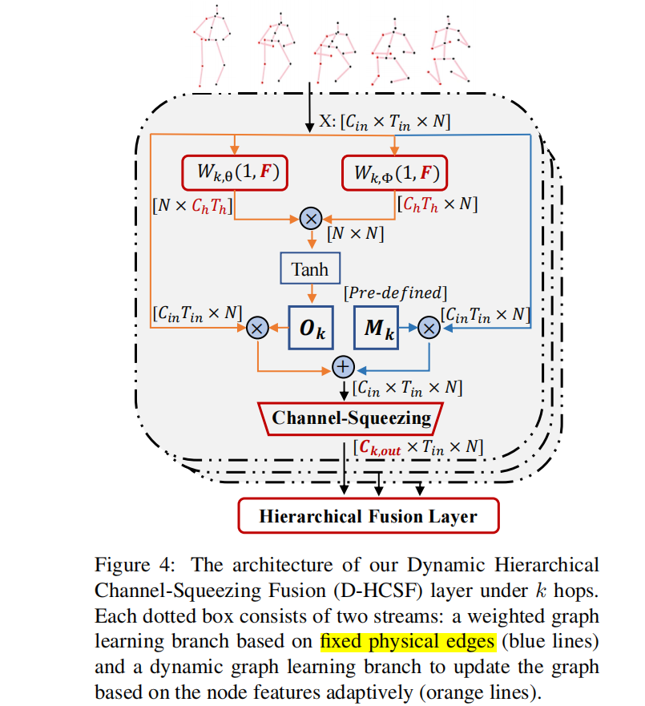

动态图由两个分支学习，一个分支由物理骨架拓扑关系更新，另一个由关节特征更新。

- 第一个分支：蓝色，由物理骨架拓扑（SemGCN）初始化，在训练过程中更新，**测试时固定**
- 第二个分支：黄色，通过学习的方式获得动态关系。测试时，这个图能够根据输入自适应调整。

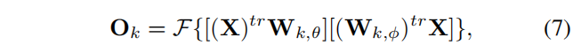

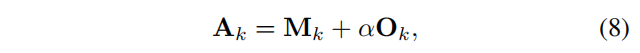

## 实验

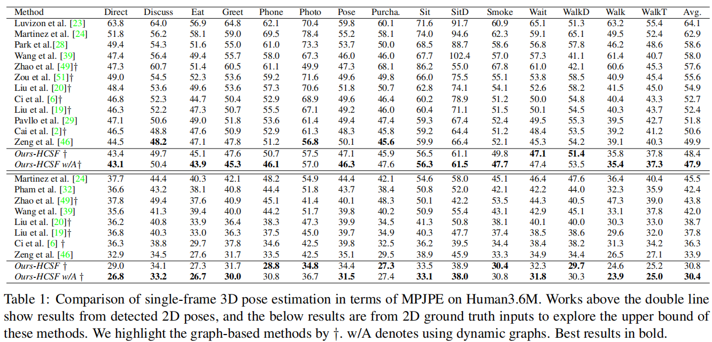

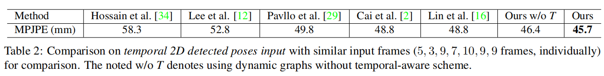

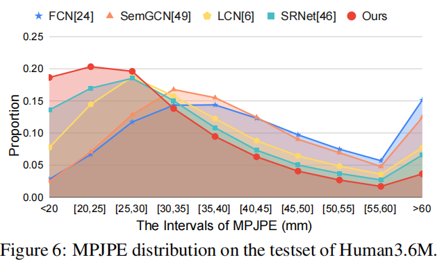

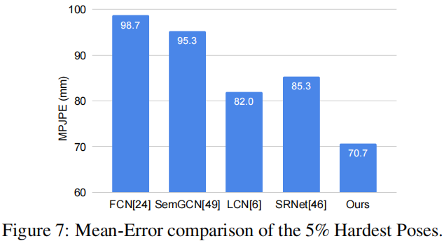

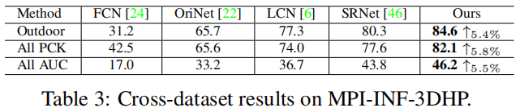

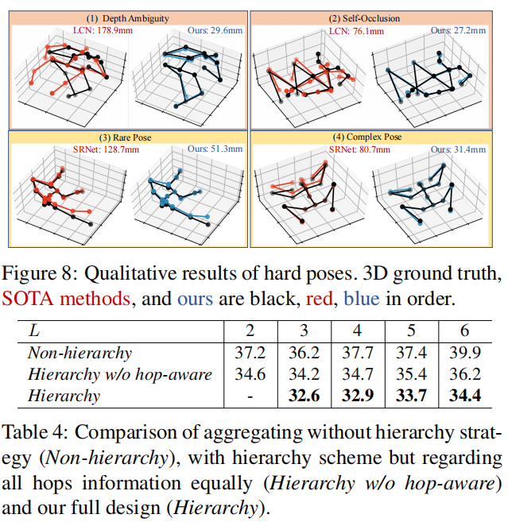

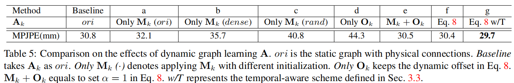

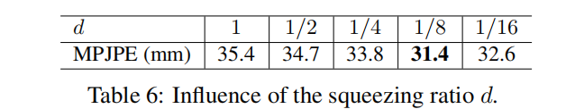

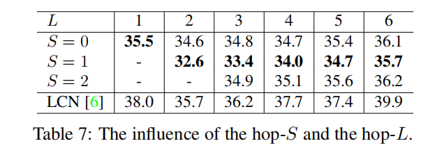

## 专业词汇

- action-specifific poses： 特定动作姿态
- human skeleton topology： 人体骨架拓扑

## 讨论

- Existing GNN-based solutions do not fully tap the potential of the skeleton graph 同样适用于GSAT
  - The power of graph neural networks lies in the aggregation of neighboring nodes, which, however, contributes both useful information and undesired noises.
  - The relationship between body joints varies with different poses.

- GCN训练好后，在测试中参数是固定的；
- Transformer（non-local）训练好后，在测试中参数能够根据输入自适应调整。

