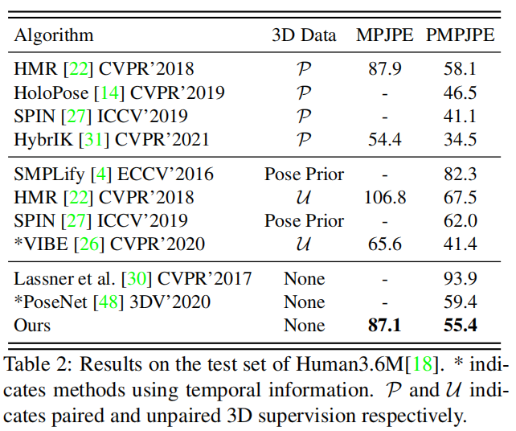

# Skeleton2Mesh: Kinematics Prior Injected Unsupervised Human Mesh Recovery

> ICCV 2021  
>
> Shanghai Jiao Tong University | Shanghai Key Lab of Digital Media Processing & Transmission

[TOC]

## 摘要

本文将无监督的人体网格重建解耦到已经充分研究的无监督三维姿态估计问题中，从估计的三维骨架中重建人体网格。从三维骨架估计人体网格存在两个主要的挑战：

- 姿态失败
  - 姿态不匹配：数据集和SMPL中**不同的骨架定义**
  - 姿态歧义：对于**相同的三维关节**坐标，端点可以进行**任意角度**的连接

- 形状歧义：从三维骨架中不能获得充足的形状信息，在人体配置中缺乏形状约束

于是我们提出了Skeleton2Mesh，这是一个从**单张图片**恢复人体网格的轻量框架。Skeleton2Mesh由三个模块组成：

- 可微逆运动学（Differentiable Inverse Kinematics，DIK）：从估计的三维骨架中推理三维旋转，这依赖于一组运行学先验知识。
- 姿态细化（Pose Refinement，PR）：处理姿态歧义，许多三维姿态估计的方法输出14-17个关节，但没有估计手和脚，因此使用该模块来解决这个问题
- 形状细化（Shape Refinement，SR）：处理形状歧义，利用现成的轮廓检测器来获得形状信息。

三个模块合在一起进行端到端的训练。

## 引言

三维人体重建的应用：人机交互（robot interaction）、增强现实（augmented reality）、动漫产业（animation industry）

不同于回归法和优化法依赖于**三维标签**或者**优化模块**，本文的方法需要三维监督训练，但不需要三维标签（比如三维骨架、SMPL参数等）、优化模块和时序信息。

### 无监督人体三维重建

目的：恢复SMPL模型，姿态参数（三维旋转）和形状参数

姿态参数：如果SMPL只使用姿态参数，不考虑形状信息，就和三维姿态估计相似。这激发我们可以用估计的三维骨架来方便人体网格的重建

形状参数：许多方法探索不配对的**三维姿态鉴别器**或者**平均shape的简单的正则化器**，来获得有效的人体网格。

**但平均shape的正则化器无法捕捉到特殊的合理的形状。**

## 方法

### Overview

### 姿态匹配分支

蓝色：

- 关节数量的不匹配
- 关节角度的不匹配，根关节的旋转不能通过三维骨架计算得到，但可以通过逆运动学求解得到

橘色：末端关节的旋转不受约束，不能通过逆运动学求解

#### 可微逆运动学

利用DIK来将三维骨架转换为三维旋转。DIK模块利用一个最小的先验知识集来定义底层的运行学三维结构。

#### Pose Refinement

从可微逆运动学不能推理出手腕的局部三维旋转，因为缺乏相应的父节点。因此引入PR模块，以特征图和编码轮廓信息为输入，输出末端的三维旋转，也就是头、手和脚这些没在DIK中求解出来的。

### 形状匹配分支

跟三维骨架相比，轮廓能够提供丰富的体型和身体方向信息。具体来说，就是将人体网格M结合一个弱视角相机参数，投影到二维平面，计算像素级的重投影损失。

#### 自适应的关节回归器

因为不同的数据集有不用的骨架表示，与使用预训练的mesh2joint转换矩阵不同，本文训练了一个转换矩阵：

## 实验

### 损失函数

- 总损失函数：

  

- 
- 

- 
- 
- 

- 

## 实验

### 定性实验

### 定量实验

### 消融实验

#### 分析每个模块

#### 分析自适应关节回归器

## 专业词汇

- pose mismatching - 姿态不匹配：数据集和SMPL中**不同的骨架定义**（pose mismatching – different skeleton defifinitions in dataset and SMPL）
- pose ambiguity - 姿态歧义：对于相同的三维关节坐标，端点具有**任意角度**的配置（pose ambiguity - endpoints have arbitrary joint angle configurations for the same 3D joint coordinates）
- shape ambiguity - 形状歧义（比如，对身体结构缺乏形状约束）
- off-the-shelf - 现成的
- view-invariant - 视图不变的
- multirigid-body - 多刚体
- orientation - 方向
- differentiable renderer - 可微渲染器
- non-convexity - 非凸性
- discontinuity on the rotation - 旋转的不连续性
