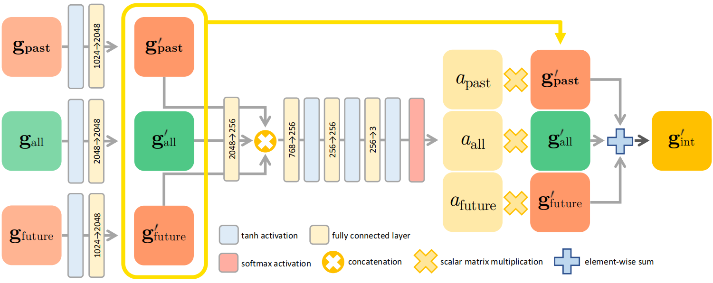

# TCMR: Beyond Static Features for Temporally Consistent 3D Human Pose and Shape from a Video

## 摘要

尽管近期在单图像人体三维重建上有很多成功的工作，但是从视频中重建具有时间一致性和光滑三维运动的人体仍然具有很大的挑战性。由于强烈地依赖当前帧的静态特征，基于视频的方法难以解决单图像方法中的时序不一致问题。在这点上，我们提出了一个时序连续网格重建系统（TCMR），能够高效地关注于过去帧和未来帧的时序信息，不被静态特征所主导。我们的TCMR比之前基于视频的方法有更好的每帧三维位姿和形状。

## 引入

目前有许多工作从图像来分析人体，从简单的二维骨架估计到重建人体的三维姿态和形状。尽管有所进展，但是从二维图像重建三维人体依然充满挑战，特别是在单目的情况下，存在深度不确定、数据集有限、人体关节复杂的困难。

之前的许多工作，比如Pose2Mesh[1]、I2L-MeshNet[2]基于参数化三维人体网格模型，直接从输入的单张图片回归模型参数。虽然在静态图片上有合理的输出，但是应用到视频上就会产生时序不一致和运动不平滑的问题。时序不稳定性是由于连续帧中不一致的三维位姿误差。误差可能大声在不同的三维方向，或者后续帧位姿输出可能保持相对不变，不能反映运动。

[3] [4] [5]扩展了单张图像重建到视频的方法，他们把视频序列输入到预训练的单帧图像三维人体重建网络[6] [7]来获得序列的静态特征，然后再送到时序编码器，对每个输入帧编码一个时序特征。然后，人体参数回归器从相应时间步长的时序特征输出每帧SMPL参数。

尽管这些工作极大提高了每帧三维位姿正确性和运动的平滑性，但仍然存在时序不一致性。重建失败的原因是因为对**当前帧静态特征**的强烈依赖。强烈依赖的原因是：

- 当前帧静态特征和时序特征的残差连接。虽然参擦汗链接已经被验证能够促进学习过程，但是纯粹地将残差连接用于时间编码可能会阻碍系统学习有用的时序信息。假设静态特征是从预训练网络提取出来的，它包含了当前帧很重的SMPL参数，静态特征的残差连接恒等映射可能会使得SMPL参数回归器严重依赖于残差连接，而只是略微利用到时序特征，限制了时序编码器编码更有用的时序特征。

- 时序编码使用了所有帧的静态特征，当前帧的静态特征对当前时序特征有最大的影响潜力。当前工作尽管能够重建当前帧很高的人体精度，但是阻碍了时序编码器学习过去和未来的时序信息。因此基于视频的人体三维重建存在时序不一致的问题。

于是，我们提出TCMR - 时序连续网格重建系统，用来解决对当前静态特征的强烈依赖，以实现时序一致性和视频的平滑的三维人体运动输出。

- 首先，fellow之前基于视频的工作[3] [4] [5]，但是移除了静态特征和时序特征之间的残差连接。
- 引入PoseForecast，由两个时序编码器构成，分别利用过去和未来帧来预测当前帧的位姿。因此PoseForecast的时序特征不受当前静态特征影响。
- 当前时序特征是从所有输入帧提取出来的。
- PoseForecast预测的时序特征和输入帧的时序特征融合，用来预测当前的SMPL参数。

通过移除当前静态特征的强依赖，我们的SMPL回归器能够专注于过去和未来帧，而不是只有当前帧。

论文的贡献：

- 提出了一个时序一致的网格重建系统（TCMR），能够从视频中产生时序一致性和平滑的三维人体运动，高效地利用了过去和未来的时序信息，而不是只关注与当前帧的静态信息。
- 虽然简单，TCRM不仅提高了三维人体运动的时序一致性，也提高了每帧的位姿和形状的准确性

## 相关工作

### 基于单张图像的三维人体姿态和形状估计

许多单张图像的人体三维重建都是基于模型的方法，来预测预定义的三维人体网格模型SMPL的参数。[6]提出了一个**端到端可训练的人体网格重建（HMR）**系统，使用**对抗性损失**使得输出的人体三维网格是解剖学上合理的。[8]使用**二维关节热图**和轮廓来预测正确的SMPL参数。[9]使用**人体部分分割**来回归SMPL。[10]使用**多视图颜色一致性**来监督网络形成多视图几何。[11]引入**自我改善系统**来约束SMPL参数回归器并**迭代拟合框架**。[12]融合人体**层次运动学先验**到网络中。

相反，无模型的方法直接估计形状而不是回归模型的参数。[13] BodyNet在**三维体积空间**中，评估三维人体形状。[14] 设计了一种**图卷积人体网格回归系统**，以**模板人体网格**作为输入，利用来自ResNet的图像特征预测网格顶点坐标系。[2] I2L-MeshNet引入了一种基于**lixel**（线+像素）的一维热图，以全卷积的方式来定位网格顶点。[1] Pose2Mesh提出从二维人体位姿重建三维人体位姿的**图卷积网络**。

但基于图片的工作存在时序不一致性。

### 基于视频的三维人体位姿和形状估计

[15] HMMR使用**一维全卷积时序编码器**来提取静态特征并编码到时序特征。它通过预测附近的过去和未来帧的三维位姿，来学习时序上下文表达来减少三维预测的时序不一致性。[16] 利用**光流**和二维位姿序列来训练他们的网络，从而在视频上有很好的表现。[17] 提出**骨架解耦框架**，把三维人体姿态和形状分解成多层次的时空子问题。他们排序打乱的帧，来鼓励时间特征的学习。[4] VIBE使用**双向GRU**将输入帧的静态特征编码到时序特征，并将时序特征输入SMPL参数回归器，利用**运动鉴别器**来鼓励回归器产生真实的三维人体运动。[5]MEVA使用**由粗到细的方式**，他们的系统首先使用**变分运动估计器（VME）**评估粗糙的三维人体运动，然后使用运动**残余回归器（MRR）**预测残余的运动。

### 视频的时序一致三维人体运动

[15] HMMR引入了时序一致性和人体运动平滑性**三维姿态加速度误差**，和单张图像的方法相比，HMMR和VIBE降低了加速度误差。但是，他们在每帧的正确性和时序的一致性上做了**权衡（trade-off）**，HMMR输出了更加平滑的三维人体运动但是减少了每帧三维位姿的准确性。VIBE展示了较高的每帧三维位姿准确性，但是和HMMR相比在定量指标和定性结果上具有时序不一致性。

[5] MEVA尝试建立每帧三维位姿准确性和时序平滑性的平衡，尽管在两个指标上都展示了更好的结果，但是定性结果依然暴露出不平滑的三维运动。原因是系统过于依赖当前的静态特征来估计当前三维位姿和形状。

- 首先，MEVA建立了当前帧的静态特征和时序特征的残差连接；
- 用**运动残差回归器（MRR）**来细化初始三维姿态和形状的时序特征，是从所有帧的静态特征编码来的，包括当前帧。这个过程会导致时序特征被当前静态特征主导。
- 因此，这个精细化过程会收到当前静态特征的严重影响，连续帧的三维误差出现不一致。

相反，TCMR被有意设计来减小对静态特征的严重依赖，残差连接被移除，PoseForecast网络预测来自过去和未来帧额外的时序特征。我们的方法减少了依赖并提供三维人体运动的时序一致性和准确性。

### 从图像中预测三维人体位姿

[15] [18] [19]提出从RGB输入预测人体未来三维位姿。[15]HMMR使用hallucinator（幻觉器？）从当前输入图像预测当前、未来和过去的三维姿态，并由以为全卷积时序编码器的输出进行自监督。[19] 提出神经自回归框架，以过去的视频帧为输入来预测未来的三维运动。 [18] 采用深度强化学习来预测未来三维人体位姿 。虽然目标大欧式预测未来三维位姿，我们的系统目标是从静态特征中解放出来，学习有用的时序特征。

## 方法

TCMR的框架如下：

### 1. 所有帧的时序编码

给定视频的RGB序列，经过[11]预训练的残差网络，提取每帧的静态特征。然后将残差网络的输出进行全局平均池化，得到$f$。ResNet网络的权重由所所有帧共享。

利用所有输入帧的静态特征我们利用双向GRU计算当前帧的时序特征，这两个双向GRU从相反的时间方向上从输入静态特征中提取时序特征。

- 两个双向GRU的输入分别是第一个$f_1$和最后一个的$f_T$，他们的初始隐藏状态都是零张量。
- 然后，他们通过聚合下一帧的静态特征来反复更新隐藏状态。
- 在当前帧的GRU的连接隐藏状态成为当前时序特征$g_{all}$。不像VIBE，我们没有在$f_{T/2}$和$g_{all}$之间加入残差连接，所以时序特征不会被静态特征主导。

### 2. PoseForecast的时序编码

PoseForecast网络使用两个额外的GRU，记为$G_{past}$和$G_{future}$，预测来自过去和未来帧额外的时序特征。过去帧定义为：1到当前帧-1，未来帧定义为：当前帧+1到结束帧。$G_{past}$的初始输入是$f1$，初始隐藏状态是零张量。然后通过不断聚合接下来的帧$f_2,...f_{T/2-1}$来反复更新隐藏状态。同样，$G_{future}$的初始输入是$f_T$，初始隐藏状态是零张量。然后通过不断聚合接下来的帧$f_{T-1},...f_{T/2+1}$来反复更新隐藏状态。

### 3. 时序特征融合

我们将所有帧的时序特征$g_{all}$、过去帧的时序特征$g_{past}$、未来帧的时序特征$g_{future}$进行融合得到最后的三维网格估计，如下图。

- 每个时序特征都经过ReLU激活函数和全连接层，来改变维数到2048，输出记为$g'_{all}$、$g'_{past}$、$g'_{future}$
- 然后，通过共享的全连接层将输出特征调整到256并连接
- 连接后的特征通过许多全连接层，后面都跟着softmax激活函数，产生注意值$a_{all}$、$a_{past}$、$a_{future}$。注意值代表特征应该得到的权重。
- 最后的的融合时序特征为：$g'_{int}=a_{all}g'_{all}+a_{past}g'_{past}+a_{future}g'_{future}$

训练的时候，我们将$g'_{all}$、$g'_{past}$、$g'_{future}$扔到SMPL参数回归器，分别得到每个时序特征的参数。最后使用$\Theta_{int}$作为最后的三维人体网格。

### 4. 损失函数

L2损失函数：（1）预测值和真实值SMPL参数；（2）二维和三维关节坐标，跟VIBE一样，三维坐标由SMPL参数获得，二维关节坐标由三维关节坐标通过相机参数的反投影获得。

## 实施细节

用预训练好的[20]SPIN作为backbone和回归器。权重使用Adam优化器优化。人体区域用之前的工作裁剪出来，并调整到224*224。对对象进行遮挡，以增强数据。用ResNet从裁剪的图像中计算静态特征。

## 数据集

## 关键词

temporal consistency - 时序一致性

smooth 3D human motion - 光滑三维人体运动

static feature - 静态特征

depth ambiguity - 深度不确定性

**residual connection - 残差连接**

pretrained network - 预训练网络

identity mapping - 恒等映射

human mesh recovery system（HMR）- 人体网格重建系统

anatomically plausible - 解剖学上合理

2D joint heatmap - 二维关节热图

human part segmentation - 人体部分分割

multi-view color consistency - 多视图颜色一致性

self-improving system - 自我改善系统

3D volumetric space - 三维体积空间

graph convolutional network - 图卷积网络

lixel - 线+像素

optical flow - 光流

generalize well - 很好的推广

skeleton-disentangling framework - 骨架解耦框架？？？

multi-level spatial and temporal subproblems - 多层次的时空子问题

variational motion estimator（VME）- 变分运动估计器

motion residual regressor（MRR）- 运动残余回归器

3D pose acceleration error - 三维姿态加速度误差

trade-off - 权衡

quantitative metrics - 定量指标

qualitative results - 定性结果

consecutive frame - 连续帧

hallucinator - 幻觉器？？？

neural autoregressive framework - 神经自回归框架

global average pooling - 全局平均池化

attention values - 注意值

## 参考文献

 [1] Hongsuk Choi, Gyeongsik Moon, and Kyoung Mu Lee.

Pose2Mesh: Graph convolutional network for 3D human

pose and mesh recovery from a 2D human pose. *ECCV*,

2020.

[2] Gyeongsik Moon and Kyoung Mu Lee. I2L-MeshNet:

Image-to-Lixel prediction network for accurate 3D human

pose and mesh estimation from a single RGB image. *ECCV*,

2020.

[3] Angjoo Kanazawa, Jason Y Zhang, Panna Felsen, and Jiten

dra Malik. Learning 3D human dynamics from video. *CVPR*,

2019.

[4] Muhammed Kocabas, Nikos Athanasiou, and Michael J

Black. VIBE: Video inference for human body pose and

shape estimation. *CVPR*, 2020. 

[5] Zhengyi Luo, S Alireza Golestaneh, and Kris M Kitani. 3D

human motion estimation via motion compression and re-

fifinement. *ACCV*, 2020. 

[6] Angjoo Kanazawa, Michael J Black, David W Jacobs, and

Jitendra Malik. End-to-end recovery of human shape and

pose. *CVPR*, 2018

[7] Nikos Kolotouros, Georgios Pavlakos, Michael J Black, and

Kostas Daniilidis. Learning to reconstruct 3D human pose

and shape via model-fifitting in the loop. *ICCV*, 2019.

[8] Georgios Pavlakos, Luyang Zhu, Xiaowei Zhou, and Kostas

Daniilidis. Learning to estimate 3D human pose and shape

from a single color image. *CVPR*, 2018. 

[9] Mohamed Omran, Christoph Lassner, Gerard Pons-Moll, Pe

ter Gehler, and Bernt Schiele. Neural Body Fitting: Unifying

deep learning and model based human pose and shape esti

mation. *3DV*, 2018. 

[10] Georgios Pavlakos, Nikos Kolotouros, and Kostas Daniilidis.

TexturePose: Supervising human mesh estimation with tex

ture consistency. *ICCV*, 2019.

[11] Nikos Kolotouros, Georgios Pavlakos, Michael J Black, and

Kostas Daniilidis. Learning to reconstruct 3D human pose

and shape via model-fifitting in the loop. *ICCV*, 2019. 

[12] Georgios Georgakis, Ren Li, Srikrishna Karanam, Terrence

Chen, Jana Kosecka, and Ziyan Wu. Hierarchical kinematic

human mesh recovery. *ECCV*, 2020.

[13] Gul Varol, Duygu Ceylan, Bryan Russell, Jimei Yang, Ersin

Yumer, Ivan Laptev, and Cordelia Schmid. BodyNet: Vol

umetric inference of 3D human body shapes. *ECCV*, 2018.

[14] Nikos Kolotouros, Georgios Pavlakos, and Kostas Dani

ilidis. Convolutional mesh regression for single-image hu

man shape reconstruction. *CVPR*, 2019. 

[15] Angjoo Kanazawa, Jason Y Zhang, Panna Felsen, and Jiten

dra Malik. Learning 3D human dynamics from video. *CVPR*,

2019.

[16] Carl Doersch and Andrew Zisserman. Sim2real transfer

learning for 3D human pose estimation: motion to the res

cue. *NeurIPS*, 2019.

[17]  

Yu Sun, Yun Ye, Wu Liu, Wenpeng Gao, YiLi Fu, and Tao

Mei. Human mesh recovery from monocular images via a

skeleton-disentangled representation. *ICCV*, 2019.

[18] Ye Yuan and Kris Kitani. Ego-pose estimation and forecast

ing as real-time pd control. *ICCV*, 2019. 3

[19] Jason Y Zhang, Panna Felsen, Angjoo Kanazawa, and Jiten

dra Malik. Predicting 3d human dynamics from video. *ICCV*,

\2019. 

[20] Nikos Kolotouros, Georgios Pavlakos, Michael J Black, and

Kostas Daniilidis. Learning to reconstruct 3D human pose

and shape via model-fifitting in the loop. *ICCV*, 2019.

[21] Yi Zhou, Connelly Barnes, Jingwan Lu, Jimei Yang, and Hao

Li. On the continuity of rotation representations in neural

networks. *CVPR*, 2019.
