# THUNDR: Transformer-based 3D HUmaN Reconstruction with Markers

> ICCV 2021
>
> Google Research

[TOC]

## 摘要

本文提出了THUNDR，一个基于Transformer的从单目RGB图像恢复三维姿态和形状的方法。我们方法的关键是中间**三维标记点**，通过结合无模型输出架构的人体表面模型，比如最近提出的GHUM，进行端到端的训练，来实现全身统计的三维人体模型。我们提出的基于Transformer的方法可以专注于与任务相关的图像区域，支持自监督机制，保证解决方案与人体测量相一致。

## 引言

统计人体模型提供了丰富的解剖和语义信息。人体测量统计可以用来正则化学习和推理的过程，在没有这些约束的情况下，由于单目图像到三维的提升的模糊性，很容易产生混乱。语义模型不仅可以提供三维的对齐信号，还可以帮助规范三维的解决方案。如果没有语义限制，可能打破身体的对称性、肢体的相对比例、表面非自交的一致性和关节角度的限制。

我们的方法依赖于**三维表面标记**和**三维统计模型**。标记还有一个额外的优点，可以在不同的参数模型之间进行配准。

现有的三维人体重建的方法分为有模型的和无模型的，后者的精度一般会比前者高。而前者在语义和结构上更直观，更容易在自监督学习中使用，对没遇到的姿态更鲁棒。我们的工作结合了二者的优势：预测可观测的标记，并使用统计的运动学上的姿态和形状模型。进一步，使用多层细化的视觉Transformer，来提高性能。

## 方法

### GHUM

- 形状参数：
  - 身体+表情
  - $\beta=\left(\beta_{b}, \beta_{f}\right)$

- 姿态参数：
  - 身体+左/右手
  - $\theta=\left(\theta_{b}, \theta_{l h}, \theta_{r h}\right)$

- 骨盆参数：
  - 旋转和平移是独立控制的
  - 旋转：6D旋转$\mathbf{r} \in \mathbb{R}^{6 \times 1}$
  - 平移：$\mathbf{t} \in \mathbb{R}^{3 \times 1}$

- 网格
  - 顶点：$N_{v}=10,168$
  - 三角面：$N_{t}=20,332$

### 相机模型

针孔相机，透视投影，$\mathbf{x}_{2 d}=\Pi\left(\mathbf{x}_{3 d}, \mathbf{C}\right)$

因为使用的是裁剪的图像，为了使得裁剪图像和原始图像对齐，进行了一个相机内参的转换：
$$
\left[\mathbf{C}_{c}^{\top} 1\right]^{\top}=\mathbf{K}\left[\mathbf{C}^{\top} 1\right]^{\top}
$$
其中K是5*5的尺度和平移矩阵。

### 基于标记的建模

受无模型方法对输出施以较弱约束的启发，我们采用三维表面标记作为中间输出，三维表面标记可以捕获人体形状和姿态。

我们使用了两个网络来恢复GHUM人体模型：

- 从三维标记点重建GHUM网格顶点
- 从三维标记点恢复GHUM参数

三维标记点可以从GHUM网格顶点，通过一组简单且固定的线性回归矩阵获得：$\mathbf{M}=\mathbf{W V}(\theta, \beta, \mathbf{r}, \mathbf{t})$，其中我们对回归的三维标记点注入了噪声。

#### 基于标记点的姿态器

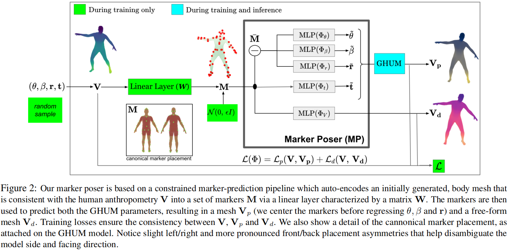

其中Vd是直接从标记点预测的，Vp是通过GHUM参数获得的

## THUNDR

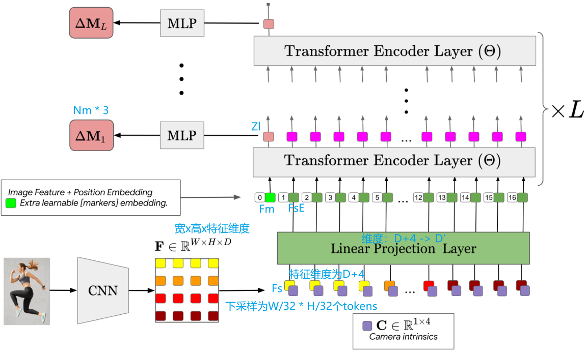

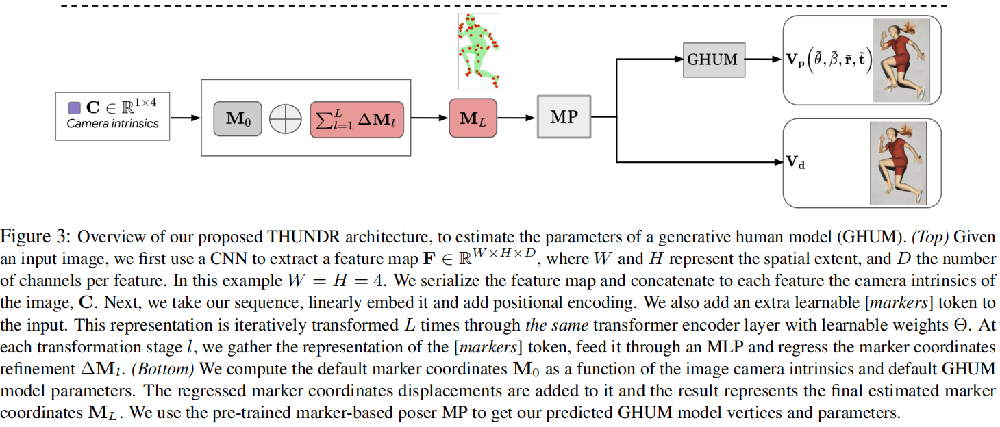

### 损失函数

- 姿态和形状参数的正则化损失：

- 平均标记点损失：

  

- 二维关节点重投影加权损失：

  

- 人体解析对齐损失：

  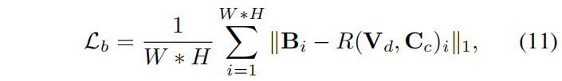

- 三维损失：

  

- 总损失：

  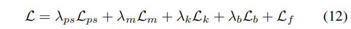

# 实验

### 数据集

#### Human3.6M

- Human3.6M有三个常用的protocols，P1和P2将官方的训练集划分为新的训练集（S1, S5-S8）和测试集（S9, S11）
- P1在所有可得的相机视角都进行了测试
- P2只在一个单一预定义的视角进行测试，这是一个高度不确定的protocol，因为它的小尺寸和设计。
- 第三个也是最具代表性的官方的protocol，我们对保留的900K样本的测试集进行了评估。

#### 3DPW 

这个工作中用来测试

### 定量实验

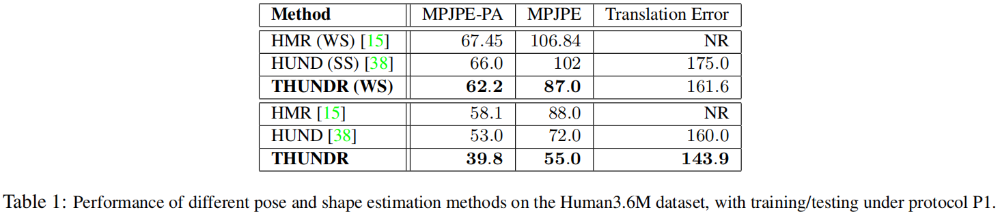

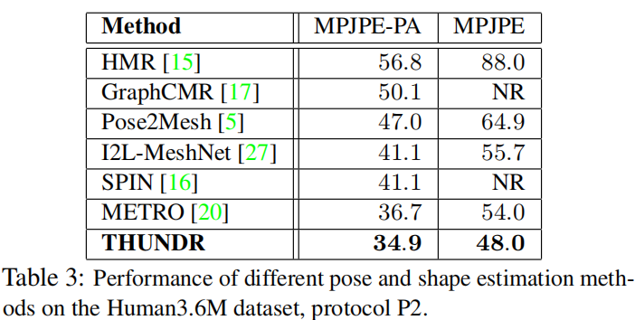

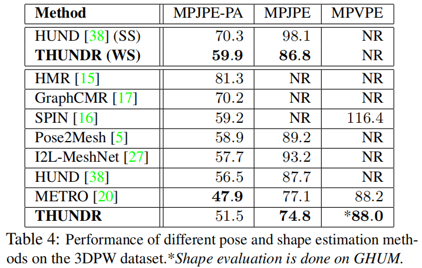

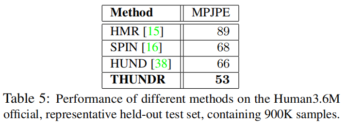

### 消融实验

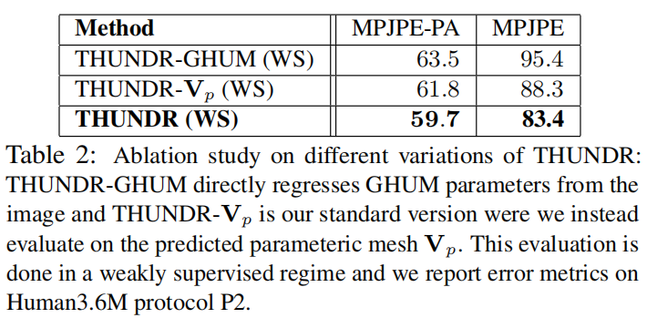

### 可视化

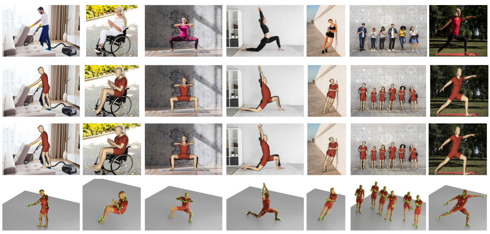

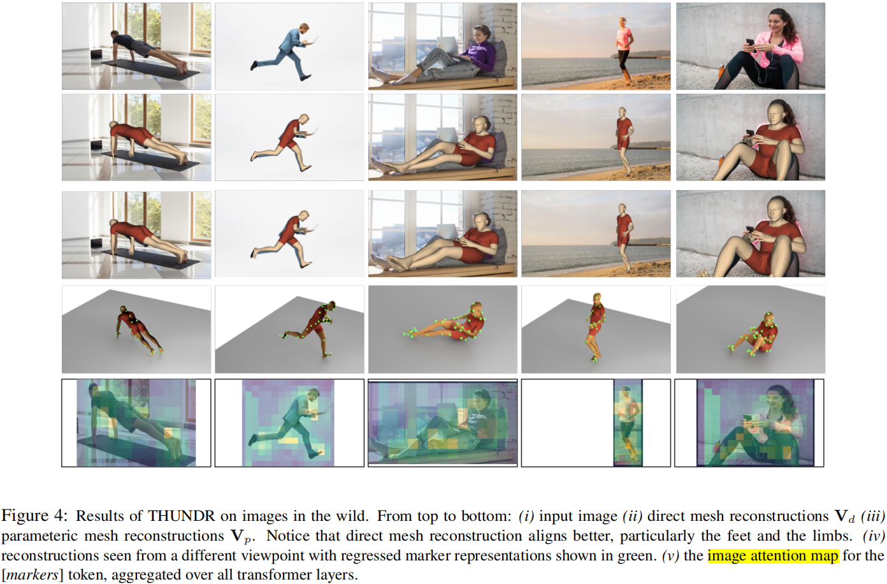

## 专业词汇

- emergence - 出现、兴起
- anthropometry - 人体测量学
- ambiguity - 歧义
- symmetry of the body - 身体的对称性
- relative proportions of limbs - 肢体的相对比例
- consistency of the surface - 表面的一致性
- non self-intersection - 非自交
- joint angle limits - 关节角度限制
- deep variational auto-encoders - 深变分自动编码器
- pelvis - 骨盆
- perspective model - 透视模型
- orthographic model - 正交模型

