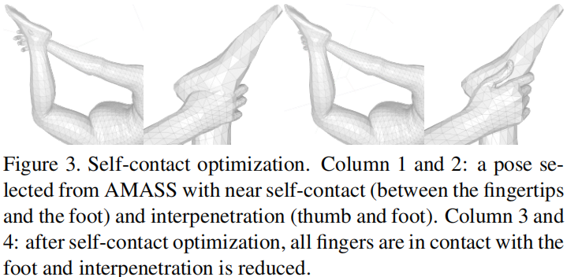

# On Self-Contact and Human Pose

> CVPR 2021
>
> Max Planck Institute for Intelligent Systems & ETH Zurich

[TOC]

## 摘要

许多人的图像包含各种自我接触，但是目前的三维人体姿态和形态（HPS）回归方法通常无法对此进行估计。为了解决这个问题，我们开发了一个新的数据集和方法，显著提高了包含自我接触的人体姿态估计。首先，我们创建了一个3D接触姿态（3DCP）的数据集，其中包含有拟合AMASS的3D 扫描和姿态的SMPL-X模型，我们对他们做了接触的细化。据此，我们创建了MTP数据集，模拟人体自我接触的姿态数据集。第三，我们提出了一个HPS优化方法，称为SMPLify-XMC，包括接触约束，并在拟合过程中使用已知的3DCP姿态为MTP图像创建接近ground-truth的姿态。第四，为了获得更多的图像种类，我们用离散自接触(DSC)信息标记一个in-the-wild图像数据集，并使用另一种新的优化方法SMPLify-DC，该方法在姿态优化过程中利用离散接触。最后，我们用我们的数据集训练SPIN，称为TUCH，显著提高了在原来数据集上3D人体姿态估计的性能。

## 引言

自接触在人类行为中无处不在，但在计算机视觉中却很少研究。当自接触发生，模型估计的姿态应该要能够反映真实的接触。现有的方法往往在具有自接触的图像上表现不佳。

学习的方法依赖于带标签的训练数据，但是目前的训练数据缺乏3D接触的信息。

因此我们提出了关注自接触的三个新的数据集，包含不同程度的细节。除此之外，我们还提出了两个新的优化方法来拟合自接触的3D人体到图像，来产生带自接触的3D姿态的伪ground-truth。

一个关键的观察结果是，如果我们知道自接触（甚至是近似的），就能通过消除自由度而大大减小姿态的模糊性。

本文的关键贡献是：

- （1）我们介绍了TUCH，第一个端到端的自接触的HPS回归。
- （2）我们创建了一个新的包含现实接触的三维人体网格数据集(3DCP)。
- （3）我们定义了一个“模拟姿势”的MTP任务和一个新的优化方法，以创建一个新的具有精确的3D参考数据的in-the-wild图像数据集。
- （4）我们使用离散接触标签，创建了一个具有参考姿态的大型图像数据集。
- （5）我们在实验中表明，自接触信息以两种方式（数据和损失）改进了姿态估计，从而在三维姿态估计基准上获得了最先进的结果。
- （6）这些数据和代码可用于研究目的。

## 相关工作

### 带接触的三维姿态估计

关于接触的信息可以在许多方面有利于3D HPS估计，通常能够提供额外的物理约束，比如肢体之间的相互接触。

#### 身体接触

加入loss：加入渗透loss、加入体素占用排除loss

引入接触信号

#### 世界接触

许多方法使用3D场景来帮助3D HPS估计。物理约束可以来自于地面、物体和场景信息。

## 方法

### 自接触的定义

欧氏距离：空间中的最短距离

测地距离：不离开曲面从A点走到B点的最短距离

定义1：两个顶点满足自接触的条件是，他们的欧式距离很小，但是测地距离大。这样的顶点对被收集起来。我们将自接触网格分类为不同的类型。

我们定义自接触信号，$S \in \{0,1\}^{K \times K}$，我们首先把网格顶点分为K个区域，每个区域没有交集。

定义2：两个网格区域接触的条件是，两个区域之间存在自接触的顶点，此时他们的自接触信号$S_{kl}=S_{lk}=1$。

由于全身顶点密度的变化，顶点-顶点的距离是一个很差的近似。为此我们均匀地、密集地来采样点。$M_{P} \in \mathbb{R}^{P \times 3}$ with $P=20,000$。计算P上的距离来代替直接从$M_V$上计算距离。

### 自接触数据集

我们首先绘制自接触网格，然后通过一种新的姿态模拟和拟合程序将它们与图像配对。我们使用SMPL-X来创建3DCP和MTP数据集，以更好地适合手和身体之间的接触。然而，为了微调SPIN[23]，我们将MTP数据转换为SMPL拓扑，并在使用离散接触进行优化时使用SMPLify-DC

#### 3DCP网格

包括两个部分：3D扫描和来自AMASS的自接触运动捕获数据。

由于AMASS数据集中有一部分数据存在自渗透或者过近，因此我们使用自接触优化来改善这些情况。

#### MTP数据

有个3DCP网格后，人们模仿网格做出相应的pose以此来收集in-the-wild图像，然后网格根据真实图像再进行refine。

优化过程的损失函数为：

第一个是重投影损失，第二个是左右手的标准先验，第三个是pose偏离所提供的pose的惩罚L2 loss。M考虑了真值的高和宽，C是接触点的loss，如下：

Ls是细粒度的自接触优化，$\mathcal{L}_{\mathcal{S}}=\lambda_{C} \mathcal{L}_{C}+\lambda_{P} \mathcal{L}_{P}+ \lambda_{A} \mathcal{L}_{A}$

C:自接触的顶点相互拉近，P:在网格内的顶点被推到表面，A:对齐两个接触顶点的表面法向量。

#### 离散自接触数据（DSC）

离散的自接触标注提供了关于姿态的有用的3D信息。我们使用K=24区域，并为三个公开的数据集（LSP, LSPet, DF）标记它们的成对的接触。

### TUCH

最后，我们训练了一个与SPIN设计相同的回归网络。

#### 回归

其中离散接触损失，拉近接触点的距离。（PS：用L2 loss可以同时处理表面内外的顶点。）

## 实验

## 专业词汇

- interpenetration - 渗透，相互贯通

## 讨论

- 自接触能够减少自由度来缓解2D->3D的模糊性。
- 自接触可以提供一些物理约束，来防止肢体之间的相互渗透
- 测地距离和欧氏距离可以用来判断自接触

