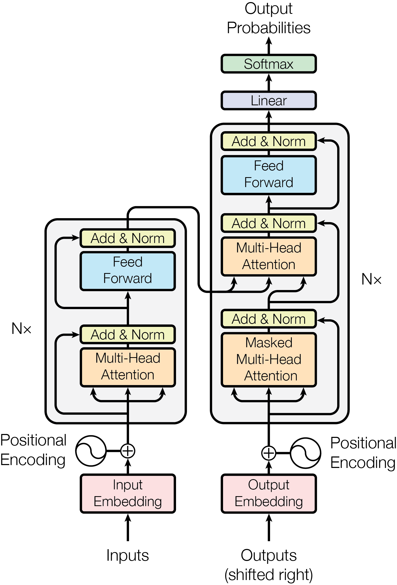
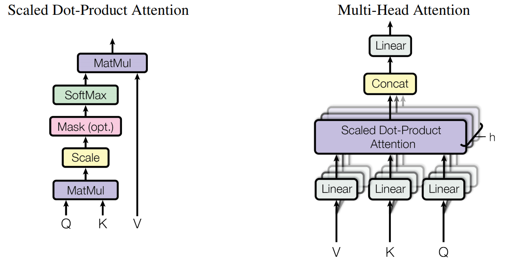
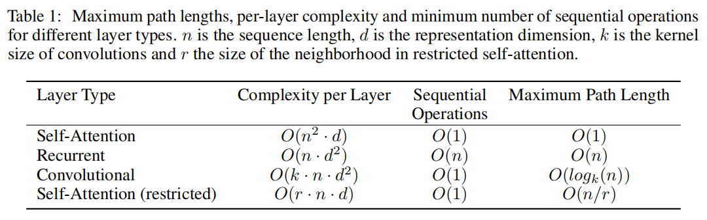
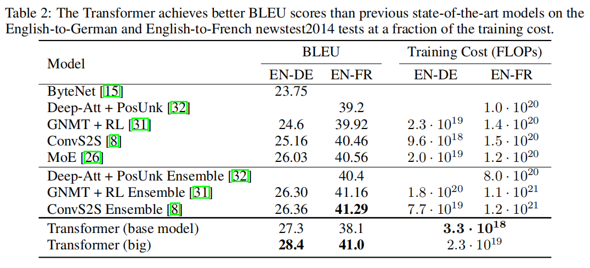
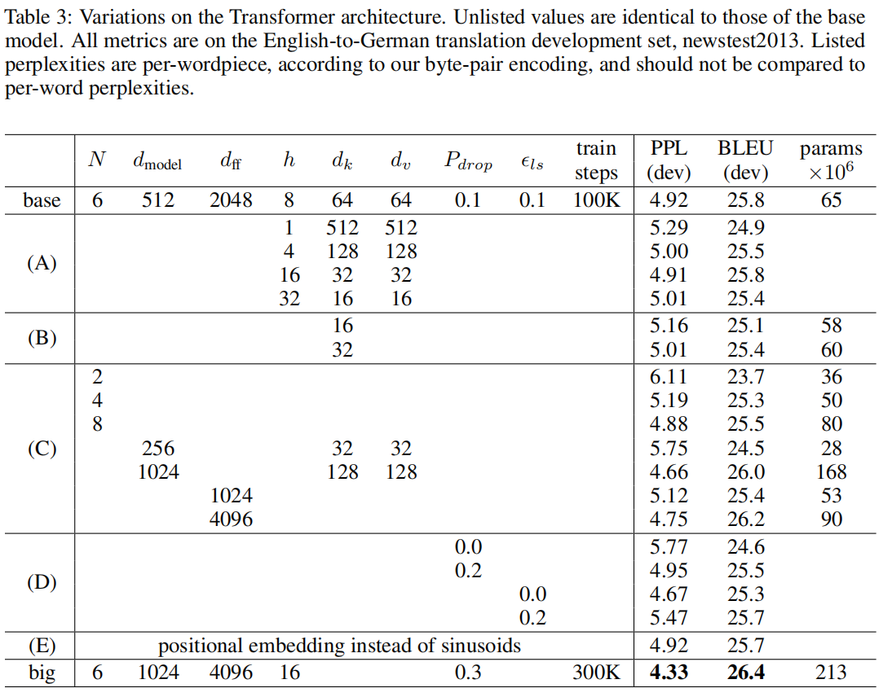

# Transformer: Attention is All You Need

[TOC]

## 摘要

主要的序列转换模型是基于复杂的RNN或者CNN，其中包括一个编码器和一个解码器。性能最好的模型还通过注意机制连接编码器和解码器。我们提出了一种新的简单的网络架构，即Transformer，**完全基于注意机制，完全避免了循环和卷积**。在两个机器翻译任务上的实验表明，这些模型在质量上更优越，同时更并行，需要的训练时间明显更少。我们的模型在WMT2014英-德翻译任务上实现了28.4BLEU，比现有的SOTA，包括集成提高了2BLEU。在WMT2014英法翻译任务中，我们的模型在8个gpu上进行了3.5天的训练，建立了一个新的最先进的单模型BLEU分数为41.0，只占最佳模型训练成本的一小部分。

## 1. 引言

RNN（Recurrent neural networks），特别是LSTM（ long short-term memory）和GRU（ gated recurrent neural networks），已成为序列建模和转换问题的最先进方法，比如语言建模和机器翻译。许多工作继续推动循环语言模型和编解码器结构的边界。

**循环模型**（recurrent models）通常沿着输入和输出序列的符号位置进行计算。将这些位置与计算时间中的步骤对齐，它们生成一个隐藏状态ht序列，作为前一个隐藏状态ht−1的函数和位置t的输入。这种固有的**顺序性质阻止了训练的并行化**，这在较长的序列长度上变得至关重要，因为内存限制了跨示例的批处理。最近的工作通过因子分解技巧和条件计算显著提高了计算效率，同时也提高了后者的模型性能。然而，顺序计算的基本约束仍然存在。

**注意力机制**（attention mechanisms）已经成为各种任务中**序列建模**（sequence modeling）和**转换模型**（transduction models）的一个重要组成部分，它允许依赖关系的建模而不用考虑它们在输入或输出序列中的距离。然而，在除少数实例外，这种注意力机制是和循环网络一起使用的。

在这项工作中，我们提出了**Transformer，一种避开循环的模型架构，完全依赖于一种注意机制来描绘输入和输出之间的全局依赖关系**。Transformer允许更多的**并行化**，在8个p100gpu上训练了12个小时后，可以达到翻译质量的新SOTA。

## 2. 背景

减少**串行计算**的目标也构成了扩展神经GPU、ByteNet和ConvS2S的基础，所有这些网络都使用卷积神经网络作为基本的构建块，**并行计算**所有输入和输出位置的隐藏表示。在这些模型中，关联来自两个任意输入或输出位置的信号所需的操作数量随着他们位置之间的距离而增加，ConvS2S是线性，ByteNet是对数，这使得学习遥远位置的依赖关系更加困难。在Transformer中，操作数量被减少到一个常数的大小，尽管由于**平均注意力加权的位置（averaging attention-weighted positions）而降低有效分辨率**，我们使用多头注意力（Multi-Head Attention）来抵消影响。

**自注意力（Self-attention），有时也被称为内注意力，是一种关联单个序列的不同位置的注意机制**，以计算序列的表示。自我注意已成功地应用于阅读理解、抽象摘要、文本隐含和学习任务独立的句子表征。

端到端记忆网络（End-to-end memory networks）基于循环注意力机制（recurrent attention mechanism），而不是序列对齐的循环，并已被证明在简单语言问题的回答和语言建模任务上表现良好。

然而，据我们所知，**Transformer是第一个完全依赖于自注意力来计算其输入和输出的表示的转换模型，而不使用序列对齐的rnn或卷积**。在下面的章节中，我们将描述Transformer，自注意力的动机，并讨论其相对于其他模型的优势。

## 3. 模型结构

大多数有竞争力的神经序列转换模型都具有编码器-解码器结构。在这里，编码器将一个符号表示的输入序列(x1，...，xn)映射到一个连续表示的序列z=(z1，...，zn)。给定z，解码器一次生成一个元素的符号输出序列(y1，...，ym)。在每一步中，模型都是自回归的，在生成下一个符号时，使用先前生成的符号作为额外的输入。

Transformer遵循这种整体架构，使用堆叠的自注意层和point-wise，编解码器都是全连接层，分别如图1的左半部分和右半部分所示。

### 3.1 编解码器堆 

#### 编码器：

编码器由**N=6**堆相同的层组成。每层有两个子层，第一个是**多头自注意力机制**（Multi-Head Self-Attention），第二个是一个简单的**位置全连接前馈网络**。我们在两个子层都使用**残差连接**，然后进行层归一化。即，每个子层的输出为$LayerNorm(x+Sublayer(x))$，其中$Sublayer(x)$是子层本身实现的函数。为了方便这些残差连接，模型中的所有子层以及嵌入层都会产生维度d=512的输出。

#### 解码器：

解码器也是由**N=6**个相同的层堆叠组成。除了每个编码器层中的两个子层外，解码器还插入第三子层，该子层对编码器堆的输出执行多头注意力。与编码器类似，我们在每个子层使用残差连接，然后进行层归一化。我们还修改了解码器堆中的自注意力子层，以防止位置关注后续位置。这种掩蔽（mask），将Output Embedding做一个位置偏移，确保了对位置i的预测只能依赖于小于i的位置的已知输出。

### 3.2 注意力

**注意力函数可以描述为将一个查询（query）和一组键值对（key-value pairs）映射到输出，其中查询、键、值和输出都是向量**。输出是值的加权和，其中分配给每个值的权重由查询与相应键的兼容函数计算。

#### 3.2.1 缩放点乘注意力

我们称我们特殊的注意力为 “Scaled Dot-Product Attention”（图2），输入由$d_k$维的查询和键以及$d_v$维的值组成。我们使用所有键计算与查询的点乘，每个除以$\sqrt{d_{k}}$，然后应用softmax函数获得值的**权重**。

实际操作时，我们同时计算一组查询的注意力函数，并将其打包成一个矩阵$Q$。键和值也打包到矩阵$K$和$V$中。于是输出矩阵为：
$$
\operatorname{Attention}(Q, K, V)=\operatorname{softmax}\left(\frac{Q K^{T}}{\sqrt{d_{k}}}\right) V
$$
**最常用的两个注意函数是加性注意力和点乘（乘法）注意力。**除$\frac{1}{\sqrt{d_{k}}}$的尺度因子外，点乘注意力与我们的算法相同。加性注意力是指使用具有单个隐藏层的前馈网络来计算兼容函数（campatibility function）。虽然两者在理论复杂性上相似，但点乘注意力在实践中更快、更高效，因为它可以使用高度优化的矩阵乘法代码来实现。

对于较小的$d_k$，两种注意力机制表现相似，但对于较大的$d_k$，加性注意力优于点乘注意力。我们怀疑，对于$d_k$大的值，点乘的结果变大，将softmax函数推到梯度极小的区域。为了抵消这种效应，我们用$\frac{1}{\sqrt{d_{k}}}$来缩放点积。

#### 3.2.2 多头注意力

与用$d_{model}$维键、值和查询执行单个注意力函数相比，使用另一种可学习的线性投影（projection）分别对查询、键和值进行$h$次线性投影（linear projection）将它们投影到$d_k$、$d_k$和$d_v$维会更有效。然后，在这些查询、键和值的每个投影版本上，我们并行地执行注意力函数，产生$d_v$维输出值。将这些输出值连接（concatenate）起来并再次投影，从而得到最终的值，如图2所示。

多头注意允许模型在不同位置共同关注来自不同表示子空间的信息。如果只用一个注意力头，平均化会抑制这一情况。
$$
\begin{aligned}
\operatorname{MultiHead}(Q, K, V) &=\operatorname{Concat}\left(\operatorname{head}_{1}, \ldots, \text { head }_{\mathrm{h}}\right) W^{O} \\
\text { where head }_{\mathrm{i}} &=\operatorname{Attention}\left(Q W_{i}^{Q}, K W_{i}^{K}, V W_{i}^{V}\right)
\end{aligned}
$$
其中投影是参数矩阵，$W_{i}^{Q} \in \mathbb{R}^{d_{\text {model }} \times d_{k}}, W_{i}^{K} \in \mathbb{R}^{d_{\text {model }} \times d_{k}}, W_{i}^{V} \in \mathbb{R}^{d_{\text {model }} \times d_{v}}$ 和 $W^{O} \in \mathbb{R}^{h d_{v} \times d_{\text {model }}}$

本工作中， 我们采用$h=8$的平行注意力层，或者说是头。对每个头，我们使用维数$d_{k}=d_{v}=d_{\text {model }} / h=64$。由于每个头的维数减小，其总计算代价与全维数的单头注意力相似。

#### 3.2.3 注意力在我们模型中的应用

Transformer以三种不同的方式使用多头注意力：

- 在“encoder-decoder attention”层中，查询（queries）来自前面的解码器层，内存键（keys）和值（values）来自编码器的输出。这允许解码器中的每个位置都关注输入序列中的所有位置。这模拟了sequence-to-sequence模型中典型的encoder-decoder的注意力机制。
- 该编码器包含**自注意力层**。在自注意层中，所有的键、值和查询都来自同一个地方，是编码器上一层的输出。编码器中的每个位置都可以关注编码器前一层中的所有位置。
- 类似地，解码器中的自注意力层允许解码器中的每个位置关注解码器中的所有位置，直到并包括该位置。为了保持解码器的**自回归特性**，我们需要**防止解码器中的向左信息流**。为了实现了这一点，我们在缩放点乘注意力中屏蔽（设置为$-\infty$）softmax输入中非法连接的值。见图2。

### 3.3 位置前馈网络

除了注意力子层外，我们的编码器和解码器中的每个层都包含一个全连接的前馈网络，分别相同地应用于每个位置。这由两个线性变换组成，中间有一个ReLU激活。
$$
\operatorname{FFN}(x)=\max \left(0, x W_{1}+b_{1}\right) W_{2}+b_{2}
$$
虽然不同位置的线性变换是相同的，但它们从一层到另一层使用不同的参数。另一种描述方法是两个核大小为1的卷积。输入输出的维数 $d_{model}=512$ ，内层（隐藏层）维度$d_{ff}=2048$ 。

### 3.4 Embeddings 和 Softmax

与其他序列转换（transduction ）模型类似，我们**使用可学习的 Embeddings 将输入Tokens 和输出 Tokens 转换为维度为 $d_{model}$ 的向量。我们还使用常用的可学习的线性变换和Softmax函数将解码器输出转换为预测的下一个Token的概率。**在我们的模型中，我们在两个嵌入层之间共享相同的权值矩阵和pre-softmax linear变换。在嵌入层中，我们将这些权重乘以$\sqrt{d_{\text {model }}}$。

### 3.5 位置编码器

由于我们的模型不包含循环和卷积，为了使模型能够利用序列的顺序，我们必须注入一些关于序列中tokens的相对或绝对位置的信息。为此，我们将“位置编码”添加到编码器和解码器堆栈底部的输入嵌入中。位置编码与embedding具有相同的维度$d_{model}$，所以两者可以相加。位置编码有很多选择，可学习的和可固定的。
这里，我们使用不同频率的正余弦函数：
$$
\begin{aligned}
P E_{(p o s, 2 i)} &=\sin \left(p o s / 10000^{2 i / d_{\text {model }}}\right) \\
P E_{(p o s, 2 i+1)} &=\cos \left(p o s / 10000^{2 i / d_{\text {model }}}\right)
\end{aligned}
$$
其中，$pos$是位置，$i$是维度。也就是说，位置编码的每个维度都对应于一个正弦曲线。波长形成一个从$2\pi$到$10000 \cdot 2 \pi$的等比级数。我们之所以选择这个函数，是因为我们假设它可以让模型很容易地通过相对位置进行学习，因为对于任何固定的偏移量$k$，$PE_{pos+k}$都可以表示为$PE_{pos}$的线性函数。
我们对可学习的位置嵌入进行了实验，发现两个版本产生了几乎相同的结果。我们选择正弦曲线模型是因为它可能允许模型外推到比训练中遇到的序列长度更长的序列。

## 4 为什么用自注意力

在本节中，我们将自注意力层的各个方面与通常用于将一个可变长度的符号表示$(x_{1},...,x_{n})$序列映射到另一个同样长度序列$(z_{1},...,z_{n})$的循环层和卷积层进行比较 。其中，$x_{i}, z_{i} \in \mathbb{R}^{d}$，例如典型的序列转换编码器或解码器中的隐藏层。我们使用自注意力考虑到三个目的：

- 一个是每层的**总计算复杂度**。
- 另一个是可以**并行化的计算量**，通过所需的最小顺序操作数来衡量。
- 第三个是网络中**长距离依赖关系**之间的路径长度。学习长期依赖关系是许多序列转换任务中的一个关键挑战。**影响学习这种依赖性能力的一个关键因素是网络中前向和后向信号传播路径的长度**。输入输出序列中任意**位置组合**之间的路径越短，就越容易学习长期依赖关系。因此，我们还比较了由不同层类型组成的网络中任意两个输入和输出位置之间的最大路径长度。

如表1所示，**一个自注意力层将所有位置连接起来只需要常数的顺序操作数**，而一个循环层则需要$O(n)$顺序操作。在计算复杂度方面，当序列长度n小于表示维数d时，自注意力层比循环层更快。为了提高涉及非常长序列的任务的计算性能，可以将自注意力限制为仅考虑以各自输出位置为中心的输入序列中大小为r的邻域。这将让最大路径长度增加到$O(n/r)$。我们计划在今后的工作中进一步研究这种方法。

具有核宽度$k<n$的单个卷积层不能连接所有输入和输出位置对。如果是连续的核，这样做需要一堆$O(n/k)$的 卷积层，或者对于扩展卷积是$O(log_{k}(n))$，通过增加网络中任意两个位置之间最长路径的长度。卷积层通常比循环层花销更大，因为系数k。可分离卷积（Separable convolutions）可将复杂性大大降低至$O(k·n·d+n·d^2)
$。然而，即使在 k = n 的情况下，可分离卷积的复杂性也相当于自注意力层和逐点( point-wise）前向层的组合，也就是我们在模型中采用的方法。

作为副产物，自注意力可以产生更多可解释的模型。我们从模型中检查注意力分布，并在附录中给出和讨论示例。不仅个别注意力头清楚地学会了执行不同的任务，许多似乎表现出与句子的句法和语义结构有关的行为。

## 5 训练

本节描述了我们的模型的训练机制。

### 5.1 训练数据和批

我们在标准的WMT2014英-德语数据集上进行了训练，该数据集包含约450万个句子对。句子使用字节对编码，有一个大约37000个标记的共享源-目标词汇表。对于英法任务，我们使用了更大的WMT2014英法数据集，由3600万个句子组成，并将标记分解为32000个字片词汇。句子对按近似的序列长度在一起。每个训练批包含一组句子对，其中包含大约25000个源标记和25000个目标标记。

### 5.2 硬件和时间表

我们在一台使用**8张NVIDIA P100 GPU**的机器上训练我们的模型。对于我们使用本文中描述的超参数的基础模型，每个训练步骤大约需要0.4秒。我们对基础模型总共训练了10万步或**12个小时**。对于我们的大模型（如表3的底线所描述），步长时间为1.0秒。这些大型模型接受了30万步（3.5天）的训练。

### 5.3 优化

我们使用Adam优化方案，其中$\beta_{1}=0.9, \beta_{2}=0.98, \epsilon=10^{-9}$。根据如下的公式，我们在整个训练过程中改变了学习速度：
$$
lrate =d_{\text {model }}^{-0.5} \cdot \min \left(\right. step\_num ^{-0.5}, step\_num \cdot warmup\_steps \left.^{-1.5}\right)
$$
这相当于线性地增加第一个$warmu\_steps$的学习速率，然后与步骤数的平方根成比例地降低学习速率。我们使用 $warmup\_steps= 4000$ 。

### 5.4 正则化

在训练期间，我们采用三种正规化：
$\textbf{Residual Dropout}$ 在其被添加到子层输入并进行归一化之前，我们将Dropout应用于每个子层的输出。此外，我们还将dropout应用于编码器和解码器堆栈中的Embedding和位置编码之和。我们使用的是$P_{drop}= 0.1 $。
$\textbf{Label Smoothing}$ 在训练过程中，我们采用了$ ϵ_{ls}=0.1$的标签平滑。这损害了perplexity，因为模型学习变得更加不确定，但提高了准确性和BLEU分数。

## 6. 结果

### 6.1 机器翻译

在WMT2014英德翻译任务中，大Transformer模型（表2中的Transformer（big））超过之前最佳模型2.0BLEU，获得了SOTA性能为28.4的BLEU分数。模型的训练在8张 P100 GPU上花了3.5天。即使是我们的基本模型也查过了之前所有模型的性能，而我们的训练成本只是这些模型的一小部分。

在WMT2014年的英法翻译任务中，我们的大模型获得了41.0的BLEU分数，优于之前的所有模型，其训练成本不到之前最先进的模型的1/4。

表2总结了我们的结果，并将我们的翻译质量和训练成本与其他模型进行了比较。我们通过训练时间、使用的GPU的数量以及每个GPU的持续单精度浮点容量，来估计用于训练模型的浮点操作的数量。

### 6.2 模型变量

为了评估Transformer不同部分的重要性，我们以不同的方式改变了我们的基础模型，测量了英德语翻译的性能的变化。表3展示了这些结果。

在表3(A)行中，我们改变了注意力头的数量、键和值的维度，并保持计算量不变。虽然单头注意力比最好的设置差0.9BLEU，但太多头数量也会造成质量下降。

在表3(B)行中，我们观察到减少键大小$d_k$会降低模型质量。这表明，确定兼容性并不容易，而且一个比点乘更复杂的兼容函数可能是有益的。我们在第(C)行和第(D)行中进一步观察到，正如预期的那样，较大的模型更好，并且dropout对于避免过拟合非常有效。在第(E)行中，我们用学习到的位置Embeddings替换正弦位置编码，并观察到与基本模型有几乎相同的结果。

## 结论

在这项工作中，我们提出了Transformer，这是**第一个完全基于注意力的序列转换模型，用多头自注意力取代了编码器-解码器结构中最常用的循环层。**

对于翻译任务，Transformer的训练速度明显快于基于循环层或卷积层的架构。在WMT2014英德语和WMT2014英法翻译任务中，我们取得了SOTA。在前一项任务中，我们的最佳模型甚至优于所有之前的结果。

我们对基于注意力的模型的未来感到兴奋，并计划将它们应用于其他任务。我们计划将Transformer扩展到涉及文本以外的输入和输出模式的问题，并研究局部化的、有限的注意力机制，以有效地处理大型输入和输出，如图像、音频和视频。减少顺序排列是我们的另一个研究目标。

## 专业词汇

recurrent neural networks - RNN

long short-term memory - LSTM

gated recurrent neural networks - GRU

attention mechanisms - 注意力机制

sequential computation - 串行计算

Multi-Head Attention - 多头注意力

self-attention - 自注意力

recurrent attention mechanism - 循环注意力机制

auto-regressive - 自回归

stacked self-attention - 堆叠自注意力

query - 询问

key-value pairs - 键值对

compatibility function - 兼容函数？？？

linear projection - 线性投影：乘以一个投影的参数矩阵

auto-regressive property - 自回归特性

embedding - 离散变量的连续向量表示？？？

computational complexity - 计算复杂度

regularization - 正则化

## 摘抄积累

### 词汇

superior - 更好的、更高级的

inherently - 固有地

preclude - 阻止

trick - 技巧

integral - 基本的，必须的

compelling - 引人注意的

eschew - 避开

arbitrary - 任意的

albeit - 虽然，即使

identical - 相同的

magnitude - 巨大

counteract - 抵消

attend - 关注

mimic - 模拟

dimensionality - 维度

to this end - 为此

regime - 机制

### 句子

- The fundamental constraint of sequential computation, however, remains. 

- In this work we propose the Transformer, a model architecture eschewing recurrence and instead relying entirely on an attention mechanism to draw global dependencies between input and output.
- Self-attention, sometimes called intra-attention is an attention mechanism relating different positions of a single sequence in order to compute a representation of the sequence. 
