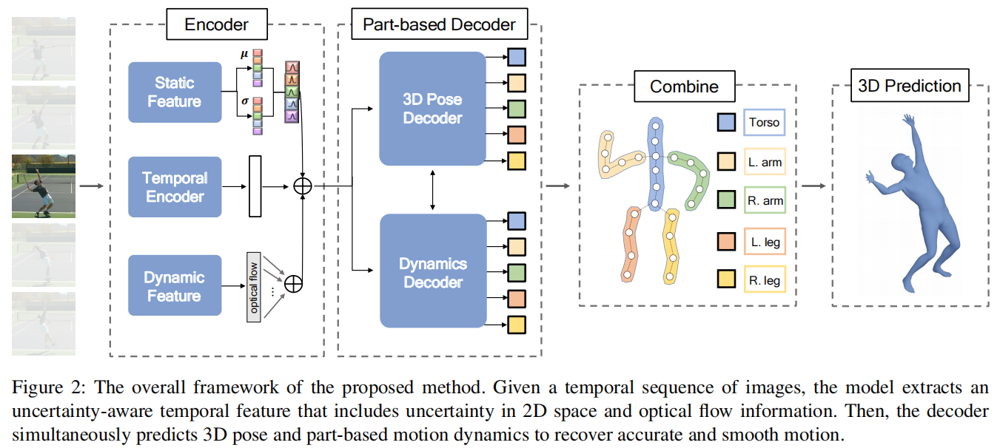
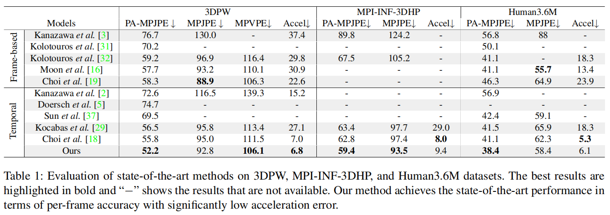
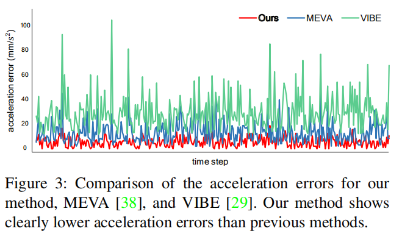
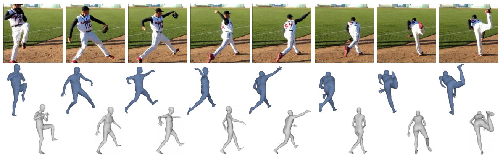
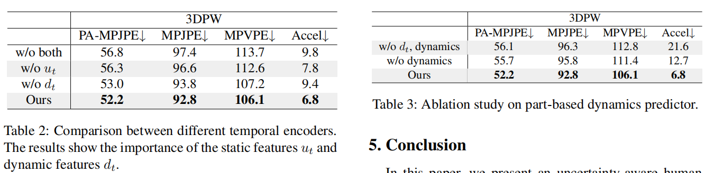

# Uncertainty-Aware Human Mesh Recovery from Video by Learning Part-Based 3D Dynamics

> ICCV 2021
>
> Korea University,  South Korea

[TOC]

## 摘要

在视频三维人体重建任务中，每帧的精度和运动平滑性存在权衡的问题。我们在3D pose和motion dynamics上解决这个问题。首先，我们利用不确定性来解决产生相同的二维投影的多个三维配置的问题。其次，我们将身体划分为局部区域，在估计三维运动动力学方面显示出了突出的结果。

## 贡献

- 提出了两种特征：静态特征 + 动态特征，的提取方式，同时预测3D pose和motion dynamics
- 采用视图不变概率编码器，通过2D pode特征的分布来考虑2D空间的不确定性。进一步引入了不确定性损失
- 将人体分为五个不同的local区域，估计每个区域的3D motion dynamics

## 方法

### 特征提取：

- 静态特征：和VIBE一样， 利用SPIN中预训练的resnet提取每帧图像特征，然后通过一个**全局平均池化**， 得到特征$f_{t} \in \mathbb{R}^{2048}$
- 时序特征：和VIBE一样，利用GRU获得动态特征$g_{t} \in \mathbb{R}^{2048}$。
- 两个特征concat在一起来估计不确定性
- 动态特征：包含光流信息

### 损失函数：

包括三部分：生成器损失 + 动态损失 + 不确定性损失
$$
\mathcal{L}=\lambda_{\mathcal{G}} \mathcal{L}_{\mathcal{G}}+\lambda_{\Delta t} L_{\Delta t}+\lambda_{u n c} \mathcal{L}_{u n c}
$$

#### 生成器损失

$$
L_{\mathcal{G}}=L_{2 D}+L_{3 D}+L_{S M P L}
$$

包括2D重投影关节损失、3D关节损失、3D SMPL参数损失

#### 动态损失

让预测的相邻帧的$\theta$应用在相邻帧的生成器损失函数上，能够使其最小

#### 不确定性损失

$$
\mathcal{L}_{u n c}=\sum_{t=1}^{T}\left\|\frac{\sigma_{t}^{2}}{\sum \sigma_{t}^{2}} \mu_{t}-\frac{\hat{\sigma}_{t}^{2}}{\sum \hat{\sigma}_{t}^{2}} \hat{\mu}_{t}\right\|_{2}
$$

提出了一个不确定性姿态编码器，embedding的方式服从高斯分布

## 实验

## 讨论

- 不确定性的引入很有学习意义
