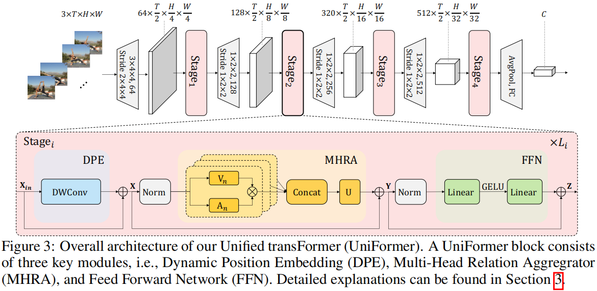
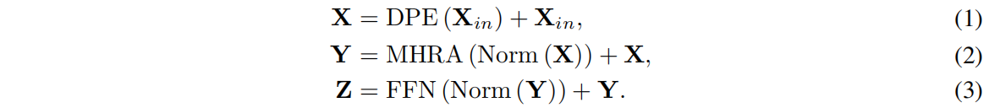
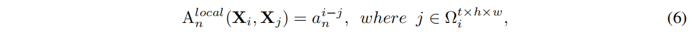
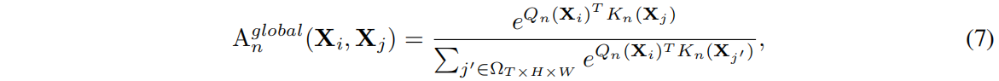
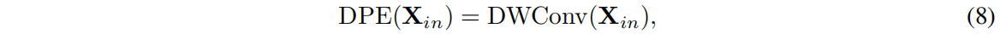
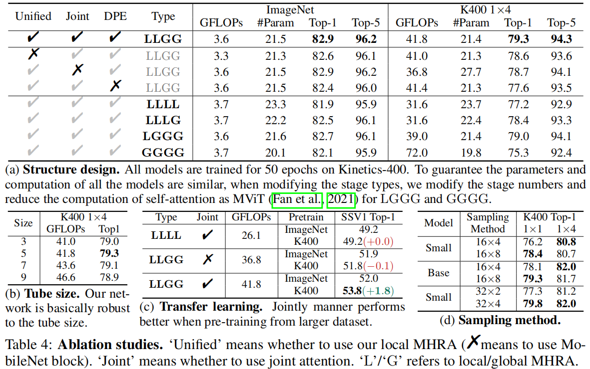
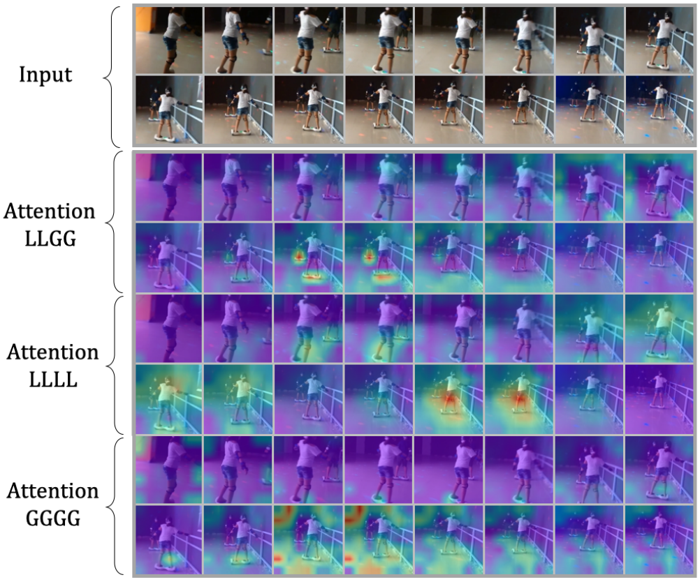
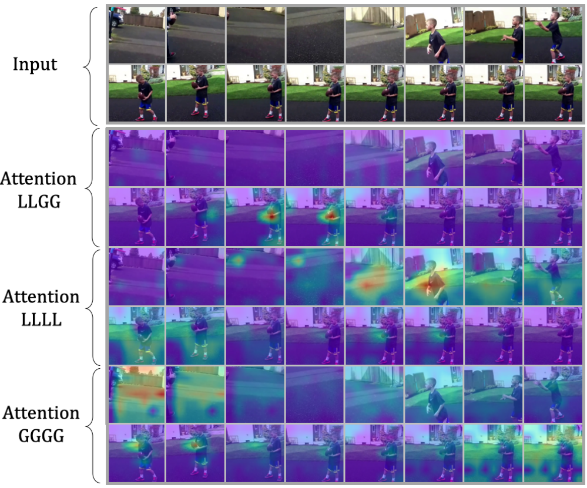

# UniFormer: Unified Transformer for Efficient Spatial-Temporal Representation Learning

> ICLR 2022
>
> Shenzhen Institute of Advanced Technology, Chinese Academy of Sciences

[TOC]

## 摘要

因为视频帧大量的局部冗余以及复杂的全局依赖，所以从视频中学习丰富的多尺度的时空语义信息非常有挑战性。最近的工作主要有3D CNN和Transformer。3D CNN虽然能够有效聚合局部信息来压缩局部冗余，但是由于感受野有限不能捕获全局依赖。Transformer能够通过自注意力机制有效捕获长距离依赖，但不能减少局部冗余，盲目地在所有tokens中进行相似性比较。在此基础上，我们提出了一种统一的Transformer（UniFormer），它将3D CNN的优点融合到时空自注意力的Transformer中。与传统的Transformer不同，我们的关系聚合器能够在浅层和深层分别学习局部和全局的token关系，来解决时空冗余和依赖性。

## 引言

我们的Uniformer由三个模块组成：动态位置编码（DPE），多头关系聚合器（MHRA）和前向传播网络（FFN）

- 首先，与每层都使用自注意力机制不同，我们提出了关系聚合器来处理视频的冗余和依赖关系

  - 在浅层，关系聚合器学习局部关系，只需要一个小的可学习参数矩阵，通过在一个小的3D邻域内，聚合相邻的token信息，减小了大量的计算

  - 在深层，聚合器学习通过相似性比较学习全局关系，能够灵活构建远帧之间的长距离依赖。

- 第二，与传统的时空Transformer不同，我们在每层联合编码时空信息，通过联合学习的方式能够更好地提高视频表征。
- 最后，我们以分层的方式逐步集成Uniformer块来建立我们的模型

## 相关工作

- MViT（2021）引入多层结构和自注意力池化

- Video Swin（2021）引入视频局部性的归纳偏置，在自注意力中应用局部3D窗口

## 方法

首先，用DPE动态聚合3D位置信息到token中，来利用视频的时空顺序。

然后，利用MHRA聚合每个token及其语义相关token。和传统的MHSA不同，MHRA处理了局部冗余和全局依赖的问题，通过设计浅层和深层中不同token关系的学习。

最后，我们加入两层线性层的FFN对每个token进行点级的强化。

### MHRA多头关系聚合器

现有的3D CNNs和时空Transformer只关注于局部冗余和全局依赖中的一个。我们设计了一个交替关系聚合器，能够有效统一**3D CNN**和**时空自注意力**在一个Transformer中，分别在**浅层和深层**中解决视频的**冗余和依赖**问题。

对输入张量$X \in R^{C \times T \times H \times W}$，首先将其reshape为$X \in R^{L \times C}$。$U \in R^{C \times C}$是一个可学习的矩阵来聚合N个heads。每个关系聚合器RA包含两部分，内容编码$V_n(X) \in R^{L \times C/N}$和token关系学习$A_n \in R^{L \times L}$。其中的关键就是A的学习。

#### Local MHRA

在浅层的MHRA中，目标是从局部时空内容中，通过一个小3D邻域，学习细节的视频表征。因此，我们设计了一个在局部3D邻域内操作的可学习参数矩阵：给定一个固定token（anchor token）$X_i$，RA从一个小的立方体$\Omega_{i}^{t \times h \times w}$学习局部时空关系：

在浅层中，响铃token之间视频内容变化很细微，用局部操作编码细节特征来减少冗余，具有重要意义。token关系是一个可学习的参数矩阵，其值只与token之间的**相对时空距离**有关系。

巧合的是，local MHRA与3D卷积的设计一样，等价于PWConv-DWConv-PWConv。

#### Global MHRA

在深层的MHRA中，我们关注于计算长距离依赖，与自注意力的设计相似。因此，我们设计了token关系矩阵，通过计算内容之间的相似性：

Q和K是X两种不同的线性变换。

与之前的时空Transformer不同的是，我们没有分解时空注意力，而是在MHRA的所有阶段都联合编码时空关系，来更好地实现计算量-精度的平衡。

### 动态位置编码

为了克服Transformer的位置不变性，我们使用动态位置编码来保持平移不变性，**适应任何输入的剪辑长度**。因为视频既是时间变化的，又是空间变化的，因此有必要对时空位置信息进行编码作为标记。之前的工作大多采用**绝对位置**或者相对**位置编码**。绝对位置编码：当使用更长的输入片段测试时，绝对的输入片段需要通过微调插值到与目标输入大小相同。相对位置编码：由于缺乏绝对的位置信息，相对位置编码改变了自注意力，会表现得更差。为了克服这个问题，我们扩展了**条件位置编码（CPE）**来设计DPE：

DWConv是0 padding的3D深度卷积。由于共享参数和卷积的局部性，因此DP能克服位置不变性，并适应任意的输入长度。此外，在CPE中已经证明，0 padding有助于边界上的标记了解它们的绝对位置，因此所有标记都可以通过查询它们的邻居来逐步编码其绝对时空位置信息。

## 实验

### 消融实验

#### 联合/分解时空注意力

我们联合学习了时空注意力，而不是分别学习时间注意力和空间注意力。表格4显示，联合学习比分别学习效果更好，说明能够学到更多有区别的视频表征。

#### 动态位置编码的有效性

动态位置编码能够保持时空顺序，有助于更好的时空表征学习。

#### local MHRA的有效性

没有local MHRA的时候，网络缺乏提取细节视频表征的能力，导致模型对冗余的时空注意力的过拟合。

### 可视化

## 专业词汇

- local redundancy - 局部冗余
- inductive bias - 归纳偏置
- frame volumes - 帧体素
- deteriorate - 恶化
- spatial and temporal factorization - 时间和空间分解

## 讨论

- 视频存在的问题：
  - 时空冗余，大量重复帧
  - 时间依赖、空间依赖和时空依赖

- 自注意力编码低级特征低效

  视频Transformer在浅层中对局部时空特征的编码往往效率较低。

- 对时空信息的联合学习

  先用3D CNN获得局部细节的信息，同时消除冗余

  再用Transformer来获得全局信息
