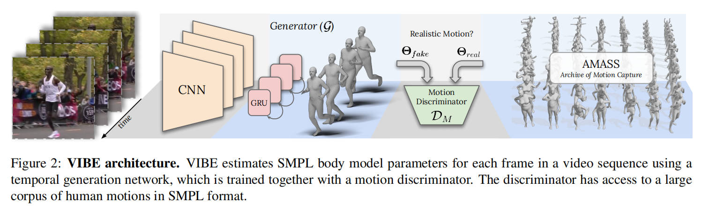
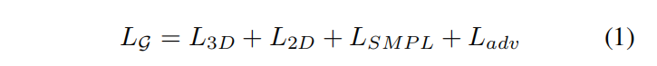
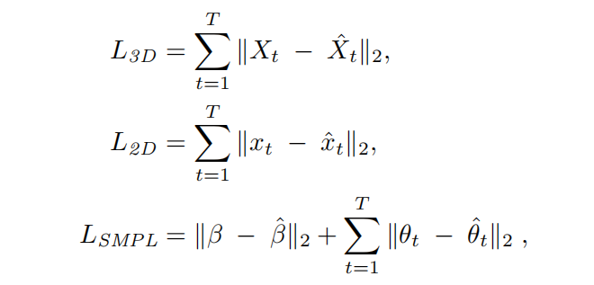
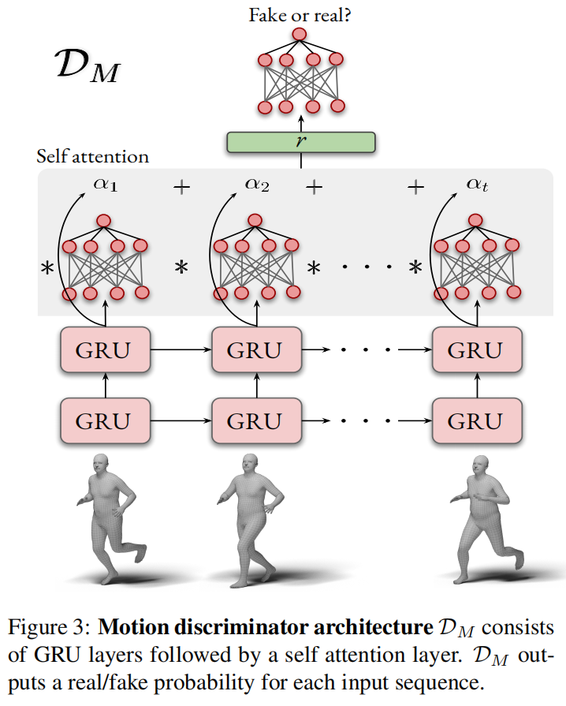
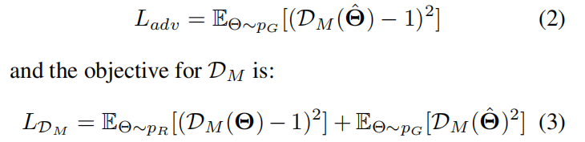
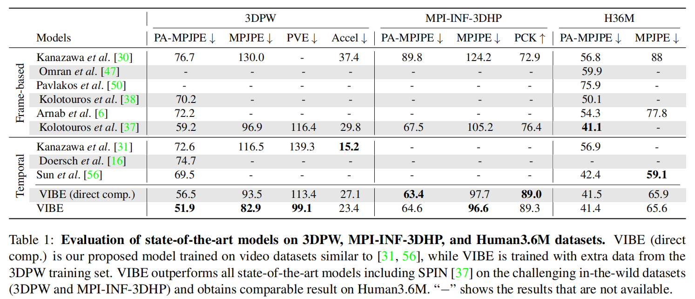
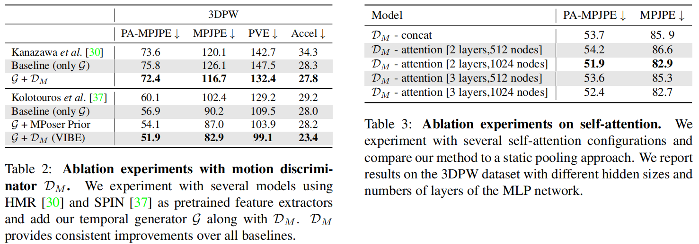
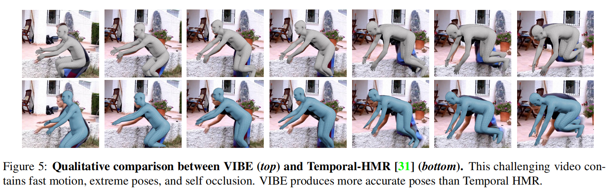

# VIBE: Video Inference for Human Body Pose and Shape Estimation

## 摘要

因为缺少ground truth的三维运动数据来训练，所以目前SOTA的工作不能很好地产生自然正确的运动。我们利用大型运动捕获数据集AMASS，提出了基于视频的人体姿态和形状估计网络VIBE。创新点在于，利用AMASS来区分真实人类运动和我们时序位姿和形状回归网络产生的运动。我们提出一个创新的时序网络框架，使用了自我注意机制和对抗训练，在序列的水平上产生运动学合理的运动序列。

## 引入

尽管目前有很多工作从单张图片中估计三维人体位姿和形状，但是人体动作才体现人的行为。我们关注于探索单目视频的时序信息来更好地评估人体运动。由于缺乏足够的训练数据，之前的时序网络没有捕获到人体复杂多变的运动。我们提出了新的时序神经网络和训练方法，来提高单目视频的三维人体位姿估计性能。

[1]和[2]结合室内视频和二维gd或伪gd关键点标注的数据集，但室内三维数据集物体的数量、运动范围和图片复杂度都受到限制，标注的数量仍然不够充足，伪gd标签在建模人体运动上不够可靠。

我们的灵感来自于[3]，[3]利用单张图片来估计位姿，只将二维关键点和未配对的静态三维人体形状和位姿用于对抗训练方法。在视频序列上，早已存在二维关键点标注的视频，接下来的问题是如何获得足够质量的真实的三维人体运动来进行对抗性训练。因此，我们使用大规模三维动作捕获数据集AMASS，该数据集足够丰富来学习人体的运动。

我们的方法从真实场景的视频学习视频序列的三维人体重建，不仅能够区别估计的运动和数据集的运动的区别，也使用三维关键点。我们方法的输出是一个SMPL的pose和shape参数序列。具体地就是采用两个未配对的信息源（真实视频和AMASS数据集）来训练一个序列的生成对抗网络（GAN）[4]。我们训练一个时间模型来预测每一帧的SMPL身体模型的参数，而一个运动鉴别器来区分真实序列和回归序列。因此，通过最小化对抗训练损失回归器能够输出接近真实运动的位姿，而运动鉴别器作为一个弱监督。

### 训练过程

输入：真实视频图像

预测：预训练的单图像认为i位姿和形状卷积神经网络，由[3]的时序编码器和人体参数回归器组成，在GRUs上执行，来获取人体运动的序列特性。

鉴别：运动鉴别器将预测的位姿和数据集采样的位姿进行对比，对每个序列输出real/fake标签，并采用了注意力机制来放大各自框架的贡献。

输出：SMPL人体pose和shape参数

损失函数：整个模型使用监督的方法，通过对抗损失和回归损失来最小化预测结果和gd在关键点、pose和shape参数上的误差。

### 测试过程

给定一个视频，使用预训练的CNN和时序模型来预测每一帧SMPL的pose和shape的参数。

### 贡献

- 我们使用AMASS数据集来对抗性地训练VIBE，促进回归器产生真实准确的运动。
- 在运动鉴别器中使用注意力机制，给不同的帧赋权重，来区分每帧的重要性。

## 相关工作

### 单一图像的三维位姿和形状

参数人体模型，比如SMPL、SCAPE经常用在人体姿态估计，因为它们捕获到了人体的统计数据，能够提供三维网格模型。

非参数人体模型，比如Bodynet用涂卷机网络直接回归顶点位置、PIFu隐函数像素对齐，但是在视频下会有不稳定的情况。

### 视频的三维位姿和形状

基于视频的人体运动捕获有很长的历史，但受限于简单的动作。最近的深度学习方法只关注于关节位置。有些使用二阶段的方法将现有的二维关键点对应到三维的关节位置。[5]和[6]VNect使用端到端直接回归三维关节点位置，在室内数据集中表现出色，但是在真实数据集中表现不好。许多方法通过扩展SMPLify从视频中重建SMPL的shape和pose参数来计算人体的一致性和平滑运动。[8] 展示了标记SMPLify的网络视频来提高微调时的HMR。[9]通过预测前后帧来学习人体运动学，他们展示了使用二维关键点检测器标记的网络视频可以缓解真实三维位姿标签的需要。[10]提出使用基于transformer的时序模型来提高性能。他们提出了一个无监督对抗训练策略，来为乱序的帧排序。

### 序列模型的生成对抗网络

GAN对图像建模和合成有重要的意义。最近许多工作将GAN融入到序列-序列的任务，比如机器翻译。在运动建模中，结合顺序架构和对对抗训练，能够基于之前的的运动来预测未来的运动序列，或者产生人类运动序列。而我们专注于在序列输入数据下对抗性地细化预测的姿态。我们采用一个运动鉴别器，编码位姿和形状参数，来学习真实数据的优点。

## 方法

**输入**：单人视频

**预训练网络**：预训练好的CNN，用来提取每帧图像的特征

**训练的网络**：双向GRU组成的时序编码器，输出包含过去和未来帧信息的潜在变量。

**作用**：这些特征被用来回归SMPL的参数。

#### SMPL参数

- pose：人体的全局旋转和23个关节的轴角，控制动作位姿
- shape：包括主成分分析PCA空间的的前十个系数，这里使用的是SMPL中的中性模型，控制高矮胖瘦

#### 过程

- 生成pose参数
- 生成shape参数
- 平均池化所有的输入序列，得到一个人体
- 时序产生器生成和AMASS采样的模型进入到运动鉴别器，来去人真假样本。

### 时序编码器

intuition：使用循环结构的原因是视频的前位姿信息对未来帧可能有帮助，尤其是人体模糊或者遮挡的情况。之前帧能够解决和约束姿态的估计。

时序编码器作为一个产生器，对于给定的**输入序列**，**输出**每帧对应的位姿和形状参数$\hat{\Theta} = [(\hat{\theta_1},...,\hat{\theta_T}), \hat{\beta}]$。

序列T进入一个预训练的作为特征提取器的卷积网络，每帧输出一组2048维的向量 *f* 。这些向量被输入GRU层，每帧再输出潜在的特征向量 *g* 。然后将 *g* 输入到回归器进行迭代反馈。回归器初始化为平均位姿并将当前的位姿和特征 *g* 输入来迭代更新参数。

时序编码器的损失函数由二维 *x* 、三维 X 、位姿 *θ* 和形状 *β* 误差组成：

每个误差的计算公式为：

其中二维关键点x_hat是通过三维关节点X_hat投影来的。

### 动作鉴别器

动作鉴别器的设计受到了End-to-end recovery of human shape ans pose的启发，他们设计了人体鉴别器和重投影误差，促进产生器来产生和二维关节点对齐的三维位姿。但是单图像不能约束序列的位姿，当忽略运动的时间连续性时，多个不准确的姿态可能被认为是有效的。于是我们提出了动作鉴别器$D_M$，来鉴别产生的序列是否和真实序列一致。

输入：产生器输出的参数$\hat{\Theta} = [(\hat{\theta_1},...,\hat{\theta_T}), \hat{\beta}]$

网络：多层GRU模型$f_M$，用来预测隐藏的编码$h_i = f_m(\hat{\Theta_i})$，如图3，为了汇总隐藏的状态$[h_i,...,h_T]$，引入了注意力机制。

输出：一个线性层给出[0, 1]概率，表示$\hat{\Theta}$作为人类运动的合理性。

传播给产生器的对抗损失为：

其中，$p_R$是AMASS数据集中真实的运动序列，$p_G$是产生的运动序列。

【E是期望】

#### MPoser

把GAN换成VAE，测试效果，消融实验使用

#### 自我注意机制

给重要的帧赋予更高的权重

### 训练过程

- 图像编码器：一个ResNet-50网络，输入单帧图像，输出2048维特征$f_i$
- 时序编码器：2层GRU
- SMPL回归器：2层全连接层，最后一层输出SMPL参数向量$\hat\Theta$，有75+10=85个参数，包括位姿、形状和相机参数
- 自我注意机制：2层MPL，学习权重，输出每个样本的真假概率

## 实验

## 结论

### 未来的工作

- 使用视频监督单帧方法，来细化HMR特征
- 检验密集运动的线索，比如光流，是否有帮助
- 使用运动来消除多人歧义
- 在遮挡情况下，利用运动来跟踪
- 尝试其他的编码方式，比如transformer，来更好地估计人体运动。

## 数据集

**AMASS**：Naureen Mahmood, Nima Ghorbani, Nikolaus F. Troje, Gerard Pons-Moll, and Michael J. Black. AMASS: Archive of motion capture as surface shapes. In *International Conference on Computer Vision*, 2019.

**Human3.6M**: Catalin Ionescu, Dragos Papava, Vlad Olaru, and Cristian Sminchisescu. Human3.6M: Large scale datasets and predictive methods for 3D human sensing in natural environments. In *IEEE Transaction on Pattern Analysis and Machine Intelligence*, 2014. 

**3DPW**: Timo von Marcard, Roberto Henschel, Michael Black, Bodo Rosenhahn, and Gerard Pons-Moll. Recovering accurate 3D human pose in the wild using IMUs and a moving camera. In *European Conference on Computer Vision*, 2018.

**MPI-INF-3DHP**: Dushyant Mehta, Helge Rhodin, Dan Casas, Pascal Fua, Oleksandr Sotnychenko, Weipeng Xu, and Christian Theobalt. Monocular 3D human pose estimation in the wild using improved CNN supervision. In *International Conference on 3DVision*, 2017.

**PennAction**：Weiyu Zhang, Menglong Zhu, and Konstantinos G Derpanis. From actemes to action: A strongly-supervised representation for detailed action understanding. In *International Conference on Computer Vision*, 2013.

**PoseTrack**：Mykhaylo Andriluka, Umar Iqbal, Eldar Insafutdinov, Leonid Pishchulin, Anton Milan, Juergen Gall, and Bernt Schiele. Posetrack: A benchmark for human pose estimation and tracking. In *IEEE Conference on Computer Vision and Pattern Recognition*, June 2018.

**InstaVariety**：Angjoo Kanazawa, Jason Y. Zhang, Panna Felsen, and Jitendra Malik. Learning 3D human dynamics from video. In*IEEE Conference on Computer Vision and Pattern Recognition*, 2019.

**Kinetics-400**：Joao Carreira and Andrew Zisserman. Quo vadis, action recognition? a new model and the kinetics dataset. In *proceedings of the IEEE Conference on Computer Vision and Pattern Recognition*, 2017.

## 关键词

adversarial learning - 对抗学习

self-attention mechanism - 自我注意机制

kinematically plausible motion - 运动学合理运动

non-trivial - 非平凡的

unpaired dataset - 未匹配数据集

generative adversarial network（GAN）- 生成对抗网络

Gated Recurrent Units（GRUs）- ????

 off-the-shelf - 现有的

HMR - human mesh recovery缩写

synthesis - 合成

corpus - 语料库

recurrent architecture - 循环结构

ambiguous - 模糊

occluded - 遮挡

iterative feedback - 迭代反馈

weak-perspective - 弱视角

 orthographic projection - 正投影

convex combination - 凸组合

VAE（variational autoencoder） - 基于变分思想的生成模型

Adam optimizer - Adam优化器

## 参考文献

[1] Angjoo Kanazawa, Jason Y. Zhang, Panna Felsen, and Jitendra Malik. Learning 3D human dynamics from video. In *IEEE Conference on Computer Vision and Pattern Recognition*, 2019.

[2] Yu Sun, Yun Ye, Wu Liu, Wenpeng Gao, Yili Fu, and Tao Mei. Human mesh recovery from monocular images via a skeleton-disentangled representation. In *International Conference on Computer Vision*, 2019.

[3] Angjoo Kanazawa, Michael J. Black, David W. Jacobs, and Jitendra Malik. End-to-end recovery of human shape and pose. In *IEEE Conference on Computer Vision and Pattern Recognition*, 2018.

[4] Ian Goodfellow, Jean Pouget-Abadie, Mehdi Mirza, Bing Xu, David Warde-Farley, Sherjil Ozair, Aaron Courville, and Yoshua Bengio. Generative adversarial nets. In *Advances in Neural Information Processing*, 2014.

[5] Dushyant Mehta, Oleksandr Sotnychenko, Franziska Mueller, Weipeng Xu, Srinath Sridhar, Gerard Pons-Moll, and Christian Theobalt. Single-shot multi-person 3D pose estimation from monocular RGB. In *International Conference on 3DVision*, 2018.

[6] Dushyant Mehta, Srinath Sridhar, Oleksandr Sotnychenko, Helge Rhodin, Mohammad Shafifiei, Hans-Peter Seidel, Weipeng Xu, Dan Casas, and Christian Theobalt. VNect: Real-time 3D human pose estimation with a single RGB camera. In *SIGGRAPH*, July 2017.

[7] Federica Bogo, Angjoo Kanazawa, Christoph Lassner, Peter Gehler, Javier Romero, and Michael J. Black. Keep it SMPL: Automatic estimation of 3D human pose and shape from a single image. In *European Conference on Computer Vision*, 2016. 

[8] Anurag Arnab, Carl Doersch, and Andrew Zisserman. Exploiting temporal context for 3D human pose estimation in the wild. In *IEEE Conference on Computer Vision and Pattern Recognition*, 2019. 

[9] Angjoo Kanazawa, Jason Y. Zhang, Panna Felsen, and Jitendra Malik. Learning 3D human dynamics from video. In*IEEE Conference on Computer Vision and Pattern Recognition*, 2019.

[10] Yu Sun, Yun Ye, Wu Liu, Wenpeng Gao, Yili Fu, and Tao Mei. Human mesh recovery from monocular images via a skeleton-disentangled representation. In *International Conference on Computer Vision*, 2019.
