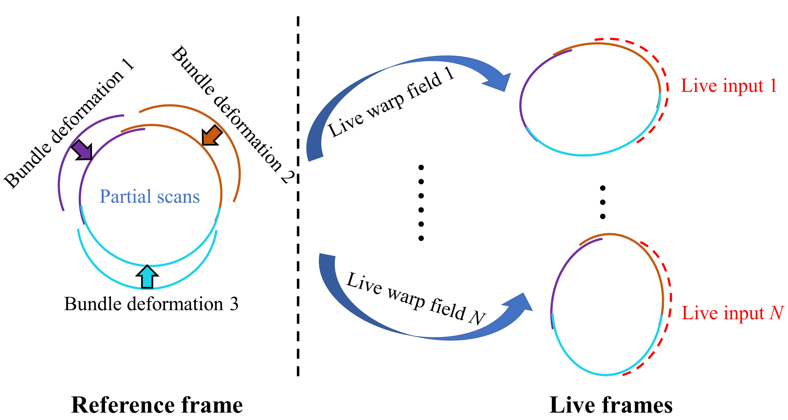
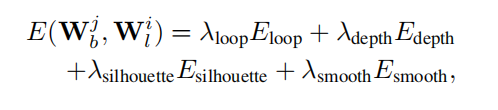
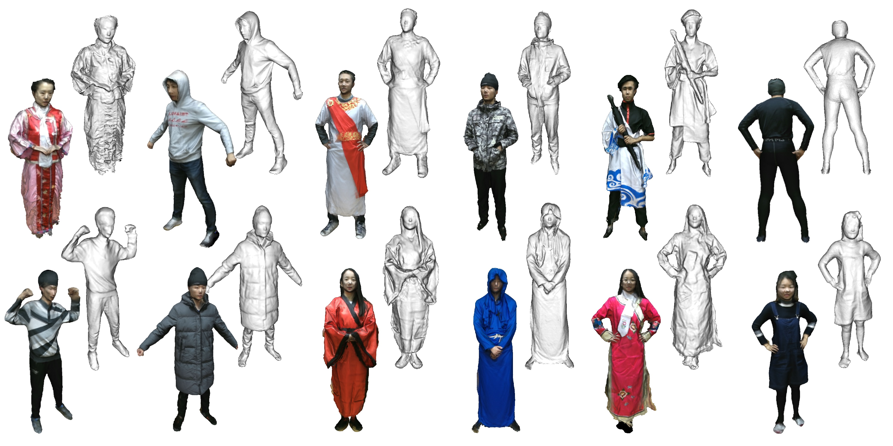
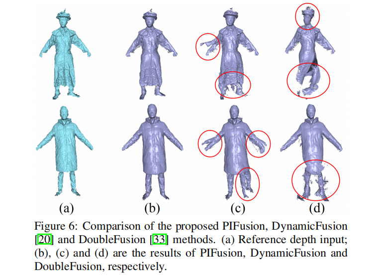
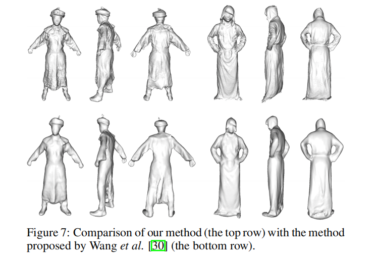
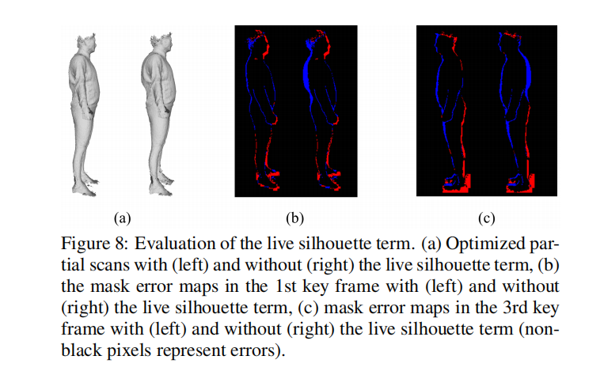
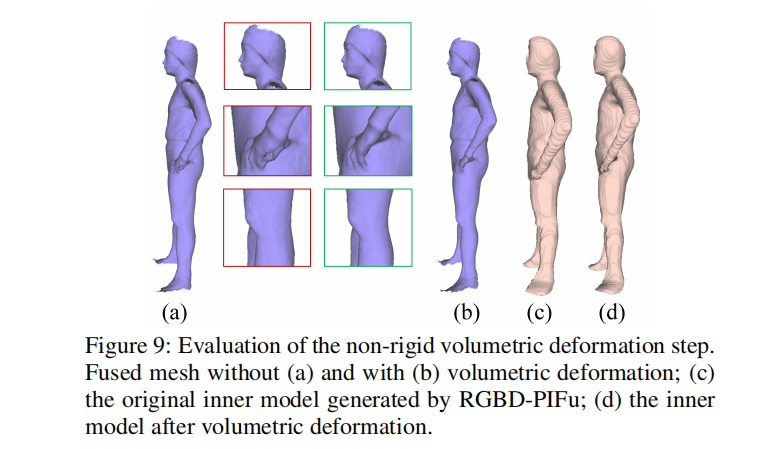
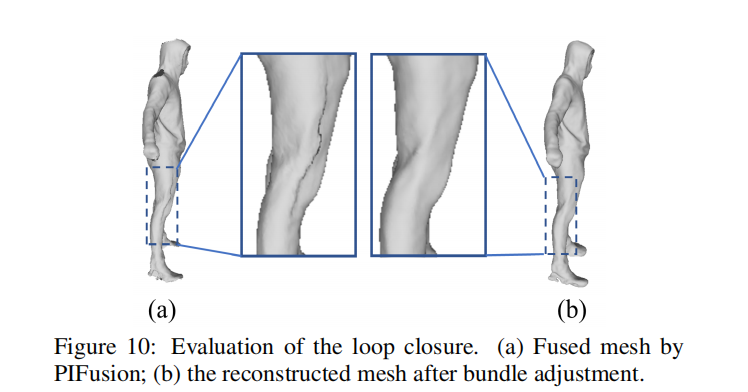

# Robust 3D Self-portraits in Seconds

## 相关工作

### 基于学习的三维人体重建

最近的研究越来越关注深度神经网络的三维表面表示，包括体素网格、多视角体型、深度图和隐函数。虽然这些方法能够方便地进行人体捕获，但是由于遮挡和固有的深度歧义，在细节的产生和结果的真确性上容易失败。

### 基于光束法平差的三维人体重建

光束平差法用来减少增量式融合过程中误差的积累。现有的方法【1】实现自旋转的重建，但因为有大量的扫描数据，效率比较低。方法【2】对所有的点集进行光束法平差，未进行体积融合，导致了过渡平滑的结果。方法【3】融合了大量肖像扫描进行重建，但只能在静态情况下，不能处理自旋转的重建。

除了RGBD的方法，还有RGB的方法，方法【4-6】使用基于轮廓的联合优化，方法【7】使用多视角立体。但是目前的方法还依靠参数模型来表达衣服，从而限制了泛化性能。除此之外，RGB视频中稀疏的特征点不足以进行细节的密集表面重建。

## 方法概括

对于自旋转RGBD序列的输入，我们的系统进行三步处理：

1. **RGBD-PIFu**：利用第一帧来推理一个大概正确的模型
2. **PIFusion**：首先，把推断的模型作为内层，进行基于双层的非刚性跟踪；然后使用非刚性融合方法，把观察融入到参考帧；最后，利用非刚性体积变形优化内层模型，来提高跟踪和融合的准确性。将整个序列分成几个块，并分别融合每个块来产生部分扫描。
3. **轻量光束法平差**：每次迭代，我们首先挑选有效的关键帧，来构建实时深度和轮廓。然后，联合优化所有的部分扫描和变形域

## RGBD-PIFu

RGBD-PIFu方法是一个混合函数 *f*，由全卷积RGBD编码器 *g* 和多层感知机隐函数 *h* 组成。在模型推理阶段，为了避免对隐式函数的密集采样，使用深度输入来忽略空区域，并只在不可见区域执行统一的隐函数采样。利用**移动立方算法**来提取等值面。

## PIFusion

### 1. 初始化

初始化TSDF空间：直接投影深度图并适应内层模型。

变形点图根据集合距离从内层函数中统一采样，来参数化表面融合和内层函数的非刚性变形。

### 2. 双层非刚性跟踪

给定上一帧 *t-1* 的内层模型和融合的mesh，将他们变形来跟踪当前帧 *t* 的深度图。存在两种通信方式：（1）融合的mesh（外层）和深度观测之间的通信；（2）内层模型（内层）和深度观测之间的通信。并定义了一个能量函数，关于内层能量、外层能量和平滑能量。

**内外层能量的计算**：测量对齐函数，利用内外模型的顶点和最近的深度值。

**平滑能量的计算**：用来保证局部的刚性变形。

利用迭代最近点算法来求解能量函数，用高斯牛顿法来优化。跟踪完后，将融入深度观测并更新TSDF空间。

### 3. 非刚性体积变形

初始的内层模型对双层表面跟踪来说是不够的准确的，可能会降低跟踪的性能。因此采用非刚性体积变形算法来通过使内层模型适应mesh来继续矫正内层模型，使得内层模型和融合的mesh对齐。

### 4. 部分扫描融合

为了减少光束法平差的次数，将整个序列分成几块，包括前后和两边。由于误差积累，最前和最后两帧可能会不对齐，而轻量的光束法平差会解决这个问题，产生准确的三维人体。

## 轻量的光束法平差

### 1. 联合优化

先利用回环关系将部分扫描变为一个环，进一步优化对应的实时扭曲域。在每次迭代中，束变形和扭曲域交替优化来使得总能量最小。因此，每个部分扫描有自己的束变形，同时所有的扫描共享实时扭曲域。

### 2. 关键帧挑选

关键帧挑选策略的提出是为了提高重建和深度适应的效率。我们将每个序列分成了 *K* 个片段，对于每一帧，计算两个指标：

（1）**几何对齐误差**：扭曲的部分扫描和对应输入的深度点云之间的误差；

（2）**轮廓误差**：在当帧相机视角下，将所有的部分扫描渲染成一个mask map，计算该mask map和输入轮廓的误差。

我们挑选分别每个片段中几何对齐误差和轮廓误差最大的帧作为**深度关键帧**和**轮廓关键帧**。

### 3. 公式

不同于其他的光束法平差，我们不仅对部分扫描做了回环，也引入了实时帧观测到优化程序中来提高准确率。总能量函数是：

### 4. 非刚性多纹理化

使用泊松重建，对于每一帧将顶点投影到彩色图像中取得一个颜色值。对与每个顶点的颜色，采用加权平均的方式来混合计算，为了避免颜色过渡平滑，只取前15%的颜色来混合。

## 实验

### 1. 三维人体重建

### 2. 对比实验

### 3. 消融实验

## 关键词

voxel grid - 体素网格

multi-view - 多视角体型

depth maps - 深度图

implicit functions - 隐函数

volumetric fusion - 体积融合

warping fields - 扭曲域

pixel-aligned implicit functions - 像素对齐隐函数

multilayer perceptrons - 多层感知机

marching cube algorithm - 移动立方算法

isosurface - 等值面

truncated signed distance funstion - TSDF 

deformation node graph - 变形点图

iterative closest point (ICP) - 迭代最近点算法

Gauss-Newton algorithm - 高斯-牛顿算法

non-rigid volumetric deformation algorithm - 非刚性体积变形算法

consistency - 连续性

bundle deformation - 束变形

Poisson reconstruction - 泊松重建

stacked hourglass network - 堆叠沙漏网络

## 参考文献

[1] Y. Cui, W. Chang, T. Noll, and D. Stricker. Kinectavatar:Fully automatic body capture using a single kinect. In，J.-I. Park and J. Kim, editors, *Computer Vision - ACCV* *2012 Workshops*, pages 133–147, Berlin, Heidelberg, 2013. SPRINGER Berlin Heidelberg.

[2] K. Wang, G. Zhang, and S. Xia. Templateless non-rigid reconstruction and motion tracking with a single rgb-d camera.*IEEE Transactions on Image Processing*, 26(12):5966–5979, Dec 2017.

[3] H. Li, E. Vouga, A. Gudym, L. Luo, J. T. Barron, and G. Gusev. 3d self-portraits. *ACM Transactions on Graph*ics*, 32(6):187:1–187:9, 2013.

[4] T. Alldieck, M. Magnor, W. Xu, C. Theobalt, and G. Pons Moll. Video based reconstruction of 3d people models. In*IEEE Conference on Computer Vision and Pattern Recogni*tion (CVPR)*, June 2018. 

[5] T. Alldieck, M. Magnor, W. Xu, C. Theobalt, and G. Pons Moll. Detailed human avatars from monocular video. In *International Conference on 3D Vision (3DV)*, sep 2018.

[6] T. Alldieck, M. Magnor, B. L. Bhatnagar, C. Theobalt, and G. Pons-Moll. Learning to reconstruct people in clothing from a single RGB camera. In *IEEE Conference on Com *puter Vision and Pattern Recognition (CVPR)*, jun 2019.

[7] H. Zhu, Y. Liu, J. Fan, Q. Dai, and X. Cao. Video-based outdoor human reconstruction. *IEEE Transactions on Cir*cuits and Systems for Video Technology*, 27(4):760–770, Apr. 2017.